# Translation Workflow

How to translate user-guide content.

## Setup - one-time

* Install VSCode: https://code.visualstudio.com/
* Create target folder for GIT content

  `c:\git`
* Run VSCode.

  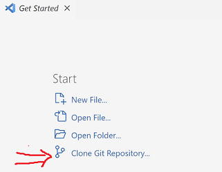
  
* Clone GIT Repository

 `https://github.com/SuperOfficeDocs/superoffice-docs.git`

  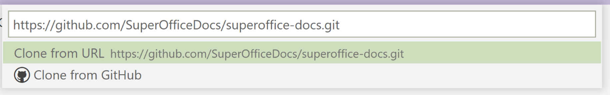

* Choose target folder to contain **superoffice-docs** folder.
  `c:\git`
* Files and branches are now cloned locally.
  When you open the target folder `c:\git\superoffice-docs` in VSCode, it will automatically connect to Github. It remembers where it came from.

## Translation Workflow

1. Someone at SuperOffice runs the **Create-translations-branch** flow on Github.
2. This creates a new branch called `Translate-Xxx-date` and a ZIP file containing the 
   changed english files.
3. Go to Actions tab on GitHub to find artifact

   https://github.com/SuperOfficeDocs/superoffice-docs/actions/workflows/build-translations.yml
4. Click on the run to access the artifacts 

  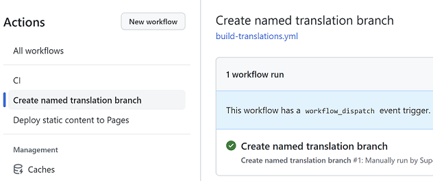

5. Download the changes zip:

  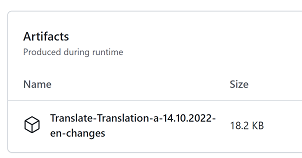

6. Unzip the changes and send them in for translations.

Translations happen.

Time passes... 

French, Swedish, etc translations come back.

7. Open **VSCode**
8. Open the target folder `C:\git\superoffice-docs`

  

9. Click the SYNC button in the footer. This ensures that the list of branches is up to date, and contains the translation branch that was created when the ZIP file was generated.

  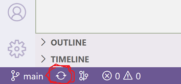

10.	Click the MAIN branch in the footer to switch to the **translate_xxx** branch.

  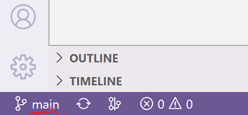

11.	Choose the `origin/Translate_xxx` branch from the list of branches

  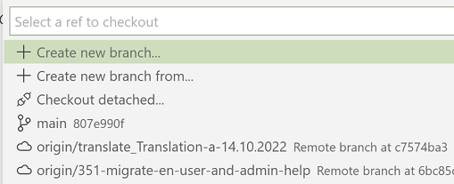

12.	Wait for the new branch to be copied.

  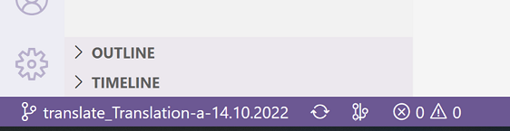

13.	Click the SYNC button just to make sure everything is up to date.
14.	Drag/Drop to copy the translated files to the corresponding language folders 
in the target folder:  

  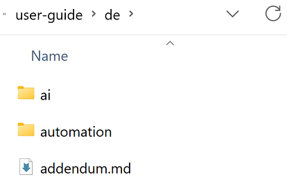

15.	Go back to VSCode - should now show changed files 

  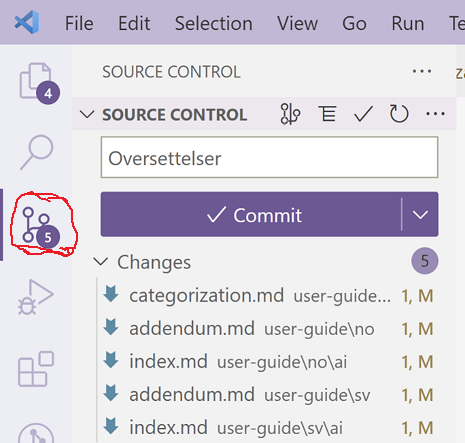

16.	Double check you are on the right branch - check the footer

  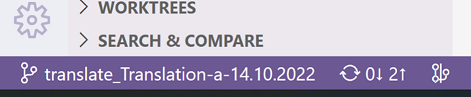

17.	Enter a commit message 
   `Oversettelser`

18.	Click COMMIT button.
19.	Click SYNC button 

   

20.	Open Github 
    
    https://github.com/SuperOfficeDocs/superoffice-docs

21.	Pick the translate branch on GitHub:

  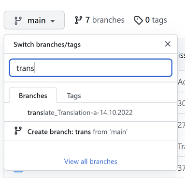

22.	Click the CREATE PR button (should appear automatically):

  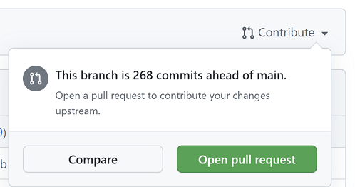

23.	Finished!

The changes committed to the branch can now be reviewed and merged back to main.

You can continue to make changes to the branch and push them to Github after you have 
created the PR.

