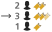
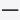

# All Icons

29.08.2022 16:11:29

C:\Agent1\_work\14\a\superoffice-docs\common\icons

*  1-column.png  1-column-h32.png
*  2-columns.png  2-columns-h32.png
*  3-columns.png  3-columns-h32.png
*  4-columns.png  4-columns-h32.png
*  accept-appointment-icon.png  accept-appointment-icon-h32.png
*  accesslevel.png  accesslevel-h32.png
*  addcomment.png  addcomment-h32.png
*  add-icon.png  add-icon-h32.png
*  appointment.png  appointment-h32.png
*  appointments-black.png  appointments-black-h32.png
*  appointments-blue.png  appointments-blue-h32.png
*  appointments-white.png  appointments-white-h32.png
*  appointment-task.png  appointment-task-h32.png
*  archive-icon.png  archive-icon-h32.png
*  archive-icon-white.png  archive-icon-white-h32.png
*  arrow-down-hover-icon.png  arrow-down-hover-icon-h32.png
*  arrow-down-icon.png  arrow-down-icon-h32.png
*  arrow-up-hover-icon.png  arrow-up-hover-icon-h32.png
*  arrow-up-icon.png  arrow-up-icon-h32.png
*  arrow-black.png  arrow-black-h32.png
*  arrow-theme.png  arrow-theme-h32.png
*  arrow-theme-noborder.png  arrow-theme-noborder-h32.png
*  assignment-even.png  assignment-even-h32.png
*  assignment-leastopen.png  assignment-leastopen-h32.png
*  assignment-noassignment.png  assignment-noassignment-h32.png
*  assignment-seen.png  assignment-seen-h32.png
*  assignment-weighted.png  assignment-weighted-h32.png
*  attachments-black.png  attachments-black-h32.png
*  attachments-blue.png  attachments-blue-h32.png
*  attachments-theme.png  attachments-theme-h32.png
*  attachments-white.png  attachments-white-h32.png
*  az.png  az-h32.png
*  ballblue.png  ballblue-h32.png
*  ballgreen.png  ballgreen-h32.png
*  ballred.png  ballred-h32.png
*  ballyellow.png  ballyellow-h32.png
*  bell.png  bell-h32.png
*  bellblack.png  bellblack-h32.png
*  bug.png  bug-h32.png
*  chat.png  chat-h32.png
*  chat-status-blue.png  chat-status-blue-h32.png
*  chat-status-disconnected.png  chat-status-disconnected-h32.png
*  chat-status-disconnected-white.png  chat-status-disconnected-white-h32.png
*  chat-status-light-blue.png  chat-status-light-blue-h32.png
*  chat-status-transfer.png  chat-status-transfer-h32.png
*  chat-status-white.png  chat-status-white-h32.png
*  check-black.png  check-black-h32.png
*  checkgreen.png  checkgreen-h32.png
*  checkgreen-circle.png  checkgreen-circle-h32.png
*  check-indeterminate-black.png  check-indeterminate-black-h32.png
*  checkradio.png  checkradio-h32.png
*  checktheme.png  checktheme-h32.png
*  check-white.png  check-white-h32.png
*  close.png  close-h32.png
*  clouds.png  clouds-h32.png
*  cog-wheel.png  cog-wheel-h32.png
*  collapse-all.png  collapse-all-h32.png
*  company.png  company-h32.png
*  confscreen-columns.png  confscreen-columns-h32.png
*  confscreen-elements.png  confscreen-elements-h32.png
*  confscreen-fields.png  confscreen-fields-h32.png
*  confscreen-settings.png  confscreen-settings-h32.png
*  contact.png  contact-h32.png
*  context-menu.png  context-menu-h32.png
*  context-menudark.png  context-menudark-h32.png
*  copy-paste-icon.png  copy-paste-icon-h32.png
*  customentities.png  customentities-h32.png
*  debugpanel.png  debugpanel-h32.png
*  delete-circle-grey-hover.png  delete-circle-grey-hover-h32.png
*  delete-circle-grey.png  delete-circle-grey-h32.png
*  delete-circle-darkmode.png  delete-circle-darkmode-h32.png
*  delete-circle-red.png  delete-circle-red-h32.png
*  delete-grey.png  delete-grey-h32.png
*  delete-icon.png  delete-icon-h32.png
*  delete-red.png  delete-red-h32.png
*  delete-x-icon.png  delete-x-icon-h32.png
*  diaryblack.png  diaryblack-h32.png
*  diary-alarm.png  diary-alarm-h32.png
*  diary-complete.png  diary-complete-h32.png
*  diary-copy.png  diary-copy-h32.png
*  diary-participants.png  diary-participants-h32.png
*  diary-recurring.png  diary-recurring-h32.png
*  diary-tentative.png  diary-tentative-h32.png
*  diary-videocall.png  diary-videocall-h32.png
*  dice-1.png  dice-1-h32.png
*  dice-1-active.png  dice-1-active-h32.png
*  dice-2.png  dice-2-h32.png
*  dice-2-active.png  dice-2-active-h32.png
*  dice-3.png  dice-3-h32.png
*  dice-3-active.png  dice-3-active-h32.png
*  dice-4.png  dice-4-h32.png
*  dice-4-active.png  dice-4-active-h32.png
*  dice-5.png  dice-5-h32.png
*  dice-5-active.png  dice-5-active-h32.png
*  dice-6.png  dice-6-h32.png
*  dice-6-active.png  dice-6-active-h32.png
*  document.png  document-h32.png
*  document-report.png  document-report-h32.png
*  dragger-hori.png  dragger-hori-h32.png
*  dragger-vert.png  dragger-vert-h32.png
*  drag-handle.png  drag-handle-h32.png
*  dropdown-icon.png  dropdown-icon-h32.png
*  dropdown-arrow.png  dropdown-arrow-h32.png
*  dropdown-arrow-disabled.png  dropdown-arrow-disabled-h32.png
*  dropdown-arrow-error.png  dropdown-arrow-error-h32.png
*  dropdown-arrow-theme.png  dropdown-arrow-theme-h32.png
*  duplicate-icon.png  duplicate-icon-h32.png
*  duplicate-tile-icon.png  duplicate-tile-icon-h32.png
*  duplicate-tile-icon-darkmode.png  duplicate-tile-icon-darkmode-h32.png
*  editor-toolbar-icon.png  editor-toolbar-icon-h32.png
*  edit-black.png  edit-black-h32.png
*  edit-pen.png  edit-pen-h32.png
*  edit-pen-darkmode.png  edit-pen-darkmode-h32.png
*  email.png  email-h32.png
*  emptydashboard.png  emptydashboard-h32.png
*  empty-targets.png  empty-targets-h32.png
*  exclamation.png  exclamation-h32.png
*  expand-all.png  expand-all-h32.png
*  explore-close.png  explore-close-h32.png
*  explore-collapse.png  explore-collapse-h32.png
*  explore-dot.png  explore-dot-h32.png
*  explore-expand.png  explore-expand-h32.png
*  explore-large.png  explore-large-h32.png
*  explore-tree.png  explore-tree-h32.png
*  export.png  export-h32.png
*  faq.png  faq-h32.png
*  favouritedark-no.png  favouritedark-no-h32.png
*  favouritedark-yes.png  favouritedark-yes-h32.png
*  favourite-icon.png  favourite-icon-h32.png
*  favourite-no.png  favourite-no-h32.png
*  favourite-yes.png  favourite-yes-h32.png
*  field.png  field-h32.png
*  filter-active.png  filter-active-h32.png
*  filter-icon.png  filter-icon-h32.png
*  flag-off.png  flag-off-h32.png
*  flag-on.png  flag-on-h32.png
*  folder.png  folder-h32.png
*  folder-closed.png  folder-closed-h32.png
*  folder-open.png  folder-open-h32.png
*  forward-icon.png  forward-icon-h32.png
*  forward-icon-dark.png  forward-icon-dark-h32.png
*  gearblack.png  gearblack-h32.png
*  group.png  group-h32.png
*  gt-black.png  gt-black-h32.png
*  gt-blue.png  gt-blue-h32.png
*  history-icon.png  history-icon-h32.png
*  image.png  image-h32.png
*  info-ball.png  info-ball-h32.png
*  invitations.png  invitations-h32.png
*  invoice.png  invoice-h32.png
*  large-x-white.png  large-x-white-h32.png
*  left-arrow.png  left-arrow-h32.png
*  left-arrow-blue.png  left-arrow-blue-h32.png
*  left-collapse.png  left-collapse-h32.png
*  left-expand.png  left-expand-h32.png
*  link.png  link-h32.png
*  link-blue.png  link-blue-h32.png
*  lock.png  lock-h32.png
*  lock-off.png  lock-off-h32.png
*  lock-on.png  lock-on-h32.png
*  mainmenu.png  mainmenu-h32.png
*  mandatory.png  mandatory-h32.png
*  marketing.png  marketing-h32.png
*  maximize-dark.png  maximize-dark-h32.png
*  max-dlg-white.png  max-dlg-white-h32.png
*  mdo-arrow.png  mdo-arrow-h32.png
*  menu-icon.png  menu-icon-h32.png
*  menu-arrow.png  menu-arrow-h32.png
*  minimize.png  minimize-h32.png
*  min-dlg-white.png  min-dlg-white-h32.png
*  morefields.png  morefields-h32.png
*  moretabs.png  moretabs-h32.png
*  move-up-down-icon.png  move-up-down-icon-h32.png
*  multiselect-mail.png  multiselect-mail-h32.png
*  nav-arrow.png  nav-arrow-h32.png
*  nav-arrow-left.png  nav-arrow-left-h32.png
*  new-window-icon.png  new-window-icon-h32.png
*  none-selected-mail.png  none-selected-mail-h32.png
*  now.png  now-h32.png
*  ops.png  ops-h32.png
*  opsred.png  opsred-h32.png
*  options.png  options-h32.png
*  own-icon.png  own-icon-h32.png
*  paragraph.png  paragraph-h32.png
*  password.png  password-h32.png
*  personblack.png  personblack-h32.png
*  personblue.png  personblue-h32.png
*  personred.png  personred-h32.png
*  persontheme.png  persontheme-h32.png
*  personwhite.png  personwhite-h32.png
*  phone.png  phone-h32.png
*  pinned.png  pinned-h32.png
*  placeholder.png  placeholder-h32.png
*  play.png  play-h32.png
*  plus-black.png  plus-black-h32.png
*  plus-white.png  plus-white-h32.png
*  pop-out-icon.png  pop-out-icon-h32.png
*  preview.png  preview-h32.png
*  print.png  print-h32.png
*  print-dark.png  print-dark-h32.png
*  product.png  product-h32.png
*  project.png  project-h32.png
*  question.png  question-h32.png
*  rating-star.png  rating-star-h32.png
*  rating-star-filled.png  rating-star-filled-h32.png
*  rating-thumb-down.png  rating-thumb-down-h32.png
*  rating-thumb-down-active.png  rating-thumb-down-active-h32.png
*  rating-thumb-up.png  rating-thumb-up-h32.png
*  rating-thumb-up-active.png  rating-thumb-up-active-h32.png
*  refresh-icon.png  refresh-icon-h32.png
*  refresh-icondark.png  refresh-icondark-h32.png
*  reject-appointment-icon.png  reject-appointment-icon-h32.png
*  remove.png  remove-h32.png
*  remove-icon.png  remove-icon-h32.png
*  reply-all-icon.png  reply-all-icon-h32.png
*  reply-icon.png  reply-icon-h32.png
*  reply-icon-black.png  reply-icon-black-h32.png
*  reply-icon-blue.png  reply-icon-blue-h32.png
*  reply-icon-dark.png  reply-icon-dark-h32.png
*  reply-icon-white.png  reply-icon-white-h32.png
*  reply-template.png  reply-template-h32.png
*  request-fixedsearch.png  request-fixedsearch-h32.png
*  resize.png  resize-h32.png
*  resize-window-icon.png  resize-window-icon-h32.png
*  right-arrow.png  right-arrow-h32.png
*  right-collapse.png  right-collapse-h32.png
*  right-expand.png  right-expand-h32.png
*  salelost.png  salelost-h32.png
*  salestalled.png  salestalled-h32.png
*  salewon.png  salewon-h32.png
*  screen.png  screen-h32.png
*  search-icon-black.png  search-icon-black-h32.png
*  search-icon-white.png  search-icon-white-h32.png
*  selection-addtostatic.png  selection-addtostatic-h32.png
*  selection-combined.png  selection-combined-h32.png
*  selection-combined-all.png  selection-combined-all-h32.png
*  selection-combined-common.png  selection-combined-common-h32.png
*  selection-combined-difference.png  selection-combined-difference-h32.png
*  selection-combined-only-in-sel1.png  selection-combined-only-in-sel1-h32.png
*  selection-combined-only-in-sel2.png  selection-combined-only-in-sel2-h32.png
*  selection-dynamic.png  selection-dynamic-h32.png
*  selection-static.png  selection-static-h32.png
*  sentiment0.png  sentiment0-h32.png
*  sentiment1.png  sentiment1-h32.png
*  sentiment2.png  sentiment2-h32.png
*  sentiment3.png  sentiment3-h32.png
*  sentiment-negative.png  sentiment-negative-h32.png
*  sentiment-negative-active.png  sentiment-negative-active-h32.png
*  sentiment-neutral.png  sentiment-neutral-h32.png
*  sentiment-neutral-active.png  sentiment-neutral-active-h32.png
*  sentiment-positive.png  sentiment-positive-h32.png
*  sentiment-positive-active.png  sentiment-positive-active-h32.png
*  settingstools.png  settingstools-h32.png
*  sharepoint.png  sharepoint-h32.png
*  smiley-hover-icon.png  smiley-hover-icon-h32.png
*  smiley-icon.png  smiley-icon-h32.png
*  soarchive.png  soarchive-h32.png
*  sort-by-down.png  sort-by-down-h32.png
*  sort-by-up.png  sort-by-up-h32.png
*  spinner.png  spinner-h32.png
*  stop.png  stop-h32.png
*  superoffice.png  superoffice-h32.png
*  superofficelogotheme.png  superofficelogotheme-h32.png
*  sync.png  sync-h32.png
*  sync-no.png  sync-no-h32.png
*  table.png  table-h32.png
*  task.png  task-h32.png
*  timespan.png  timespan-h32.png
*  videocall.png  videocall-h32.png
*  videocall-off.png  videocall-off-h32.png
*  videocall-off-disabled.png  videocall-off-disabled-h32.png
*  video-disabled.png  video-disabled-h32.png
*  view-chart.png  view-chart-h32.png
*  view-list.png  view-list-h32.png
*  view-pane.png  view-pane-h32.png
*  view-pane-right.png  view-pane-right-h32.png
*  view-table.png  view-table-h32.png
*  view-thumbs.png  view-thumbs-h32.png
*  warning.png  warning-h32.png
*  warning-red.png  warning-red-h32.png
*  webforms.png  webforms-h32.png
*  area.png  area-h32.png
*  bar.png  bar-h32.png
*  big-numbers.png  big-numbers-h32.png
*  column-bar.png  column-bar-h32.png
*  combined.png  combined-h32.png
*  combined-bar.png  combined-bar-h32.png
*  gauge.png  gauge-h32.png
*  html.png  html-h32.png
*  line.png  line-h32.png
*  list.png  list-h32.png
*  not-defined.png  not-defined-h32.png
*  pie.png  pie-h32.png
*  stacked-area.png  stacked-area-h32.png
*  stacked-bar.png  stacked-bar-h32.png
*  stacked-column-bar.png  stacked-column-bar-h32.png
*  web-panel.png  web-panel-h32.png

C:\Agent1\_work\14\a\superoffice-docs\common\icons\large

*  area.png  area-h32.png
*  bar.png  bar-h32.png
*  big-numbers.png  big-numbers-h32.png
*  column-bar.png  column-bar-h32.png
*  combined.png  combined-h32.png
*  combined-bar.png  combined-bar-h32.png
*  gauge.png  gauge-h32.png
*  html.png  html-h32.png
*  line.png  line-h32.png
*  list.png  list-h32.png
*  not-defined.png  not-defined-h32.png
*  pie.png  pie-h32.png
*  stacked-area.png  stacked-area-h32.png
*  stacked-bar.png  stacked-bar-h32.png
*  stacked-column-bar.png  stacked-column-bar-h32.png
*  web-panel.png  web-panel-h32.png

C:\Agent1\_work\14\a\superoffice-docs\common\icons\doc-icons

*  avi.png  avi-h32.png
*  css.png  css-h32.png
*  csv.png  csv-h32.png
*  dat.png  dat-h32.png
*  document.png  document-h32.png
*  docx.png  docx-h32.png
*  dwg.png  dwg-h32.png
*  eml.png  eml-h32.png
*  exe.png  exe-h32.png
*  generic.png  generic-h32.png
*  gif.png  gif-h32.png
*  html.png  html-h32.png
*  ics.png  ics-h32.png
*  img.png  img-h32.png
*  javascript.png  javascript-h32.png
*  jpg.png  jpg-h32.png
*  log.png  log-h32.png
*  media.png  media-h32.png
*  mov.png  mov-h32.png
*  mp3.png  mp3-h32.png
*  mp4.png  mp4-h32.png
*  mpg.png  mpg-h32.png
*  msg.png  msg-h32.png
*  odp.png  odp-h32.png
*  ods.png  ods-h32.png
*  odt.png  odt-h32.png
*  pdf.png  pdf-h32.png
*  png.png  png-h32.png
*  ppt.png  ppt-h32.png
*  rtf.png  rtf-h32.png
*  somail.png  somail-h32.png
*  txt.png  txt-h32.png
*  xls.png  xls-h32.png
*  xml.png  xml-h32.png
*  zip.png  zip-h32.png

C:\Agent1\_work\14\a\superoffice-docs\common\icons\flags

*  flags-abkhazia.png  flags-abkhazia-h32.png
*  flags-afghanistan.png  flags-afghanistan-h32.png
*  flags-aland-islands.png  flags-aland-islands-h32.png
*  flags-albania.png  flags-albania-h32.png
*  flags-algeria.png  flags-algeria-h32.png
*  flags-american-samoa.png  flags-american-samoa-h32.png
*  flags-andorra.png  flags-andorra-h32.png
*  flags-angola.png  flags-angola-h32.png
*  flags-anguilla.png  flags-anguilla-h32.png
*  flags-antigua-and-barbuda.png  flags-antigua-and-barbuda-h32.png
*  flags-argentina.png  flags-argentina-h32.png
*  flags-armenia.png  flags-armenia-h32.png
*  flags-aruba.png  flags-aruba-h32.png
*  flags-australia.png  flags-australia-h32.png
*  flags-austria.png  flags-austria-h32.png
*  flags-azerbaijan.png  flags-azerbaijan-h32.png
*  flags-azores-islands.png  flags-azores-islands-h32.png
*  flags-bahamas.png  flags-bahamas-h32.png
*  flags-bahrain.png  flags-bahrain-h32.png
*  flags-balearic-islands.png  flags-balearic-islands-h32.png
*  flags-bangladesh.png  flags-bangladesh-h32.png
*  flags-barbados.png  flags-barbados-h32.png
*  flags-basque-country.png  flags-basque-country-h32.png
*  flags-belarus.png  flags-belarus-h32.png
*  flags-belgium.png  flags-belgium-h32.png
*  flags-belize.png  flags-belize-h32.png
*  flags-benin.png  flags-benin-h32.png
*  flags-bermuda.png  flags-bermuda-h32.png
*  flags-bhutan-1.png  flags-bhutan-1-h32.png
*  flags-bhutan.png  flags-bhutan-h32.png
*  flags-bolivia.png  flags-bolivia-h32.png
*  flags-bonaire.png  flags-bonaire-h32.png
*  flags-bosnia-and-herzegovina.png  flags-bosnia-and-herzegovina-h32.png
*  flags-botswana.png  flags-botswana-h32.png
*  flags-brazil.png  flags-brazil-h32.png
*  flags-british-columbia.png  flags-british-columbia-h32.png
*  flags-british-indian-ocean-territory.png  flags-british-indian-ocean-territory-h32.png
*  flags-british-virgin-islands.png  flags-british-virgin-islands-h32.png
*  flags-brunei.png  flags-brunei-h32.png
*  flags-bulgaria.png  flags-bulgaria-h32.png
*  flags-burkina-faso.png  flags-burkina-faso-h32.png
*  flags-burundi.png  flags-burundi-h32.png
*  flags-cambodia.png  flags-cambodia-h32.png
*  flags-cameroon.png  flags-cameroon-h32.png
*  flags-canada.png  flags-canada-h32.png
*  flags-canary-islands.png  flags-canary-islands-h32.png
*  flags-cape-verde.png  flags-cape-verde-h32.png
*  flags-cayman-islands.png  flags-cayman-islands-h32.png
*  flags-central-african-republic.png  flags-central-african-republic-h32.png
*  flags-ceuta.png  flags-ceuta-h32.png
*  flags-chad.png  flags-chad-h32.png
*  flags-chile.png  flags-chile-h32.png
*  flags-china.png  flags-china-h32.png
*  flags-christmas-island.png  flags-christmas-island-h32.png
*  flags-cocos-island.png  flags-cocos-island-h32.png
*  flags-colombia.png  flags-colombia-h32.png
*  flags-comoros.png  flags-comoros-h32.png
*  flags-cook-islands.png  flags-cook-islands-h32.png
*  flags-corsica.png  flags-corsica-h32.png
*  flags-costa-rica.png  flags-costa-rica-h32.png
*  flags-croatia.png  flags-croatia-h32.png
*  flags-cuba.png  flags-cuba-h32.png
*  flags-curacao.png  flags-curacao-h32.png
*  flags-cyprus.png  flags-cyprus-h32.png
*  flags-czech-republic.png  flags-czech-republic-h32.png
*  flags-democratic-republic-of-congo.png  flags-democratic-republic-of-congo-h32.png
*  flags-denmark.png  flags-denmark-h32.png
*  flags-djibouti.png  flags-djibouti-h32.png
*  flags-dominica.png  flags-dominica-h32.png
*  flags-dominican-republic.png  flags-dominican-republic-h32.png
*  flags-east-timor.png  flags-east-timor-h32.png
*  flags-ecuador.png  flags-ecuador-h32.png
*  flags-egypt.png  flags-egypt-h32.png
*  flags-england.png  flags-england-h32.png
*  flags-equatorial-guinea.png  flags-equatorial-guinea-h32.png
*  flags-eritrea.png  flags-eritrea-h32.png
*  flags-estonia.png  flags-estonia-h32.png
*  flags-ethiopia.png  flags-ethiopia-h32.png
*  flags-european-union.png  flags-european-union-h32.png
*  flags-falkland-islands.png  flags-falkland-islands-h32.png
*  flags-faroe-islands.png  flags-faroe-islands-h32.png
*  flags-fiji.png  flags-fiji-h32.png
*  flags-finland.png  flags-finland-h32.png
*  flags-france.png  flags-france-h32.png
*  flags-french-polynesia.png  flags-french-polynesia-h32.png
*  flags-gabon.png  flags-gabon-h32.png
*  flags-galapagos-islands.png  flags-galapagos-islands-h32.png
*  flags-gambia.png  flags-gambia-h32.png
*  flags-georgia.png  flags-georgia-h32.png
*  flags-germany.png  flags-germany-h32.png
*  flags-ghana.png  flags-ghana-h32.png
*  flags-gibraltar.png  flags-gibraltar-h32.png
*  flags-greece.png  flags-greece-h32.png
*  flags-greenland.png  flags-greenland-h32.png
*  flags-grenada.png  flags-grenada-h32.png
*  flags-guam.png  flags-guam-h32.png
*  flags-guatemala.png  flags-guatemala-h32.png
*  flags-guernsey.png  flags-guernsey-h32.png
*  flags-guinea-bissau.png  flags-guinea-bissau-h32.png
*  flags-guinea.png  flags-guinea-h32.png
*  flags-guyana.png  flags-guyana-h32.png
*  flags-haiti.png  flags-haiti-h32.png
*  flags-hawaii.png  flags-hawaii-h32.png
*  flags-honduras.png  flags-honduras-h32.png
*  flags-hong-kong.png  flags-hong-kong-h32.png
*  flags-hungary.png  flags-hungary-h32.png
*  flags-iceland.png  flags-iceland-h32.png
*  flags-india.png  flags-india-h32.png
*  flags-indonesia.png  flags-indonesia-h32.png
*  flags-iran.png  flags-iran-h32.png
*  flags-iraq.png  flags-iraq-h32.png
*  flags-ireland.png  flags-ireland-h32.png
*  flags-isle-of-man.png  flags-isle-of-man-h32.png
*  flags-israel.png  flags-israel-h32.png
*  flags-italy.png  flags-italy-h32.png
*  flags-ivory-coast.png  flags-ivory-coast-h32.png
*  flags-jamaica.png  flags-jamaica-h32.png
*  flags-japan.png  flags-japan-h32.png
*  flags-jersey.png  flags-jersey-h32.png
*  flags-jordan.png  flags-jordan-h32.png
*  flags-kazakhstan.png  flags-kazakhstan-h32.png
*  flags-kenya.png  flags-kenya-h32.png
*  flags-kiribati.png  flags-kiribati-h32.png
*  flags-kosovo.png  flags-kosovo-h32.png
*  flags-kuwait.png  flags-kuwait-h32.png
*  flags-kyrgyzstan.png  flags-kyrgyzstan-h32.png
*  flags-laos.png  flags-laos-h32.png
*  flags-latvia.png  flags-latvia-h32.png
*  flags-lebanon.png  flags-lebanon-h32.png
*  flags-lesotho.png  flags-lesotho-h32.png
*  flags-liberia.png  flags-liberia-h32.png
*  flags-libya.png  flags-libya-h32.png
*  flags-liechtenstein.png  flags-liechtenstein-h32.png
*  flags-lithuania.png  flags-lithuania-h32.png
*  flags-luxembourg.png  flags-luxembourg-h32.png
*  flags-macao.png  flags-macao-h32.png
*  flags-madagascar.png  flags-madagascar-h32.png
*  flags-madeira.png  flags-madeira-h32.png
*  flags-malawi.png  flags-malawi-h32.png
*  flags-malaysia.png  flags-malaysia-h32.png
*  flags-maldives.png  flags-maldives-h32.png
*  flags-mali.png  flags-mali-h32.png
*  flags-malta.png  flags-malta-h32.png
*  flags-marshall-island.png  flags-marshall-island-h32.png
*  flags-martinique.png  flags-martinique-h32.png
*  flags-mauritania.png  flags-mauritania-h32.png
*  flags-mauritius.png  flags-mauritius-h32.png
*  flags-melilla.png  flags-melilla-h32.png
*  flags-mexico.png  flags-mexico-h32.png
*  flags-micronesia.png  flags-micronesia-h32.png
*  flags-moldova.png  flags-moldova-h32.png
*  flags-monaco.png  flags-monaco-h32.png
*  flags-mongolia.png  flags-mongolia-h32.png
*  flags-montenegro.png  flags-montenegro-h32.png
*  flags-montserrat.png  flags-montserrat-h32.png
*  flags-morocco.png  flags-morocco-h32.png
*  flags-mozambique.png  flags-mozambique-h32.png
*  flags-myanmar.png  flags-myanmar-h32.png
*  flags-namibia.png  flags-namibia-h32.png
*  flags-nato.png  flags-nato-h32.png
*  flags-nauru.png  flags-nauru-h32.png
*  flags-nepal.png  flags-nepal-h32.png
*  flags-netherlands.png  flags-netherlands-h32.png
*  flags-new-zealand.png  flags-new-zealand-h32.png
*  flags-nicaragua.png  flags-nicaragua-h32.png
*  flags-niger.png  flags-niger-h32.png
*  flags-nigeria.png  flags-nigeria-h32.png
*  flags-niue.png  flags-niue-h32.png
*  flags-norfolk-island.png  flags-norfolk-island-h32.png
*  flags-north-korea.png  flags-north-korea-h32.png
*  flags-northen-cyprus.png  flags-northen-cyprus-h32.png
*  flags-northern-marianas-islands.png  flags-northern-marianas-islands-h32.png
*  flags-norway.png  flags-norway-h32.png
*  flags-oman.png  flags-oman-h32.png
*  flags-orkney-islands.png  flags-orkney-islands-h32.png
*  flags-ossetia.png  flags-ossetia-h32.png
*  flags-pakistan.png  flags-pakistan-h32.png
*  flags-palau.png  flags-palau-h32.png
*  flags-palestine.png  flags-palestine-h32.png
*  flags-panama.png  flags-panama-h32.png
*  flags-papua-new-guinea.png  flags-papua-new-guinea-h32.png
*  flags-paraguay.png  flags-paraguay-h32.png
*  flags-peru.png  flags-peru-h32.png
*  flags-philippines.png  flags-philippines-h32.png
*  flags-pitcairn-islands.png  flags-pitcairn-islands-h32.png
*  flags-portugal.png  flags-portugal-h32.png
*  flags-puerto-rico.png  flags-puerto-rico-h32.png
*  flags-qatar.png  flags-qatar-h32.png
*  flags-rapa-nui.png  flags-rapa-nui-h32.png
*  flags-republic-of-macedonia.png  flags-republic-of-macedonia-h32.png
*  flags-republic-of-poland.png  flags-republic-of-poland-h32.png
*  flags-republic-of-the-congo.png  flags-republic-of-the-congo-h32.png
*  flags-romania.png  flags-romania-h32.png
*  flags-russia.png  flags-russia-h32.png
*  flags-rwanda.png  flags-rwanda-h32.png
*  flags-saba-island.png  flags-saba-island-h32.png
*  flags-saint-kitts-and-nevis.png  flags-saint-kitts-and-nevis-h32.png
*  flags-salvador.png  flags-salvador-h32.png
*  flags-samoa.png  flags-samoa-h32.png
*  flags-san-marino.png  flags-san-marino-h32.png
*  flags-sao-tome-and-principe.png  flags-sao-tome-and-principe-h32.png
*  flags-sardinia.png  flags-sardinia-h32.png
*  flags-saudi-arabia.png  flags-saudi-arabia-h32.png
*  flags-scotland.png  flags-scotland-h32.png
*  flags-senegal.png  flags-senegal-h32.png
*  flags-serbia.png  flags-serbia-h32.png
*  flags-seychelles.png  flags-seychelles-h32.png
*  flags-sierra-leone.png  flags-sierra-leone-h32.png
*  flags-singapore.png  flags-singapore-h32.png
*  flags-sint-eustatius.png  flags-sint-eustatius-h32.png
*  flags-sint-maarten.png  flags-sint-maarten-h32.png
*  flags-slovakia.png  flags-slovakia-h32.png
*  flags-slovenia.png  flags-slovenia-h32.png
*  flags-solomon-islands.png  flags-solomon-islands-h32.png
*  flags-somalia.png  flags-somalia-h32.png
*  flags-somaliland.png  flags-somaliland-h32.png
*  flags-south-africa.png  flags-south-africa-h32.png
*  flags-south-korea.png  flags-south-korea-h32.png
*  flags-south-sudan.png  flags-south-sudan-h32.png
*  flags-spain.png  flags-spain-h32.png
*  flags-sri-lanka.png  flags-sri-lanka-h32.png
*  flags-st-barts.png  flags-st-barts-h32.png
*  flags-st-lucia.png  flags-st-lucia-h32.png
*  flags-st-vincent-and-the-grenadines.png  flags-st-vincent-and-the-grenadines-h32.png
*  flags-sudan.png  flags-sudan-h32.png
*  flags-suriname.png  flags-suriname-h32.png
*  flags-swaziland.png  flags-swaziland-h32.png
*  flags-sweden.png  flags-sweden-h32.png
*  flags-switzerland.png  flags-switzerland-h32.png
*  flags-syria.png  flags-syria-h32.png
*  flags-taiwan.png  flags-taiwan-h32.png
*  flags-tajikistan.png  flags-tajikistan-h32.png
*  flags-tanzania.png  flags-tanzania-h32.png
*  flags-thailand.png  flags-thailand-h32.png
*  flags-tibet.png  flags-tibet-h32.png
*  flags-togo.png  flags-togo-h32.png
*  flags-tokelau.png  flags-tokelau-h32.png
*  flags-tonga.png  flags-tonga-h32.png
*  flags-transnistria.png  flags-transnistria-h32.png
*  flags-trinidad-and-tobago.png  flags-trinidad-and-tobago-h32.png
*  flags-tunisia.png  flags-tunisia-h32.png
*  flags-turkey.png  flags-turkey-h32.png
*  flags-turkmenistan.png  flags-turkmenistan-h32.png
*  flags-turks-and-caicos.png  flags-turks-and-caicos-h32.png
*  flags-tuvalu.png  flags-tuvalu-h32.png
*  flags-uganda.png  flags-uganda-h32.png
*  flags-ukraine.png  flags-ukraine-h32.png
*  flags-united-arab-emirates.png  flags-united-arab-emirates-h32.png
*  flags-united-kingdom.png  flags-united-kingdom-h32.png
*  flags-united-nations.png  flags-united-nations-h32.png
*  flags-united-states-of-america.png  flags-united-states-of-america-h32.png
*  flags-unknown.png  flags-unknown-h32.png
*  flags-uruguay.png  flags-uruguay-h32.png
*  flags-uzbekistn.png  flags-uzbekistn-h32.png
*  flags-vanuatu.png  flags-vanuatu-h32.png
*  flags-vatican-city.png  flags-vatican-city-h32.png
*  flags-venezuela.png  flags-venezuela-h32.png
*  flags-vietnam.png  flags-vietnam-h32.png
*  flags-virgin-islands.png  flags-virgin-islands-h32.png
*  flags-wales.png  flags-wales-h32.png
*  flags-western-sahara.png  flags-western-sahara-h32.png
*  flags-yemen.png  flags-yemen-h32.png
*  flags-zambia.png  flags-zambia-h32.png
*  flags-zimbabwe.png  flags-zimbabwe-h32.png

C:\Agent1\_work\14\a\superoffice-docs\common\icons

*  nav-browse.png  nav-browse-h32.png
*  nav-chat.png  nav-chat-h32.png
*  nav-company.png  nav-company-h32.png
*  nav-contact.png  nav-contact-h32.png
*  nav-cs.png  nav-cs-h32.png
*  nav-cs-blue.png  nav-cs-blue-h32.png
*  nav-cs-gray.png  nav-cs-gray-h32.png
*  nav-cs-green.png  nav-cs-green-h32.png
*  nav-cs-red.png  nav-cs-red-h32.png
*  nav-dashboard.png  nav-dashboard-h32.png
*  nav-diary.png  nav-diary-h32.png
*  nav-dropdown.png  nav-dropdown-h32.png
*  nav-dropdown-company.png  nav-dropdown-company-h32.png
*  nav-dropdown-diary.png  nav-dropdown-diary-h32.png
*  nav-dropdown-person.png  nav-dropdown-person-h32.png
*  nav-dropdown-project.png  nav-dropdown-project-h32.png
*  nav-dropdown-report.png  nav-dropdown-report-h32.png
*  nav-dropdown-sale.png  nav-dropdown-sale-h32.png
*  nav-dropdown-selection.png  nav-dropdown-selection-h32.png
*  nav-dropdown-ticket.png  nav-dropdown-ticket-h32.png
*  nav-fav.png  nav-fav-h32.png
*  nav-history.png  nav-history-h32.png
*  nav-inbox.png  nav-inbox-h32.png
*  nav-list.png  nav-list-h32.png
*  nav-marketing.png  nav-marketing-h32.png
*  nav-project.png  nav-project-h32.png
*  nav-reports.png  nav-reports-h32.png
*  nav-sale.png  nav-sale-h32.png
*  nav-search.png  nav-search-h32.png
*  nav-selection.png  nav-selection-h32.png
*  nav-tools.png  nav-tools-h32.png
*  nav-webforms.png  nav-webforms-h32.png
*  nav-admin-appstore.png  nav-admin-appstore-h32.png
*  nav-admin-appstore-active.png  nav-admin-appstore-active-h32.png
*  nav-admin-chat.png  nav-admin-chat-h32.png
*  nav-admin-chat-active.png  nav-admin-chat-active-h32.png
*  nav-admin-confscreen.png  nav-admin-confscreen-h32.png
*  nav-admin-confscreen-active.png  nav-admin-confscreen-active-h32.png
*  nav-admin-crmscript.png  nav-admin-crmscript-h32.png
*  nav-admin-crmscript-active.png  nav-admin-crmscript-active-h32.png
*  nav-admin-custcenter.png  nav-admin-custcenter-h32.png
*  nav-admin-custcenter-active.png  nav-admin-custcenter-active-h32.png
*  nav-admin-fields.png  nav-admin-fields-h32.png
*  nav-admin-fields-active.png  nav-admin-fields-active-h32.png
*  nav-admin-import.png  nav-admin-import-h32.png
*  nav-admin-import-active.png  nav-admin-import-active-h32.png
*  nav-admin-licenses.png  nav-admin-licenses-h32.png
*  nav-admin-licenses-active.png  nav-admin-licenses-active-h32.png
*  nav-admin-lists.png  nav-admin-lists-h32.png
*  nav-admin-lists-active.png  nav-admin-lists-active-h32.png
*  nav-admin-options.png  nav-admin-options-h32.png
*  nav-admin-options-active.png  nav-admin-options-active-h32.png
*  nav-admin-preferences.png  nav-admin-preferences-h32.png
*  nav-admin-preferences-active.png  nav-admin-preferences-active-h32.png
*  nav-admin-privacy.png  nav-admin-privacy-h32.png
*  nav-admin-privacy-active.png  nav-admin-privacy-active-h32.png
*  nav-admin-products.png  nav-admin-products-h32.png
*  nav-admin-products-active.png  nav-admin-products-active-h32.png
*  nav-admin-requests.png  nav-admin-requests-h32.png
*  nav-admin-requests-active.png  nav-admin-requests-active-h32.png
*  nav-admin-roles.png  nav-admin-roles-h32.png
*  nav-admin-roles-active.png  nav-admin-roles-active-h32.png
*  nav-admin-saint.png  nav-admin-saint-h32.png
*  nav-admin-saint-active.png  nav-admin-saint-active-h32.png
*  nav-admin-systemdesign.png  nav-admin-systemdesign-h32.png
*  nav-admin-systemdesign-active.png  nav-admin-systemdesign-active-h32.png
*  nav-admin-users.png  nav-admin-users-h32.png
*  nav-admin-users-active.png  nav-admin-users-active-h32.png
*  nav-admin-workflow.png  nav-admin-workflow-h32.png
*  nav-admin-workflow-active.png  nav-admin-workflow-active-h32.png
*  nav-ai-services.png  nav-ai-services-h32.png
*  nav-ai-services-active.png  nav-ai-services-active-h32.png
*  pref-archives.png  pref-archives-h32.png
*  pref-archives-active.png  pref-archives-active-h32.png
*  pref-defaultvalues.png  pref-defaultvalues-h32.png
*  pref-defaultvalues-active.png  pref-defaultvalues-active-h32.png
*  pref-diary.png  pref-diary-h32.png
*  pref-diary-active.png  pref-diary-active-h32.png
*  pref-email.png  pref-email-h32.png
*  pref-email-active.png  pref-email-active-h32.png
*  pref-function.png  pref-function-h32.png
*  pref-function-active.png  pref-function-active-h32.png
*  pref-notification.png  pref-notification-h32.png
*  pref-notification-active.png  pref-notification-active-h32.png
*  pref-other.png  pref-other-h32.png
*  pref-other-active.png  pref-other-active-h32.png
*  pref-person.png  pref-person-h32.png
*  pref-person-active.png  pref-person-active-h32.png
*  pref-remove.png  pref-remove-h32.png
*  pref-remove-active.png  pref-remove-active-h32.png
*  pref-request.png  pref-request-h32.png
*  pref-request-active.png  pref-request-active-h32.png
*  pref-sale.png  pref-sale-h32.png
*  pref-sale-active.png  pref-sale-active-h32.png
*  pref-sorting.png  pref-sorting-h32.png
*  pref-sorting-active.png  pref-sorting-active-h32.png
*  pref-system.png  pref-system-h32.png
*  pref-system-active.png  pref-system-active-h32.png
*  pref-travel.png  pref-travel-h32.png
*  pref-travel-active.png  pref-travel-active-h32.png
*  pref-visualeffects.png  pref-visualeffects-h32.png
*  pref-visualeffects-active.png  pref-visualeffects-active-h32.png
*  ms-signin.png  ms-signin-h32.png

C:\Agent1\_work\14\a\superoffice-docs\common\icons\singlecolour

*  appointment.png  appointment-h32.png
*  appointmenttask.png  appointmenttask-h32.png
*  chat.png  chat-h32.png
*  contact.png  contact-h32.png
*  document.png  document-h32.png
*  favourites.png  favourites-h32.png
*  mailings.png  mailings-h32.png
*  notepad.png  notepad-h32.png
*  person.png  person-h32.png
*  person-relation.png  person-relation-h32.png
*  preview.png  preview-h32.png
*  products.png  products-h32.png
*  project.png  project-h32.png
*  projectmember.png  projectmember-h32.png
*  quote.png  quote-h32.png
*  relation.png  relation-h32.png
*  sale.png  sale-h32.png
*  selection.png  selection-h32.png
*  ticket.png  ticket-h32.png
*  web.png  web-h32.png
*  webform.png  webform-h32.png
