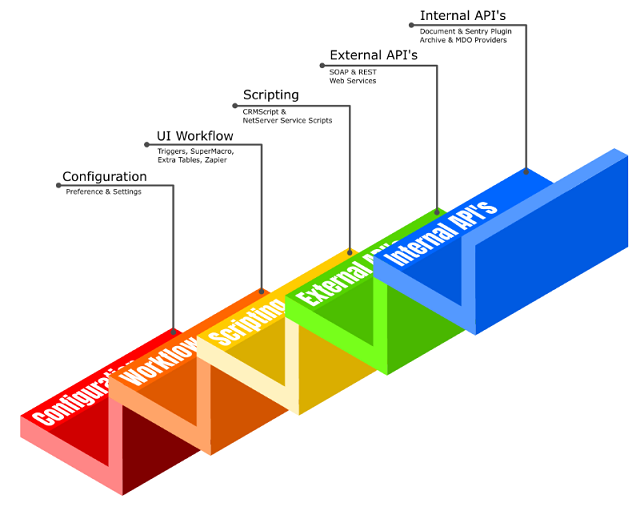

# Online versus OnSite Extensibility

Since 2005, SuperOffice has heavily invested in building API's that enables partners and customers to build integrations that encompass everything from the database schema changes all the way up to modifying UI elements in the application interface.

With this breadth of customization capability in onsite installations, it's sometimes hard for legacy partner application to adapt to move their application to the cloud.

There are several levels of SuperOffice extensibility, and these are commonly defined as Configuration, UI Workflow, Scripting, External API's and Internal API's.

The first two levels of extensibility are exposed inside the Administrative UI pages of SuperOffice. These are features commonly managed by System administrators and SuperOffice consultants, and are used to tailor SuperOffice to individual customer needs.

The scripting level pertains to a couple different features that provide similar functionality, albeit by different means. CRMScript is a SuperOffice scripting dialect similar to Javascript, and is managed inside the administrative pages of SuperOffice. NetServer scripting is an Application Server capability that is not accessible to online installations.

External API's refer to SuperOffice web services, and provide complete data access for both SuperOffice clients online applications.

Internal API's refer to the nearly limitless amount of customization capabilities that most onsite installations leverage to provide everything from custom pages and dialogs, document and sentry plugins, and so much more.

## Limitations

There are a number of online limitations when compared to on-site installations. Online applications are much more strict, and only have a subset of extensible capabilities.

With on-site installation, there is one web server hosting SuperOffice sites, and the owners can do what ever they with their installation.

Online tenants, on the other hand, share application file sets. Therefore, any compiled assemblies that are exposed to one installation would inadvertently expose those same customizations across all shared tenants. Since that cannot be isolated in a secure and effective manner, no one is permitted to deploy custom compiled assemblies to an online tenant.

Security and hosting restrictions in Online force both standard and custom applications must adapt in ways that support the features and functions they can provide, and accept the limitations that restrict the things they cannot.

The table below compares some of the most common extensibility points and defines which capabilities are possible in both environments.

|Level           |Extensibility           |Client         |Onsite|Online|
|----------------|------------------------|---------------|:----:|:----:|
|Configuration   |Preferences             |Sales & Service|X|X|
|                |Lists                   |Sales & Service|X|X|
|                |User-defined Fields     |Sales          |X|X|
|                |SAINT                   |Sales          |X|X|
|                |Sales Guide             |Sales          |X|X|
|                |Project Guide           |Sales          |X|X|
|UI Workflow     |Triggers                |Service        |X|X|
|                |SuperMacro              |Service        |X|X|
|                |Extra Tables            |Service        |X|X|
|                |Custom Screens          |Service        |X|X|
|                |Zapier                  |Sales & Service||X|
|Scripting       |CRMScript               |Service        |X|X|
|                |NetServer Service       |Sales & Service|X||
|                |Windows Client          |Sales          |X||
|External API's  |SOAP                    |Sales & Service|X|X|
|                |Restful                 |Sales & Service|X|X|
|                |Quote Connector         |Sales|X|X|
|                |ERP Sync Connector      |Sales|X|X|
|                |Database Mirroring      |Sales & Service||X|
|Internal API's  |Custom Pages            |Sales          |X||
|                |Custom Dialogs          |Sales          |X||
|                |DataHandlers            |Sales          |X||
|                |Ajax Methods            |Sales          |X||
|                |Archive Providers       |Sales          |X||
|                |MDO Providers           |Sales          |X||
|                |Document Plugins        |Sales          |X||
|                |Sentry Plugins          |Sales          |X||
|                |Batch Task Plugins      |Sales          |X||
|Database        |Continuous Database     |Sales & Service|X||
|                |SQL Scripts             |Sales & Service|X||

## Conclusion

While there are a significant number of ways partners and customers can continue to build towards and integrations, SuperOffice will continue to invest in research and development that in the future will be able to deliver equivalent onsite customization capabilities to SuperOffice CRM Online, however, a timeline for this is not available.

This policy decision is related to security reasons, and SuperOffice is not willing to compromise tenant security.

----

Further reading about online API's:

**Web Service API's**

* [REST](../api-reference/restful/index.md)
* [SOAP](../api-reference/soap/index.md)
* [Webhooks](../webhooks/index.md)

**Integration Services**

* [ERP Connectors](../erp-connectors/index.md)
* [Quote Connectors](../quote-connectors/index.md)
* [Database Mirroring](../../../../superoffice-docs/superoffice-docs/docs/mirroring/index.md)

