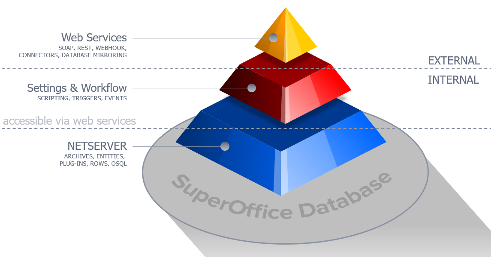

# Understanding NetServer

SuperOffice NetServer provides several **persistence layers**, each one allowing more fine-grain control than the next.

The more control over the queries you have, the more responsibility you take on for handling ensuring that relationships and keys are maintained properly.

You can choose to work at the level that suits you best.

* [Web services][5]
* [Archives][4]
* [Entities][3]
* [Rows][2]
* [SQL Data Objects (OSQL)][1]



Each level is described briefly below and in detail in the linked sections.

## Web services

When you are calling a web service, you typically **don’t have direct access to the database**. This is the highest level for working with NetServer.

A typical service call looks like this when using the NetServer helper classes:

```csharp
using SuperOffice.CRM.Services;
using SuperOffice;
using(SoSession mySession = SoSession.Authenticate("SAL0", ""))
{
  //Create a Contact Agent
  IContactAgent myContactAgent = AgentFactory.GetContactAgent();

  //Get a Contact carrier through the Contact Agent
  ContactEntity myContact = myContactAgent.GetContactEntity(1234);

  //Retrieving the Name Property of the Contact
  string name = myContact.Name;

  // warning: hard-coded address layout assumption!
  string city = myContact.Address[2][1];
}
```

## Archives

An archive is a **configurable multi-column list** that flattens the complex relationships between tables into a simple grid.

Archives simplify searching and retrieving collections of related data efficiently. The archive system is very flexible and supports many different providers. Each provider describes a set of related columns from the database.

Each provider supports a set of methods for finding out what columns are available. For simplicity, we have listed the basic set of columns in this help-file.

The example below shows how we can read the name+department as one field, and the postal address city as a separate field. Unlike an entity, the archive will not load categories or email addresses unless they are requested.

```csharp
using SuperOffice;
using SuperOffice.CRM.ArchiveLists;
using SuperOffice.Util;
using(SoSession newSession = SoSession.Authenticate("SAL0", ""))
{
  IArchiveProvider contactArchive = ArchiveProviderFactory.CreateFindContactProvider();

  //Set the columns that needs to be returned
  contactArchive.SetDesiredColumns("contactId", "nameDepartment", "address/city");

  //set the paging properties of the provider.
  contactArchive.SetPagingInfo(10, 0);

  //An array of restrictions with an implicit and in between them.
  contactArchive.SetRestriction(new ArchiveRestrictionInfo("contactId", "=", "1234"));

  //Display the retrieved data in another list box
  foreach (ArchiveRow row in contactArchive.GetRows())
  {
    foreach (KeyValuePair<string, ArchiveColumnData> column in row.ColumnData)
    {
      resultsListbox.Items.Add(column.Value.ToString());
    }
    resultsListbox.Items.Add(" --- ");
  }
}
```

## Entities

An entity is a **composite object**, which contains several related rows in one object. The entity handles maintaining the relationships for you.

> [!NOTE]
> Entities are business objects – not all tables have a corresponding entity.

An entity is suitable for **one-at-a-time work**. Each entity will load its sub-objects greedily, so loading an entity will load its related data in one big SELECT. Entity collections should be used with care, since accessing a sub-entity of an item in the collection in a loop may trigger an extra SELECT for each item in the collection.

You can use an entity's properties without worrying about the relationship details in the database. The `PostalAddress` is related to the `Contact` through an `owner_id` and `atype_idx` field, but these details are hidden by the entity:

```csharp
using SuperOffice;
using SuperOffice.CRM.Entities;
using(SoSession mySession = SoSession.Authenticate("SAL0", ""))
{
  //Get a contact through Idx class
  Contact theContact = Contact.GetFromIdxContactId(1234);

  //Access the Name property
  string name = theContact.Name;

  //Update the postal address
  theContact.PostalAddress.City = "Oslo";

  // Saves the address row
  theContact.Save();
}
```

## Rows

Rows are simple, straightforward persistence objects. Each table in the database has a corresponding Row object and Rows collection.

The row objects **do not contain any business logic**, so here you need to maintain the relationship between rows yourself.

You can use row objects to read and update the database. Each row object supports queries and `Save` and `Delete` methods.

```csharp
using SuperOffice.CRM.Rows;
using SuperOffice;
using(SoSession mySession = SoSession.Authenticate("SAL0", ""))
{
  //retrieve the contact row that we want to change
  ContactRow theContact = ContactRow.GetFromIdxContactId(1234);

  //get the name
  String name = theContact.Name;

  //retrieve the address of the contact using the address type
  // and the contact ID
  AddressRow theAddressRow = AddressRow.GetFromIdxAtypeIdxOwnerId(
      SuperOffice.Data.AddressType.ContactPostalAddress, 1234);

  //change the address
  theAddressRow.City = "Oslo";

  //save the changed address row
  theAddressRow.Save();
}
```

The Address row will have the `owner_id` field set to 1234, and the `atypeidx` field set to 1 (postal address for contact).

## SQL Data Objects (OSQL)

SQL is the lowest-level API. This is a database-independent SQL that is compile-time checked (unlike SQL strings which are checked at run-time). Objectified SQL (OSQL) lets you build your own queries and SQL commands, without worrying about Oracle’s peculiarities.

Another advantage is that the OSQL layer automatically adds transaction logging, computed fields updating, and security to your queries so that you don’t have to worry about these tedious details.

**Transactionlogging** means that every time you update a field, you don’t have to manually add a new row to the `traveltransactionlog` table yourself.

Computed fields are fields like the soundex fields or the last-updated-date fields. The OSQL system handles these for you.

Security means that the OSQL system will not return hidden or private data to users who are not authorized to see it. It will also prevent updates to rows that are supposed to be locked for the user. This makes working with SuperOffice data much easier.

The security system works by rewriting your query behind the scenes – so a simple query across the document table will join in the appointment and visiblefor tables. The security system needs data from these tables to work out if you can see each record or not.

```csharp
using SuperOffice.CRM.Data;
using SuperOffice.Data.SQL;
using SuperOffice.Data;
using SuperOffice;
using(SoSession mySession = SoSession.Authenticate("SAL0", ""))
{
  //retrieve the table info
  ContactTableInfo c = TablesInfo.GetContactTableInfo();

  //Creating an Instance of the Update Class of the person table
  Select contactQuery = S.NewSelect();
  contactQuery.ReturnFields.Add( c.ContactId, c.Name, c.Department );
  contactQuery.Restriction = c.ContactId.Equal( S.Parameter(1234) );

  using( QueryExecutionHelper qeh = new QueryExecutionHelper(contactQuery) )
  {
    while( qeh.Reader.Read() )
    {
      string name = qeh.Reader.GetString( c.Name );
    }
  }
}
```

The `ContactTableInfo` object represents an alias to a table in the database.

It exposes properties that represent the fields in the table, as well as dictionary information about the table (like its name, table-number in the dictionary). Each field also contains dictionary information (like the field type, size, name).

The fields support composition using SQL-like methods: `c.ContactId.Equal( S.Parameter(1234) )` or `c.Name.Like( S.Parameter( "SuperOffice%") )`

<!-- Referenced links -->
[1]: ../netserver/osql/index.md
[2]: ../netserver/rows/index.md
[3]: ../netserver/entities/index.md
[4]: ../netserver/archive-providers/index.md
[5]: ../netserver/services/index.md
