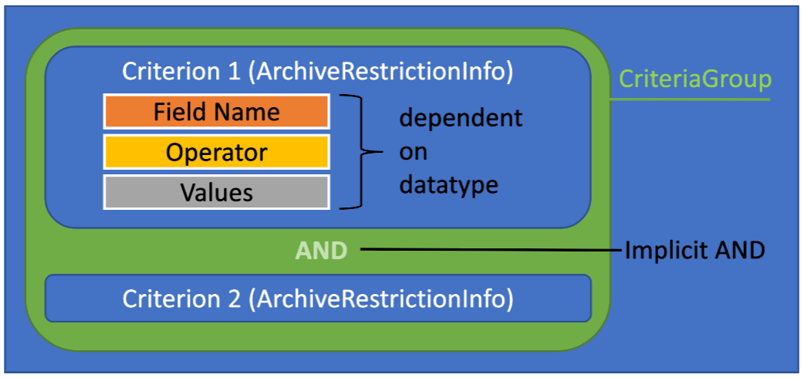
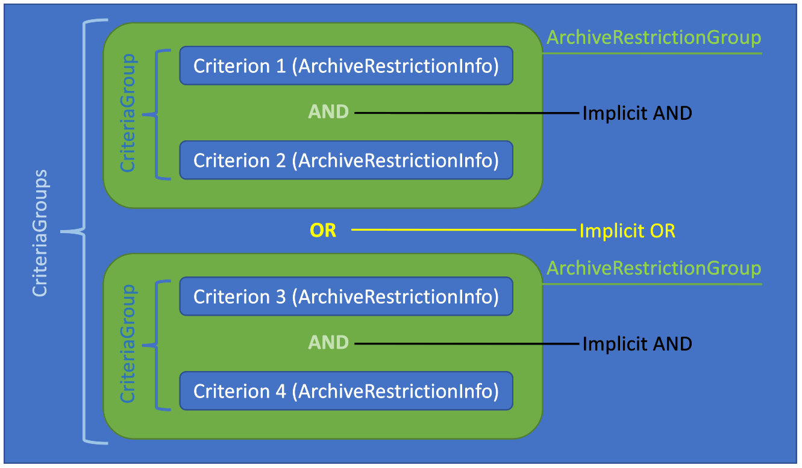

# Find and Selection

SuperOffice [Find](https://community.superoffice.com/en/customer/news/product/9-2-find-selection/) is a unification of two legacy approaches to search for specific information, the Find dialog and Selections. SuperOffice Find provides new APIs to easily implement the same search capability for integrations. This topic covers the terms and concepts needed to understand how to programmatically work with Find just like in SuperOffice.

> [!NOTE]
> The API details provided apply to SuperOffice v.9.2 and higher.

## Common Terms and Concepts

| Selection                 | Is a Find search kept for subsequent reference and/or analysis.                           |
|---------------------------|-------------------------------------------------------------------------------------------|
| ArchiveColumn             | Datatype that represents a single field in an Archive Row. Contains field data and properties about the field.|
| ArchiveProvider           | Data source used to populate table-based controls.                                        |
| ArchiveRow                | Datatype that returns a row one or more ArchiveColumn data fields.                        |
| ArchiveRestrictionInfo    | A filter criterion.                                                                       |
| ArchiveRestrictionGroup   | A group of filter criterion including an array of ArchiveRestrictionInfo                  |
| Criteria                  | Is the plural form of Criterion, a standard for evaluating and selecting an item.         |
| CriteriaGroup             | An array of `ArchiveRestrictionInfo` implicitly joined by AND operator.                   |
| CriteriaGroups            | An array of `ArchiveRestrictionGroup` implicitly joined by OR operator.                   |
| Criterion                 | A standard on which a judgement or decision is based.                                     |
| Entity                    | Refers to a SuperOffice business object, such as Company, Contact, Document, Project, etc.|
| MDO List                  | Multi-Department Organization list of related information, such as a list of categories.  |
| MDO Provider              | Data source that returns a list of items. Some lists contain child list properties.       |
| Restriction               | Used to specify a condition or filter that affects an archive provider result set.         |
| Shadow Archive Provider   | Alternative data source related to a parent archive provider.                             |
| Typical Search            | Predefined search to get started with search and selections more easily.                   |
| User                      | A person with login rights, more specifically the record in the associate table.          |

## Getting started

The way a search begins today is by clicking the Find option.


When clicked, the **Find** panel appears and all of the primary business entities are listed on the page. By default, one dynamic selection is created and maintained per user, per entity. When a user selects one of the Find _Entity_ links, SuperOffice retrieves the previously-saved dynamic selection criteria for the selected entity, or loads the default criteria for that entity, and populates the Selection search find panel.

### Find Panel


Alternatively, a pre-defined typical search option is chosen from an entity *Typical searches* drop-down menu. When selected, the pre-defined typical search criteria populates the Selection search find panel.

### Selection search panel


Each search is functionality equivalent to a Dynamic Selection. Once the search criteria have been set and saved, the Find becomes a Selection and is available for future reference.

The remainder of this article will highlight the key types and methods used to construct, persist and invoke a selection.

There are a couple of different ways to create a selection. While you can manually craft a `SelectionEntity`, save it, and then populate the CriteriaGroups, the recommended approach is to use the APIs to assembly the required information.

The recommended process is:

1. Get the available entities.
1. Get the SelectionForFind to get the archive provider name or selectionId.
1. Create default selection.
1. Get the available display columns for the archive provider
1. Get the available restriction columns for the archive provider
1. Get the available entities for the archive provider

## Get the Find entities

The Find page dynamically displays all entities that support the new Find system. It's recommended you determine which entities are available using the SelectionMemberTypeV2 MDOList provider.

> [!NOTE]
> Available entities depend on the current user's license.

### [REST](#tab/find-panel-1)

```http
GET /api/v1/MDOList/SelectionMemberTypeV2 HTTP/1.1
Authorization: Bearer {access_token}
Content-Type: application/json
Accept: application/json
```

### [Agent](#tab/find-panel-2)

```http
POST /api/v1/Agents/MDO/GetList HTTP/1.1
Authorization: Bearer {access_token}
Accept: application/json; charset=utf-8
Accept-Language: en
Content-Type: application/json; charset=utf-8

{
  "Name": "selectionmembertypev2",
  "ForceFlatList": true,
  "AdditionalInfo": "",
  "OnlyHistory": false
}
```

### [WebApi Client](#tab/find-panel-3)

```csharp
// setup access credentials
var authorization = new AuthorizationAccessToken("{access_token}", OnlineEnvironment.SOD);
var options = new WebApiOptions("https://sod.superoffice.com/Cust12345/api", authorization);

// perform the request
var mdoAgent = new MDOAgent(options);
MDOListItem[] findEntities = await mdoAgent.GetListAsync("selectionmembertypev2", true, string.Empty, false);
```

___

### Results

| Id | Name              | Tooltip                   | Deleted | Rank | Type | ChildItems | IconHint | ColorBlock | ExtraInfo | StyleHint | FullName | TableRight | FieldProperties |
|----|-------------------|---------------------------|---------|------|------|------------|----------|------------|-----------|-----------|----------|------------|-----------------|
| 5  | [SR_FIND_COMPANY] | [SR_FIND_COMPANY_TOOLTIP] | false   | 0    |      | []         | Contact  | 0          | contact   |           |          | null       | []              |
| 6  | [SR_FIND_PERSON]  | [SR_FIND_PERSON_TOOLTIP]  | false   | 0    |      | []         | Person   | 0          | person    |           |          | null       | []              |
| 6  | [SR_FIND_APPOINTMENT]  | [SR_FIND_APPOINTMENT_TOOLTIP]  | false   | 0    |      | []         | Appointment   | 0          | appointment    |           |          | null       | []              |
| 6  | [SR_FIND_SALE]  | [SR_FIND_SALE_TOOLTIP]  | false   | 0    |      | []         | Sale   | 0          | sale    |           |          | null       | []              |
| 6  | [SR_FIND_PROJECT]  | [SR_FIND_PROJECT_TOOLTIP]  | false   | 0    |      | []         | Project   | 0          | project    |           |          | null       | []              |
| 6  | [SR_FIND_SELECTION]  | [SR_FIND_SELECTION_TOOLTIP]  | false   | 0    |      | []         | Selection   | 0          | selection    |           |          | null       | []              |
| 6  | [SR_FIND_DOCUMENT]  | SR_FIND_DOCUMENT_TOOLTIP]  | false   | 0    |      | []         | Document   | 0          | document    |           |          | null       | []              |
| 6  | [SR_FIND_QUOTELINE]  | SR_FIND_QUOTELINE_TOOLTIP]  | false   | 0    |      | []         | Products   | 0          | QuoteLine    |           |          | null       | []              |
| 6  | [SR_FIND_TICKET]  | SR_FIND_TICKET_TOOLTIP]  | false   | 0    |      | []         | Ticket   | 0          | ticket    |           |          | null       | []              |

## Get the SelectionForFind type

From the results from the previous code example, use the entity name to get the appropriate SelectionForFind result, which not only specifies the correct archive provider name for this search type, it specifies the default selection id associated with the entity type. This ID can then be used to get the default criteria groups for that selection type.

Use the `SelectionAgent.GetSelectionForFind(entityName, typicalSearchId)` method to obtain the SelectionForFind type for a particular entity.

The value of typicalSearchId determines some internal logic.

* -1: Gets the default criteria for the current entity, and the selectionId of the working set is returned along with the providerName.
* 0: Gets the working set and don’t do anything else.
* \>0: Gets a selection with criterias set from the typical search of the given id.

### [RESTful Agent](#tab/get-archive-provider-1)

```http
POST https://sod.superoffice.com/Cust26759/api/v1/Agents/Selection/GetSelectionForFind HTTP/1.1
Authorization: Bearer {{token}}
Content-Type: application/json
Accept: application/json

{
  "EntityName": "contact",
  "TypicalSearchId": 0
}
```

### [WebApi Client](#tab/get-archive-provider-2)

```csharp
// setup access credentials
var authorization = new AuthorizationAccessToken("{access_token}", OnlineEnvironment.SOD);
var options = new WebApiOptions("https://sod.superoffice.com/Cust12345/api", authorization);

// perform the request
var selectionAgent = new SelectionAgent(options);

var entityName = "contact";
var typicalSearchId = 0;

SelectionForFind selectionForFind = await selectionAgent.GetSelectionForFind(entityName, typicalSearchId);
```

___

### SelectionForFind Result

| Property Name       |                                 Description                                 |
|---------------------|-----------------------------------------------------------------------------|
| CanSaveAsSelection  |          Indicates of selection entity can be saved as a selection.         |
| FieldProperties     | Mapping field names to access rights.                                       |
| FilterScreenHeading | Heading used on the Find filter page in SuperOffice.                        |
| MainHeading         | Heading used on the Find front page in SuperOffice.                         |
| ProviderName        | The name of the main archive provider use with this selection entity type.  |
| SelectionEntityHeading   | The plural form of the entity name, used on the Selection details tab. |
| SelectionId         | The selections primary key.                                                 |
| TableRight          | The carrier table rights.                                                   |

The `ProviderName` property is the main archive provider name used for this selection entity type. In this example, using contact as the entity name, the results indicate `ContactPersonDynamicSelectionV2` as the designated archive provider.

```json
{
  "ProviderName": "ContactPersonDynamicSelectionV2",
  "SelectionId": 21,
  "CanSaveAsSelection": true,
  "MainHeading": "[SR_FIND_COMPANY]",
  "FilterScreenHeading": "[SR_FIND_COMPANY]",
  "SelectionEntityHeading": "[SR_COMPANY_AND_PERSON]",
  "TableRight": null,
  "FieldProperties": {}
}
```

> [!NOTE]
> The SelectionId indicates the associates personalized dynamic selection primary key, containing a default list of criteria used to pre-populate a new selection of this entity type. This is updated each time a user creates a new dynamic selection.

#### Provider names

All Find Selections use an archive provider whose name ends with the “V2” suffix, i.e. [AppointmentDynamicSelectionV2](https://community.superoffice.com/documentation/sdk/SO.NetServer.Web.Services/html/Reference-ArchiveProviders-AppointmentDynamicSelectionV2ArchiveProvider.htm) and [ContactPersonDynamicSelectionV2](https://community.superoffice.com/documentation/SDK/SO.NetServer.Data.Access/html/Reference-ArchiveProviders-ContactPersonDynamicSelectionV2ArchiveProvider.htm). 

These providers are exclusively used together with the new CriteriaGroups for specifying restrictions.

Simply retrieve the `SelectionForFind` type and use the provider name when creating a new `SelectionEntity`.

### Get a selection entity

### [REST](#tab/get-selection-entity-1)

```http
GET /api/v1/Selection/18 HTTP/1.1
Authorization: Bearer {access_token}
Content-Type: application/json
Accept: application/json
```

### [Agent](#tab/get-selection-entity-2)

```http
POST /api/v1/Agents/Selection/GetSelectionEntity?selectionEntityId=18 HTTP/1.1
Authorization: Bearer {access_token}
Accept: application/json; charset=utf-8
Accept-Language: en
```

### [WebApi Client](#tab/get-selection-entity-3)

```csharp
// setup access credentials
var authorization = new AuthorizationAccessToken("{access_token}", OnlineEnvironment.SOD);
var options = new WebApiOptions("https://sod.superoffice.com/Cust12345/api", authorization);

int selectionId = 18;
// perform the request
var selectionAgent = new SelectionAgent(options);
SelectionEntity selectionEntity = await selectionAgent.GetSelectionEntity(selectionId);
```

___

> [!NOTE]
> It is important to not hard-code the selection provider names. Future support may include selections of more entities.

## Working with Selections

A SelectionEntity only contains a handful of properties, most of which appear in the selection details tab, and has the following considerations:

* Selection entity
* Type of selection
* Owner
* Category
* Who can see it.
* Description

### Create a Selection

Once you have the SelectionForFind, use the MainArchiveProvider to set the Selection property of the same name.

#### Selection Properties

| Name              | Description                                                            |
|-------------------|------------------------------------------------------------------------|
| Description       | A short description of the selection list.                             |
| MainProviderName  | Name of the archive provider responsible for populating the selection. |
| Name              | Selection name.                                                        |
| Owner             | The associate responsible for the selection.                           |
| SelectionCategory | List item that describes the type of selection.                        |
| SelectionType     | Defines whether this is a dynamic, static or combined selection.       |
| VisibleFor        | Define the user or groups with access rights to this selection.        |

## [REST](#tab/create-selection-entity-1)

```http
GET /api/v1/Selection/default HTTP/1.1
Authorization: Bearer {access_token}
Content-Type: application/json
Accept: application/json
```

### [Agent](#tab/create-selection-entity-2)

```http
POST /api/v1/Agents/Selection/CreateDefaultSelectionEntity HTTP/1.1
Authorization: Bearer {access_token}
Accept: application/json; charset=utf-8
Accept-Language: en
```

### [WebApi Client](#tab/create-selection-entity-3)

```csharp
// setup access credentials
var authorization = new AuthorizationAccessToken("{access_token}", OnlineEnvironment.SOD);
var options = new WebApiOptions("https://sod.superoffice.com/Cust12345/api", authorization);

int selectionId = 18;
// perform the request
var selectionAgent = new SelectionAgent(options);
SelectionEntity selectionEntity = await selectionAgent.CreateDefaultSelectionEntity();
```

___

#### Save the selection entity

Only a subset of selection properties must be set to save a selection. The main properties are the Name, MainProviderName, and SelectionCategory.

### [REST](#tab/save-selection-entity-1)

```http
POST /api/v1/Selection HTTP/1.1
Authorization: Bearer {access_token}
Content-Type: application/json
Accept: application/json

{
  "Description": "Testing Selections (Description)",
  "Postit": "",
  "SelectionCategory": {
    "Id": 2,
  },
  "IncludePerson": 0,
  "Name": "Selections from API (Name)",
  "SelectionType": "Dynamic",
  "CompanyUnique": false,
  "TargetTableNumber": 5,
  "TargetTableName": "contact",
  "Completed": false,
  "LeftSelectionId": 0,
  "RightSelectionId": 0,
  "SelectionUnionType": "Unknown",
  "MainProviderName": "ContactPersonDynamicSelectionV2",
  "ShadowProviderName": "",
  "MainHeading": "[SR_SELECTION_DYNAMICSELECTION_OF] [SR_COMPANY_AND_PERSON] (MainHeading)",
  "MemberTabHeading": "[SR_COMPANY_AND_PERSON] (MemberTabeHeading)",
  "VisibleFor": [
    {
      "VisibleId": 0,
      "Visibility": "All",
    }
  ]
}
```

### [Agent](#tab/save-selection-entity-2)

```http
POST /api/v1/Agents/Selection/SaveSelectionEntity HTTP/1.1
Authorization: Bearer {access_token}
Accept: application/json; charset=utf-8
Accept-Language: en

{
  "Description": "Testing Selections (Description)",
  "Postit": "",
  "SelectionCategory": {
    "Id": 2,
  },
  "IncludePerson": 0,
  "Name": "Selections from API (Name)",
  "SelectionType": "Dynamic",
  "CompanyUnique": false,
  "TargetTableNumber": 5,
  "TargetTableName": "contact",
  "Completed": false,
  "LeftSelectionId": 0,
  "RightSelectionId": 0,
  "SelectionUnionType": "Unknown",
  "MainProviderName": "ContactPersonDynamicSelectionV2",
  "ShadowProviderName": "",
  "MainHeading": "[SR_SELECTION_DYNAMICSELECTION_OF] [SR_COMPANY_AND_PERSON] (MainHeading)",
  "MemberTabHeading": "[SR_COMPANY_AND_PERSON] (MemberTabeHeading)",
  "VisibleFor": [
    {
      "VisibleId": 0,
      "Visibility": "All",
    }
  ]
}
```

### [WebApi Client](#tab/save-selection-entity-3)

```csharp
// setup access credentials
var authorization = new AuthorizationAccessToken("{access_token}", OnlineEnvironment.SOD);
var options = new WebApiOptions("https://sod.superoffice.com/Cust12345/api", authorization);

var selectionAgent = new SelectionAgent(config);
selectionEntity = await selectionAgent.CreateDefaultSelectionEntityAsync();
selectionEntity.Name = "Selections from API (Name)";
selectionEntity.Description = "Testing Selections (Description)";
selectionEntity.MailingsProviderName = "ContactPersonDynamicSelectionV2";
selectionEntity.SelectionCategory = new SelectionCategory() { Id = 2 };
selectionEntity.SelectionType = SelectionType.Dynamic;
selectionEntity.VisibleFor = new[] 
{
    new VisibleFor()
    {
        Visibility = Visibility.All,
        VisibleId = 0
    }
};

selectionEntity = await selectionAgent.SaveSelectionEntityAsync(selectionEntity);

```

___

> [!NOTE]
> When saving a selection, the default setting for populating the VisibleFor property looks at the user preferences. Section 'Defaults' and key 'DefaultSelectionVisibleFor'. The default value is 0 (All). Alternative configurations for this setting are: 1 (Associate) or 2 (Group). See the default preferences in Settings and maintenance for `Visibility for selections`.

### Selection Criteria

Archive provider columns are the core of selection. Just like a SQL SELECT statement, where there are any number of select fields and any number of WHERE clause criteria, selections use archive provider columns as select fields and criteria. A selection criteria is established using `CriteriaGroups`.

`CriteriaGroups` contain an array of `ArchiveRestrictionInfo`, and each `ArchiveRestrictionInfo` is implicitly joined by an AND operator. This array is encapsulated in an `ArchiveRestrictionGroup` and referred to as one CriteriaGroup.

`CriteriaGroups` are an array of `ArchiveRestrictionGroup`, and each group is implicitly joined by an OR operator.



Take the following SQL, for example:

```sql
SELECT firstName, lastName 
FROM CONTACT AS C
WHERE (C.name LIKE 'Super%' AND C.business_idx = 2) 
   OR (C.name LIKE 'Duper%' AND C.category_idx = 12)
```

The first WHERE criteria `(C.name LIKE 'Super%' AND C.business_idx = 2)` is a criteria group, comprised of two distinct criteria. To build the equivalent into an ArchiveRestrictionGroup, it looks like this:

```csharp
var criteriaGroup = new ArchiveRestrictionGroup()
{
    Name = "0",
    Rank = 0,
    Description = "Hidden Description",
    Restrictions = new []
    {
        new ArchiveRestrictionInfo()
        {
            Name = "name",
            Operator = "begins",
            Values = new[] { "Super" },
            IsActive = true,
            ColumnInfo = new ArchiveColumnInfo()
            {
                Name = "name",
                RestrictionType = "stringorPK",
                RestrictionListName = "locateContact_new",
                //... left out for brevity
            },
            InterOperator = InterRestrictionOperator.And
        },
        new ArchiveRestrictionInfo()
        {
            Name = "name",
            Operator = "begins",
            Values = new[] { "Duper" },
            IsActive = true,
            ColumnInfo = new ArchiveColumnInfo()
            {
                Name = "name",
                RestrictionType = "stringorPK",
                RestrictionListName = "locateContact_new",
                //... left out for brevity
            },
            InterOperator = InterRestrictionOperator.And
        }
    }
};

```

An array of `ArchiveRestrictionGroup` is referred to as `CriteriaGroups`, and as previously stated are implicitly joined by an OR operator.

As seen in the C# example above, the Name and Rank share the same numerical value, represent the order they appear in SuperOffice. The Name and Rank for the next `ArchiveRestrictionGroup` in the array is 1, and any subsequent group would increment one more than the one before it.



The main points to understand are:

1. Each `ArchiveRestrictionInfo` in an `ArchiveRestrictionGroup` is implicitly joined by an AND operator.
2. Each `ArchiveRestrictionGroup` is implicitly joined by an OR operator.

The grouping and use of the operator as such means it's simple to define, maintain and comprehend how groups of criteria are applied to selection search routines.

#### Column Names

While it's possible to lookup archive provider columns using the NetServer documentation reference, it's recommended to get **and cache** the columns using the API.

There are three types of interesting archive information:

* Archive columns
* Archive restriction columns
* Archive entities

They are obtained using the following format:

`archive{Descriptor}:{archiveProviderName}`

### Get archive columns

### [REST](#tab/get-archive-columns-1)

```http
GET /api/v1/MDOList/archiveColumns:ContactPersonDynamicSelectionV2 HTTP/1.1
Authorization: Bearer {{token}}
Content-Type: application/json
Accept: application/json

```

### [Agent](#tab/get-archive-columns-2)

```http
POST /api/v1/Agents/MDO/GetList HTTP/1.1
Authorization: Bearer {{token}}
Content-Type: application/json
Accept: application/json

{
  "Name": "archiveColumns:ContactPersonDynamicSelectionV2",
  "ForceFlatList": true,
  "AdditionalInfo": "",
  "OnlyHistory": false
}

```

### [WebApi Client](#tab/get-archive-columns-3)

```csharp
// setup access credentials
var authorization = new AuthorizationAccessToken("{access_token}", OnlineEnvironment.SOD);
var options = new WebApiOptions("https://sod.superoffice.com/Cust12345/api", authorization);

// perform the request
var mdoAgent = new MDOAgent(options);
MDOListItem[] listItems = await mdoAgent.GetList("archiveColumns:ContactPersonDynamicSelectionV2","true","",false);
```

___

### Get archive restriction columns

### [REST](#tab/get-archive-restriction-columns-1)

```http
GET /api/v1/MDOList/archiveRestrictionColumns:ContactPersonDynamicSelectionV2 HTTP/1.1
Authorization: Bearer {{token}}
Content-Type: application/json
Accept: application/json

```

### [Agent](#tab/get-archive-restriction-columns-2)

```http
POST /api/v1/Agents/MDO/GetList HTTP/1.1
Authorization: Bearer {{token}}
Content-Type: application/json
Accept: application/json

{
  "Name": "archiveRestrictionColumns:ContactPersonDynamicSelectionV2",
  "ForceFlatList": true,
  "AdditionalInfo": "",
  "OnlyHistory": false
}

```

### [WebApi Client](#tab/get-archive-restriction-columns-3)

```csharp
// setup access credentials
var authorization = new AuthorizationAccessToken("{access_token}", OnlineEnvironment.SOD);
var options = new WebApiOptions("https://sod.superoffice.com/Cust12345/api", authorization);

// perform the request
var mdoAgent = new MDOAgent(options);
MDOListItem[] listItems = await mdoAgent.GetList("archiveRestrictionColumns:ContactPersonDynamicSelectionV2","true","",false);
```

___

### Get archive entities

### [REST](#tab/get-archive-entities-columns-1)

```http
GET /api/v1/MDOList/archiveEntities:ContactPersonDynamicSelectionV2 HTTP/1.1
Authorization: Bearer {{token}}
Content-Type: application/json
Accept: application/json

```

### [Agent](#tab/get-archive-entities-columns-2)

```http
POST /api/v1/Agents/MDO/GetList HTTP/1.1
Authorization: Bearer {{token}}
Content-Type: application/json
Accept: application/json

{
  "Name": "archiveEntities:ContactPersonDynamicSelectionV2",
  "ForceFlatList": true,
  "AdditionalInfo": "",
  "OnlyHistory": false
}

```

### [WebApi Client](#tab/get-archive-entities-columns-3)

```csharp
// setup access credentials
var authorization = new AuthorizationAccessToken("{access_token}", OnlineEnvironment.SOD);
var options = new WebApiOptions("https://sod.superoffice.com/Cust12345/api", authorization);

// perform the request
var mdoAgent = new MDOAgent(options);
MDOListItem[] listItems = await mdoAgent.GetList("archiveEntities:ContactPersonDynamicSelectionV2","true","",false);
```

___

Whether getting columns or entities, the results an array of MDOListItem. The structures do differ slightly between columns and entities.

#### Column Results

| Property           |Description                                           |
|--------------------|------------------------------------------------------|
|ID                  | Arbitrary number, starts at 1                        |
|Name                | DisplayName of column                                |
|Tooltip             | DisplayTooltip of column                             |
|Rank                | Same as ID (items are already in rank order)         |
|Deleted             | always false                                         |
|Type                | the programmatic name of the column, like person/fullName |
|Color               | always 0                                             |
|IconHint            | iconhint from column                                 |
|StyleHint           | blank                                                |
|ExtraInfo           | When archiveColumns: list, an “Y” or “N” if OrderBy is supported.<br/>When archiveRestrictionColumns: list, the column RestrictionType |
|Selected            | true if the column is selected for display, i.e. there is a row in the superlistcolumnsize table |

#### Entity Results

| Property           |Description                                           |
|--------------------|------------------------------------------------------|
|ID                  | Arbitrary number, starts at 1                        |
|Name                | DisplayName of entity                                |
|Tooltip             | DisplayTooltip of entity                             |
|Rank                | Same as ID (items are already in rank order)         |
|Deleted             | always false                                         |
|Type                | the programmatic name of the entity, like retired    |
|Color               | always 0                                             |
|IconHint            | blank                                                |
|StyleHint           | blank if entity is optional, “mandatory” if the entity isn’t optional |
|ExtraInfo           | blank                                                |
|Selected            | true if the entity is selected for display, i.e. there is a row in the superlistcolumnsize table  with an e: prefix in the listOwner field |

## Operators and data types

Difference data types can have different operators.

| Data type       | Description                                                                 |
|-----------------|-----------------------------------------------------------------------------|
| All types       | equals, isNull, isNotNull                                                   |
| Bool            | set                                                                         |
| Int, Decimal    | equals, = , unequals, !=, less, <, greater, >, between                      |
| String          | begins, contains, is, notBegins, notContains, isNot                         |
| Date            | See `Working with dates` section                                            |
| DateTime        | See `Working with dates` section                                            |
| Associate       | associateIsOneOf, associateIsNotOneOf, currentAssociate                     |
| Lists           | equals, oneOf, notOneOf                                                     |
| intArray / Tags | intArrayAllOf, intArrayNotAllOf, intArrayOneOf, intArrayNotAnyOf            |

### Working with dates

The following table contains the list of common date and datetime operators.

| Data type       | Description                                                                    |
|-----------------|--------------------------------------------------------------------------------|
| Date            | after, afterToday, before, beforeToday, between, date, from, equals, to, today |
| DateTime        | dateTime, beforeTime, afterTime                                                |

The Date and DateTime restriction types have had their relative operators changed. Relative operators are those that refer to the current date, and several existing relative operators are considered legacy.

### Legacy relative operators

| Data type | Description                                                                 |
|-----------|-----------------------------------------------------------------------------|
| Weeks     | lastWeek, thisWeek, nextWeek                                            |
| Months    | lastMonth, thisMonth, nextMonth                                        |
| Quarter   | lastQuarter, thisQuarter, nextQuarter                                 |
| Year      | thisHalf, thisYear                                                       |

### New relative operators

Instead of having period-specific operators, they are now more generic. Each relative operator takes two arguments; the number of periods and the period type.

* thisPeriod
* thisAndNext
* thisAndPrevious
* nextPeriod
* previousPeriod
* thisPreviousAndNext

| Period Types |              |
|-- |:---------|
| 1 | days     |
| 2 | weeks    |
| 3 | months   |
| 4 | quarters |
| 5 | years    |

In this way, we can express thisAndNext 2 weeks or thisAndPrevious 2 years.

> [!NOTE]
> The old operators still exist within the code and will work; however, their use is strongly discouraged. If saved through the criteria API, they will be converted to the new, equivalent operators > and values.

Some archive columns have changed their type from DateTime to Date. The archive grid control displayed both of them as just Date, but we actually need to differentiate and now do so.

There are some new `RestrictionTypes` as well:  

* `ReporterDate` (which adheres to the old operators, only used in Reports)
* `TimeSpan`, encoded in seconds as a new CultureDataFormatter type with marker [TS:
* `EjUser`, referring to an `ejuser.id`
* `UserGroup`, referring to a `usergroup.usergroup_id`
* `IntArray`, used for Tags

Each of these has operators and value hints in the usual manner, accessible through the appropriate MDO list (`restrictionOperators` with the restriction type passed in through the `ExtraInfo` parameter). They are used for new archive columns and should not cause any compatibility issues.

#### Fetching and saving criteria

New Selection introduces the concept of __criteria groups__, where the criteria within each group are connected by AND, and groups are connected by OR. The database layout to support this has been in place for a long time and was used in an equivalent fashion for Saint Status definitions. There, each criteria group was in a separate tab in the user interface; in the new Filter screen groups are stacked vertically instead.

APIs that only work with a simple `ArchiveRestrictionInfo[]` do not support the concept of multiple groups. Such methods will only return the first group, and on writing will delete any other groups. Examples are `GetDynamicSelectionCriteria` and `SetDynamicSelectionCriteria`; and similar methods in the Find agent. All these methods should be considered obsolete when applied to Selection and Find.

Selection criteria should be fetched and stored using the `GetDynamicSelectionCriteriaGroups` and `SetDynamicSelectionCriteriaGroups` methods on the Selection agent. Using them will retrieve and save all groups, and avoid having to make assumptions about the StorageKey concept used in the Find agent methods. Contrast the differences in the two calls (the ts.Key is a selection id):
