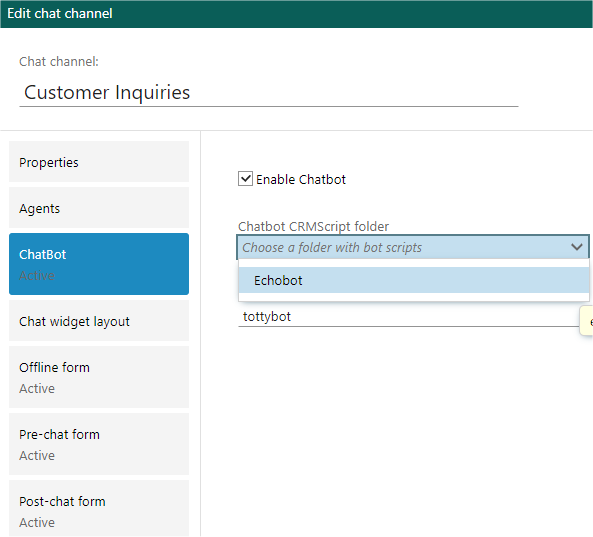

You pick a folder containing a CrmScript named `echobot register`.

## Bot Register

This script is called when a bot is configured / saved in channel admin. Not called during chat with customer.

This script identifies the script folder as a chatbot. It must exist in order for a script folder to be recognized as a chatbot.

First any existing **bot register** script that is registered on the channel is called with input values:

* `action` = "unregister"
* `topicid` = the id of the topic the bot is active on. 

This is to allow the old bot to clean up its scripts and triggers that it may have installed.

The script is also called during channel delete.

The new bot's register script is called with input values:

* `action` = "register"
* `topicid` = the id of the topic the bot is being saved on. 

The register script can do whatever it needs to - create new triggers for example, set up state, fetch access/refresh tokens.
It doesn't have to do anything.

SuperOffice will scan the folder for the names other chatbot scripts in the folder

* `%bot%Session%Created`
* `%bot%Session%Status%Changed`
* `%bot%Message%Received`

and store the script ids in the ChatTopic record.

This means we don't have to scan the folder on every new message, but we won't pick up
changes to the folder until the chatbot registration is changed. If you register a bot
and then add a new script `bot message received` to the folder, it won't call the new script
until you deactivate the chatbot and re-activate it. This will trigger a new scan of the folder,
and pick up the new id.
