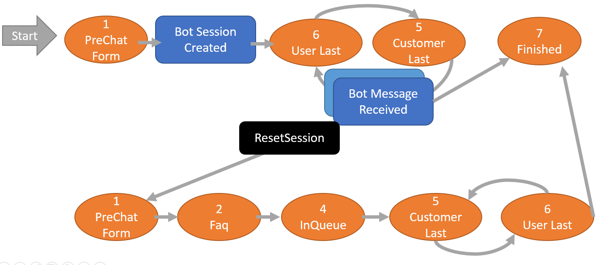
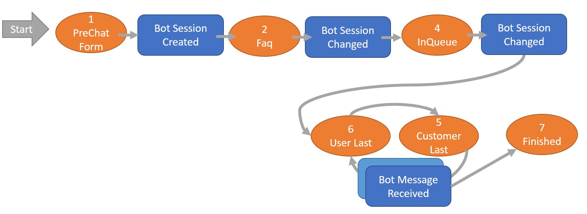

## Chat Sessions

Sessions are created when a customer connects to the chat service.


Depending on how the channel is configured, the initial state may be "in queue"(4) or "pre-chat-form"(1), or "faq" (2).

When a bot is active, the bot script takes over, and the message is not shown in the queue. 
The bot prevents the session from going to the offline form state, since the bot is always present.

When the bot hands off the session to humans, the session may go to `offline` status because there are no humans available.

### Bot first or form first?



Usually the bot goes first, and then if the bot fails to come up with answer, then the session is handed off to a human, and then the pre-chat form happens. This is the easiest flow to implement. See the **Echobot** example.

However, it is possible to have the pre-chat forms appear first, then the bot, then the human - it just requires a bit of care when programming the bot. See the **Echobot2** example.


### Pre-chat form

If a pre-chat form is configured, this will be the first state. This will prompt the user to fill in fields.

If a FAQ category is configured, this will show the FAQ prompt and wait for the users question.
Session state is 2.  The user's first message will trigger the `bot message received` script.
The chat system will look up a suitable FAQ and send that as a response (if a match is found),
then ask if the FAQ is ok. If the user clicks No, then the session is state forwarded from FAQ(2) to In-Queue(4).

When the session is In-Queue, the bot should say hello.



If the bot says hello before the session reaches In-Queue(4), the session will move to state UserLast(6), and skip the FAQ and pre-chat-form status.

### Post-chat form

If a post-chat form is configured, then the form is displayed when the state is set to Finished(7).
When the session is in this state, the form fields are displayed to the user.

The user may re-activate the chat from this state, but this cannot be detected until the user sends a message.

## `Bot Session Created`

Called when a new session starts on a channel with the bot activated.

Some of the input values:

* `chatSession.id` - session has been saved/created at this point.
* `chatSession.topicId` - topic the session belongs to
* `chatSession.status` - state of new session
* `chatTopic.name` - name of channel
* `chatTopic.botName` - name of bot

The bot can post messages at this point, to say welcome.

`addChatMessage(Integer sessionId, String message, Integer type, String author, Integer specialType, String specialParams, DateTime whenPosted)`

Posting a message will set the chat session status to 6 (user last) since the bot was the last to speak.
This keeps the session off the queue, and skips any pre-chat form.

If you do nothing, then the session go to the queue, waiting for a human - or to the pre-chat form (if configured).

In addition to the bot script, these things also happen:

* all CrmScript triggers defined for the **Chat Session Created** event are run.
* webhooks for **chatSession.created** are dispatched.

### Example

```crmscript
#setLanguageLevel 3;

EventData ed = getEventData();
String botName = ed.getInputValue("chatTopic.botName");
Integer sessionId = ed.getInputValue("chatSession.id").toInteger();
Integer toCustomer = 1;

String message = "Welcome human. Say 'human' to transfer. Say 'quit' to end session.";
addChatMessage(sessionId, message, toCustomer, botName, 0, "" );
```

## `Bot Session Changed`

This script is called when session changes status - i.e. when pre-form is filled in by customer.

Some of the input values

* `chatSession.id` - session id
* `chatSession.topicId` - topic the session belongs to
* `chatSession.status` - new status

Variables `status.old` and `status.new` contain old and new values for chat session status.

The bot can add messages to sign off, or do other tasks.

In addition to the bot script, these things also happen:

* all CrmScript triggers defined for the **Chat Session Changed** event are run.
* webhooks for **chatSession.changed** are dispatched.

## Handing off session

Call `resetChat(sessionId)` for the bot to hand off the session to humans.
This will trigger either the in-queue state, or the offline-form, depending on the
availability of humans.

When the session has been handed off, the bot scripts are not called any more.
The session is marked with 'botActive' = false, which blocks further calls to the bot scripts.

The generic CrmScript triggers for chat will continue to fire, as well as the webhooks. 

## Ending a session

Call `setChatStatus(sessionId, 7)` to end the session.

```crmscript
   setChatStatus(sessionId, 7); // 7 = closed
```

This will trigger the post-form (if configured).
