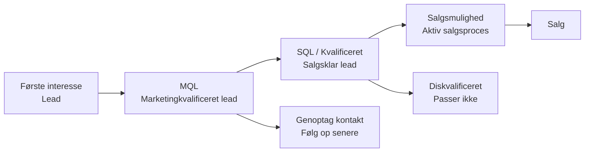

# Leadhåndtering

Leadhåndtering hjælper dig med at forstå, hvor potentielle kunder befinder sig i deres købsrejse, og giver både marketing og salg en fælles, struktureret måde at spore interesse, parathed og udvikling på.

Ved at bruge kategorier og leadstatusser konsekvent kan du se, hvilke leads der kræver opmærksomhed nu, hvilke der skal plejes, og hvilke der er klar til at gå videre i salgsprocessen.

Leadinformation vises direkte på firma- og personkort, i kontaktfaner, i udvalg og i dashboards, hvilket gør det nemt at prioritere næste trin.

## Leadlivscyklus

En lead går typisk gennem flere trin, før den bliver en salgsmulighed. SuperOffice bruger en kombination af **firmakategori** og **personens leadstatus** til at afspejle hvert trin. Disse værdier hjælper dig med at forstå, om en lead er ny, bliver kontaktet, er klar til salgsopfølgning eller ikke passer.

## Leadstatus

Feltet **Leadstatus** sporer en leads udvikling fra første kontakt til kvalificering. Det hjælper salgs- og marketingteams med at prioritere aktiviteter og sikrer et ensartet overblik over, hvor leadet befinder sig i salgstragten.

Leadstatus er kun tilgængelig for personer, hvis firma tilhører en kategori i gruppen **Potentiel kunde** med **Aktivér leadstatus** valgt.

Når denne indstilling er aktiv, vises feltet direkte under feltet **Kategori** på personkortet. Hver person kan have sin egen leadstatus, selv om flere personer tilhører samme firma. For eksempel kan én person være *Diskvalificeret*, mens en anden er *Kvalificeret* og klar til at gå videre i salgsprocessen.

Når en ny person oprettes for et firma med leadstatus aktiveret, sættes feltet automatisk til *Åben*. Hvis firmaets kategori senere ændres til en, der ikke bruger leadstatus, forsvinder feltet fra visningen, men den sidst registrerede værdi bevares. Dette sikrer, at leadinformation forbliver søgbar og tilgængelig i dashboards, selv når den ikke længere kan redigeres i brugergrænsefladen.

> [!TIP]
> Hvis du ikke ser feltet **Leadstatus** på en person, er dennes kategori ikke en del af gruppen *Potentiel kunde*.

### Foruddefinerede statusser

Følgende statusser er tilgængelige som standard i SuperOffice og repræsenterer nøgletrin i, hvordan en lead kan udvikle sig gennem kvalificeringsprocessen. [Leadstatusser kan tilpasses][2] af administratorer.

| Status | Beskrivelse |
|---|---|
| Åben | Ingen kontakt er foretaget. |
| Kontakter | Sælger forsøger at få kontakt. |
| Diskvalificeret | Leaden opfylder ikke kriterierne. |
| Genoptag kontakt | Ikke klar endnu. |
| Kvalificeret | Klar til salgsproces. |

## Kategorier for potentielle kunder

Feltet **Kategori** på et firma definerer typen af forhold, du har til det pågældende firma, såsom *Kunde*, *Partner* eller *Lead*. Kun kategorier, der tilhører gruppen **Potentiel kunde**, viser feltet **Leadstatus**.

Gruppering af kategorier efter type sikrer, at leads håndteres konsekvent:

* **Søgninger og dashboards** kan nemt filtrere på alle potentielle kunder på én gang.
* **Automatiseringer** kan sikkert opdatere kategorier uden ved et uheld at nedgradere kunder til leads.
* **Synlighed:** feltet **Leadstatus** vises automatisk kun, hvor det er relevant.

### Foruddefinerede kategorier

Følgende kategorier repræsenterer nøgletrin i, hvordan en lead kan udvikle sig gennem salgstragten. De er tilgængelige som standard i **nye** SuperOffice-databaser version 11.6 og nyere. Kategorier kan tilføjes og ændres af administratorer.

| Kategori | Beskrivelse |
|---|---|
| Lead | Indledende interesse. |
| Marketingkvalificeret lead (MQL) | Matcher målgruppen / har anmodet om kontakt. |
| Mulighed | Aktiv salgsproces. |
| Tabt mulighed | Kunde med tabte salg. |

## Hvor leadinformation vises

Leadinformation vises flere steder i SuperOffice CRM, så det er nemt at se en leads udvikling og handle, når det er nødvendigt.

* **Personkort:** Feltet **Leadstatus** vises direkte under **Kategori**, når firmaet bruger en potentiel kundekategori med leadstatus aktiveret.

    ![Kategori og leadstatus vist på personkort. -screenshot][img2]

* **Firmakort:** Firmaets **Kategori** afgør, om personer under det pågældende firma kan vise leadstatus.

* **Detaljekortet Kontakter:** Du kan tilføje kolonnerne **Leadstatus**, **Kategori** og **Kategorigruppe** for at sortere, filtrere eller gruppere personer baseret på deres leadstadie.

    ![Leadstatus vist i firmaskærmbilledet. -screenshot][img1]

* **Søgning:** Leadrelaterede felter som **Kategori**, **Kategorigruppe** og **Leadstatus** kan bruges til at opbygge dynamiske udvalg til marketing eller leadpleje.

* **Tavle-visning:** Visualiser leads efter status i et kolonnebaseret layout.

* **Dashboards:** Dashboardfelter kan vise antal eller lister over leads i specifikke statusser eller kategorier, så du kan overvåge nye, aktive eller diskvalificerede leads.

## Relateret indhold

* [Arbejd med leads i SuperOffice][4]
* [Konverteringssporing][5]
* [Konfigurer leadhåndtering][3] - i Indstillinger og vedligeholdelse
* [Konfigurer firmakategorier][1] - i Indstillinger og vedligeholdelse
* [Administrér leadstatusser][2] - i Indstillinger og vedligeholdelse

<!-- Referenced links -->
[1]: ../admin/add-company-category.md
[2]: ../admin/add-lead-status.md
[3]: ../admin/index.md
[4]: work-with-leads.md
[5]: ../../marketing/utm/learn/index.md

<!-- Referenced images -->
[img1]: ../../../media/loc/en/lead/company-lead-with-contacts-section-tab.png
[img2]: ../../../media/loc/en/lead/contact-card-open-lead.png
