# Konverteringssporing

Markedsførere har ofte svært ved at forstå, hvilke kampagner, kanaler eller platforme der genererer de mest værdifulde leads. Uden denne viden er det svært at optimere budgettet eller dokumentere afkastet (ROI).

Konverteringssporing i SuperOffice hjælper dig med at knytte marketingaktiviteter til faktiske resultater. Den bruger **UTM-parametre** til at identificere, hvor hvert lead kommer fra, og hvordan besøgende interagerer med dit websted, før de bliver personer eller salgsmuligheder.

Ved at spore kilden til hvert lead kan du:

* Se præcist, hvor hvert lead kom fra (f.eks. LinkedIn-annonce, nyhedsbrev eller Google-søgning)
* Identificere hvilke kanaler og kampagner der genererer flest leads og aftaler
* Sammenligne kampagnepræstationer og fokusere budgettet på det, der virker

For at forstå, hvordan UTM-sporing fungerer i detaljer, se [UTM-parametre forklaret][1].

## Datapunkter, der spores i SuperOffice CRM

SuperOffice registrerer flere vigtige datapunkter, der hjælper dig med at forstå, hvordan leads bliver oprettet og konverteret.

| Datapunkt | Beskrivelse | Lagringsniveau |
|---|---|---|
| **Første interaktion** | Den allerførste kilde, medie og kampagne, der fik personen til at interagere med virksomheden. | Person |
| **Leadsgenerering** | Den kilde, det medie og den kampagne, der førte til, at leadet faktisk blev oprettet i CRM. | Person |
| **Konvertering** | Den seneste kilde, det medie og den kampagne, der fik en eksisterende person til at indsende en ny formular. | Formularindsendelse |
| **Virksomhedskilde** | Når en ny person tilføjes, og et firmakort oprettes samtidigt, gemmes kilden på firmakortet. | Firma |

> [!NOTE]
> Første interaktion, leadsgenerering og virksomhedskilde spores kun for nye personer og virksomheder, der ikke allerede findes i CRM.

## Sådan registreres lead-kilden

En besøgende klikker på en **LinkedIn-annonce** og lander på dit websted. Når vedkommende ankommer, gemmes *første interaktionsdata* – herunder kilde, medie og kampagne – i browseren. Den besøgende forlader siden uden yderligere handling.

Senere klikker den samme person på en **Facebook-annonce** og vender tilbage til webstedet. Denne gang udfylder vedkommende og **indsender en formular**. Når formularen indsendes, registrerer SuperOffice kildeoplysningerne fra URL'en.

Hvis indsendelsen opretter en ny person eller et nyt lead i SuperOffice CRM, gemmes både **første interaktion** og **leadsgenerering** på personkortet.

```mermaid
flowchart TD
    subgraph Journey["Besøgsrejse"]
        A["<br/>&#8203;Klikker på LinkedIn-annonce<br/> "] --> B["<br/>&#8203;Besøger websted<br/> "]
        B --> C["<br/>&#8203;Forlader webstedet<br/> "]
        C --> D["<br/>&#8203;Første interaktion gemt i browseren<br/> "]
        D --> E["<br/>&#8203;Klikker på Facebook-annonce<br/> "]
        E --> F["<br/>&#8203;Besøger webstedet igen<br/> "]
        F --> G["<br/>&#8203;Indsender formular<br/> "]
    end

    subgraph CRM["CRM-behandling"]
        G --> H["<br/>&#8203;Kilde registreret<br/> "]
        H --> I["<br/>&#8203;Både første interaktion og leadsgenerering gemt i SuperOffice<br/> "]
    end

    style Journey fill:#f5faff,stroke:#c0d9f1,stroke-width:1px
    style CRM fill:#f2fff8,stroke:#a8e0c0,stroke-width:1px
```


<!--Alt-tekst: Flow, der viser hvordan første interaktion og leadsgenerering gemmes i SuperOffice CRM efter en formularindsendelse.-->

## Vis registrerede UTM-data i SuperOffice CRM

Når SuperOffice registrerer UTM-parametre fra en formularindsendelse, er **første interaktion** og **leadsgenerering** synlige i personens **Personbeskyttelse**-fane under formålet *E-markedsføring*.
Du kan vise disse skrivebeskyttede værdier ved at klikke på *Vis mere*.

![E-markedsføringssektionen i Personbeskyttelse-fanen, der viser første interaktion og leadsgenerering UTM-felter -screenshot][img1]

Du kan også se UTM-data i [detaljekortet **Personer**][7] på et firmakort.

Klik på <i class="ph ph-gear" aria-label="Gear icon"></i> for at tilpasse, hvilke kolonner der vises.

![Detaljekortet Personer, der viser lead-kolonner med UTM-data -screenshot][img3]

## Brug UTM-data som søgekriterier

Du kan bruge UTM-datafelter til at finde eller segmentere personer og virksomheder i SuperOffice CRM.

I **Find**-skærmen tilføjer du kriterier under **Firma** > **Lead** eller **Person** > **Lead**, for eksempel:

* Første interaktion-kilde
* Første interaktion-kampagne
* Leadsgenerering-kilde
* Leadsgenerering-medium
* Leadsgenerering-kampagne

![Find-skærmen viser UTM-felter tilgængelige som kriterier -screenshot][img2]

Du kan gemme dine søgeresultater som et **udvalg**, som senere kan bruges til målrettede marketingaktiviteter eller rapporter.

Når du har et dynamisk udvalg af firmaer eller personer, kan du også åbne det i [Tavlevisning][6] for at visualisere lead-progression.

## Virkelige eksempler

### Brugssag 1: Identificér hvilken kanal der giver flest tilmeldinger

Du afholder et **webinar** og promoverer det via et **LinkedIn-opslag**, en **Google-annonce** og et **nyhedsbrev**.

Efter arrangementet vil du vide:

* Hvilken kanal gav flest tilmeldinger?
* Hvilke leads blev senere til salgs­muligheder?

**Rapporter i SuperOffice viser:**

* 50 % af tilmeldingerne kom fra LinkedIn.
* Leads fra nyhedsbrevet har en 30 % højere konverteringsrate.

Disse indsigter hjælper dig med at justere budget og budskab til fremtidige kampagner.

### Brugssag 2: Sammenlign resultater på tværs af partneraktiviteter

Du kører tre marketingaktiviteter med forskellige partnere:

* Et partnernyhedsbrev
* Et fælles webinar
* Et henvisningslink på partnerens websted

Du vil vide, hvilken aktivitet der genererer flest nye leads og aftaler.

| Kilde | Medium | Leads | Aftaler |
|---|---|---|---|
| Partner A | Email | 30 | 2 |
| Partner B | Webinar | 50 | 10 |
| Partner C | Henvisning | 10 | 1 |

Konverteringssporing i SuperOffice hjælper dig med at sammenligne partnerresultater og fokusere på det, der giver målbare resultater.

## Eksempel på sporingslink

Du kan tilføje UTM-parametre til alle kampagnelinks for at identificere trafikkilder.

```text
https://yourcompany.com/signup?utm_source=linkedin&utm_medium=social&utm_campaign=webinar_sept
```

Brug UTM-builderen til SuperOffice-formularer til at oprette kampagnelinks med ensartede navne.

## Relateret indhold

* [UTM-parametre forklaret][1]
* [Aktivér UTM-sporing for formularindsendelser][3] i Indstillinger og vedligeholdelse
* [UTM-builder til SuperOffice-formularer][2]
* [Lead-dashboards og rapporter][5]
* [Lead-håndtering][8]

[1]: parameters.md
[2]: ../../forms/learn/publish.md
[3]: ../admin/set-up.md
[5]: ../../../dashboard/learn/show-leads.md
[6]: ../../../search-options/selection/learn/board-view.md
[7]: ../../../learn/section-tabs/contacts-tab.md
[8]: ../../../lead/learn/index.md

<!-- Referenced images -->
[img1]: ../../../../media/loc/en/marketing/contact-privacy-utm-data.png
[img2]: ../../../../media/loc/en/search-options/lead-utm-criteria.png
[img3]: ../../../../media/loc/en/marketing/lead-in-contact-section-tab.png
