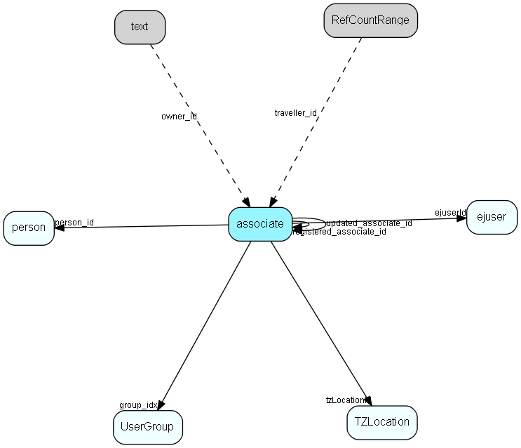

# associate Table (2)

associate MDO list item table.
Employees, resources and other users - except for External persons

## Fields

| Name | Description | Type | Null |
|------|-------------|------|:----:|
|associate\_id|Primary key|PK| |
|name|Initials, also login name, possibly database user name|String(239)| |
|rank|Rank order |UShort|&#x25CF;|
|tooltip|Tooltip or other description|String(254)|&#x25CF;|
|deleted|1 = the user is retired and should have no rights, not appear in lists, etc.|UShort|&#x25CF;|
|group\_idx|Primary group membership, see UserGroupLink for secondary memberships|FK [usergroup](usergroup.md)| |
|lastlogin|Last login date|DateTime| |
|lastlogout|Last logout date|DateTime| |
|person\_id|Owning person record|FK [person](person.md)| |
|checklistlimit|Diary checklist scan limit|DateTime| |
|type|Associate type|Enum [associatetype](enums/associatetype.md)|&#x25CF;|
|userFlags|user-specific GUI flags|String(127)|&#x25CF;|
|registered|Registered when|UtcDateTime| |
|registered\_associate\_id|Registered by whom|FK [associate](associate.md)| |
|updated|Last updated when|UtcDateTime| |
|updated\_associate\_id|Last updated by whom|FK [associate](associate.md)| |
|updatedCount|Number of updates|UShort| |
|isLocation|For resources only: 1 if this resource represents a location|Bool|&#x25CF;|
|tzLocationId|Default timezone location for this associate|FK [tzlocation](tzlocation.md)|&#x25CF;|
|locationAddress|Address of location, if this is a resource that is a location|String(239)|&#x25CF;|
|ejuserId|ID of the ej user record corresponding to this associate; 0 for associates that are not ej users|FK [ejuser](ejuser.md)|&#x25CF;|
|encryptedCheck|Encrypted hash checksum|String(254)| |
|userName|Associate user name|String(254)|&#x25CF;|
|waiting\_for\_approval|0 = Approved (default). 1 = Associate/User must be approved by an administrator. User cannot log in while waiting, but can be assigned licenses. Used in Online.|Bool| |

[!include[details](./includes/associate.md)]

## Indexes

| Fields | Types | Description |
|--------|-------|-------------|
|associate\_id |PK |Clustered, Unique |
|name |String(239) |Unique |
|person\_id |FK |Index |
|type |Enum |Index |

## Replication Flags

* Replicate changes DOWN from central to satellites and travellers.
* Replicate changes UP from satellites and travellers back to central.
* Copy to satellite and travel prototypes.
* Cache table during filtering.

## Security Flags

* Sentry controls access to items in this table using user's Role and data rights matrix.

