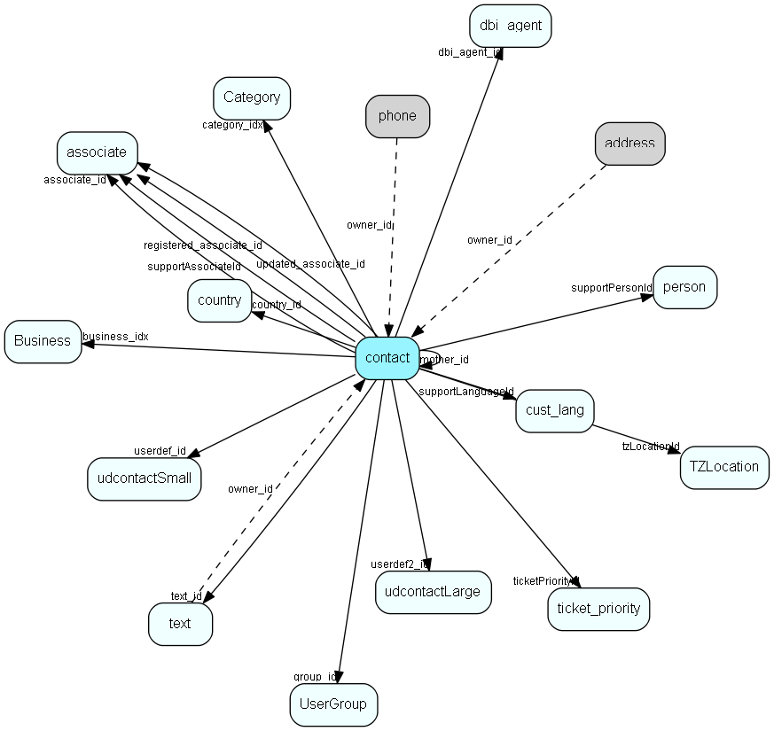

# contact Table (5)

## Fields

| Name | Description | Type | Null |
|------|-------------|------|:----:|
|contact\_id|Primary key|PK| |
|name|Contact name|String(219)| |
|kananame|Contact kana name, used in Japanese versions only|String(219)|&#x25CF;|
|department|Department|String(219)|&#x25CF;|
|number1|Alphanumeric user field|String(49)|&#x25CF;|
|number2|Alphanumeric user field|String(49)|&#x25CF;|
|associate\_id|Our contact|FK [associate](associate.md)|&#x25CF;|
|country\_id|Country|FK [country](country.md)| |
|business\_idx|Link to Business|FK [Business](business.md)| |
|category\_idx|Link to Category|FK [Category](category.md)| |
|xstop|STOP flag|Bool|&#x25CF;|
|nomailing|No mailings flags|Bool|&#x25CF;|
|registered|Date registered|UtcDateTime| |
|registered\_associate\_id|Registered by whom|FK [associate](associate.md)| |
|updated|Date last updated|UtcDateTime| |
|updated\_associate\_id|Last updated by whom|FK [associate](associate.md)| |
|text\_id|Paperclip note|FK [text](text.md)|&#x25CF;|
|mother\_id|Reserved|FK [contact](contact.md)|&#x25CF;|
|userdef\_id|User defined table record 1|FK [udcontactSmall](udcontactsmall.md)|&#x25CF;|
|orgNr|VAT number or similar|String(49)|&#x25CF;|
|soundEx|What the name sounds like, for duplicate detection|String(9)|&#x25CF;|
|source|How did we get this contact? For future integration needs|UShort|&#x25CF;|
|userdef2\_id|User defined table record 2|FK [udcontactLarge](udcontactlarge.md)|&#x25CF;|
|activeInterests|Number of records in cintr table; select count(*) from cintr ci where ci.contact_id = this.contact_id == activeInterests is always true|UShort|&#x25CF;|
|updatedCount|Number of times updated|UShort| |
|group\_id|Group id of original owning associate, semantics like appnt.grp_id|FK [UserGroup](usergroup.md)|&#x25CF;|
|tzLocationId|Default timezone location for this contact|FK [TZLocation](tzlocation.md)|&#x25CF;|
|ticketPriorityId|Default ticket priority for new tickets|FK [ticket_priority](ticket-priority.md)|&#x25CF;|
|deleted|If nonzero, then this contact is &apos;deleted&apos; and should generally not be shown|UShort|&#x25CF;|
|supportLanguageId|Customers language (does not necessarily map to ISO languages)|FK [cust_lang](cust-lang.md)|&#x25CF;|
|supportAssociateId|Our contact, but for support context, not sales/primary contact|FK [associate](associate.md)|&#x25CF;|
|supportPersonId|The person (at the customer) who support talks to (the counterpart of supportAssociateId)|FK [person](person.md)|&#x25CF;|
|dbi\_agent\_id|Integration agent (eJournal)|FK [dbi_agent](dbi-agent.md)|&#x25CF;|
|dbi\_key|The primary key for the integrated entry in the external datasource.|String(255)|&#x25CF;|
|dbi\_last\_syncronized|Last external syncronization.|DateTime|&#x25CF;|
|dbi\_last\_modified|When the entry was last modified.|DateTime|&#x25CF;|
|activeErpLinks|The number of Erp Sync connections this record is synced with; count of the ErpExternalKey+ErpInternalKey relations|Int|&#x25CF;|
|DeletedDate|Datetime (utc) when this record was soft-deleted; if this value is set then the record should not be shown|UtcDateTime|&#x25CF;|

## Indexes

| Fields | Types | Description |
|--------|-------|-------------|
|contact\_id |PK |Clustered, Unique |
|name |String(219) |Index |
|kananame |String(219) |Index |
|department |String(219) |Index |
|number1 |String(49) |Index |
|number2 |String(49) |Index |
|business\_idx |FK |Index |
|category\_idx |FK |Index |
|mother\_id |FK |Index |
|userdef\_id |FK |Index |
|orgNr |String(49) |Index |
|soundEx |String(9) |Index |
|source |UShort |Index |
|userdef2\_id |FK |Index |
|dbi\_agent\_id |FK |Index |
|dbi\_key |String(255) |Index |
|dbi\_last\_syncronized |DateTime |Index |
|dbi\_last\_modified |DateTime |Index |
|name, department |String(219), String(219) |Index |
|DeletedDate |UtcDateTime |Index |
|supportPersonId |FK |Index |

## Replication Flags

* Area Management controlled table. Contents replicated to satellites and traveller databases.
* Replicate changes UP from satellites and travellers back to central.
* Copy to satellite and travel prototypes.
* Cache table during filtering.

## Security Flags

* Sentry controls access to items in this table using user's Role and data rights matrix.

