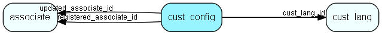

# cust\_config Table (471)

## Fields

| Name | Description | Type | Null |
|------|-------------|------|:----:|
|cust\_config\_id|Primary key|PK| |
|type|What kind of data is in this row|Enum [configtype](enums/configtype.md)|&#x25CF;|
|config|A JSON-formatted config|Clob|&#x25CF;|
|cust\_lang\_id|The customer language which this config belongs to. 0 indicates that the config is global|FK [cust-lang](cust-lang.md)| |
|registered|Registered when|UtcDateTime| |
|registered\_associate\_id|Registered by whom|FK [associate](associate.md)| |
|updated|Last updated when|UtcDateTime| |
|updated\_associate\_id|Last updated by whom|FK [associate](associate.md)| |
|updatedCount|Number of updates made to this record|UShort| |

## Indexes

| Fields | Types | Description |
|--------|-------|-------------|
|cust\_config\_id |PK |Clustered, Unique |

## Replication Flags

* None

## Security Flags

* No access control via user's Role.

