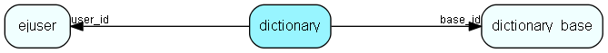

# dictionary Table (358)

## Fields

| Name | Description | Type | Null |
|------|-------------|------|:----:|
|id|The primary key (auto-incremented)|PK| |
|base\_id|The reference to the dictionary base.|FK [dictionary-base](dictionary-base.md)| |
|user\_id|The reference to the user.|FK [ejuser](ejuser.md)| |
|include|Include/Exclude word.|Int| |
|word|User word|String(32)| |

[!include[details](./includes/dictionary.md)]

## Indexes

| Fields | Types | Description |
|--------|-------|-------------|
|id |PK |Clustered, Unique |
|base\_id |FK |Index |
|user\_id |FK |Index |
|include |Int |Index |
|word |String(32) |Index |

## Replication Flags

* None

## Security Flags

* No access control via user's Role.

