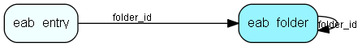

# eab\_folder Table (314)

## Fields

| Name | Description | Type | Null |
|------|-------------|------|:----:|
|id|The primary key (auto-incremented)|PK| |
|folder\_id|The id of the parent folder for this folder. NULL or -1 if this is a toplevel folder.|FK [eab_folder](eab-folder.md)| |
|name|The folder&amp;apos;s name.|String(64)| |
|description|The folder&amp;apos;s description.|String(255)|&#x25CF;|
|fullname|The full name of this category, i.e. Foo/bar/test.|Clob|&#x25CF;|

[!include[details](./includes/eab-folder.md)]

## Indexes

| Fields | Types | Description |
|--------|-------|-------------|
|id |PK |Clustered, Unique |
|folder\_id |FK |Index |
|name |String(64) |Index |

## Replication Flags

* None

## Security Flags

* No access control via user's Role.

