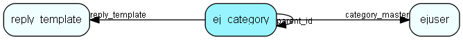

# ej\_category Table (257)

## Fields

| Name | Description | Type | Null |
|------|-------------|------|:----:|
|id|The primary key (auto-incremented)|PK| |
|parent\_id|The parent category for this category. -1 if this is a toplevel category.|FK [ej_category](ej-category.md)| |
|name|The (short) name of this category. E.g. &amp;apos;support&amp;apos;.|String(64)|&#x25CF;|
|category\_master|The user associated with this category.|FK [ejuser](ejuser.md)|&#x25CF;|
|fullname|The fullname (compiled from parents&amp;apos; names) for this category. E.g. &amp;apos;norway/product A/support&amp;apos;.|String(255)|&#x25CF;|
|flags|A bitmask representing flags for this category.|Enum [TicketCategoryFlags](enums/ticketcategoryflags.md)|&#x25CF;|
|delegate\_method|An integer indicating the delegation method for this category.|Enum [TicketCategoryDelegateMethod](enums/ticketcategorydelegatemethod.md)|&#x25CF;|
|delegate\_counter|A delegate counter, incremented by 1 for every delegation|Int| |
|external\_name|The external name for this category, used for the customer frontend.|String(255)|&#x25CF;|
|closing\_status|An integer indicating if new requests should have the &amp;apos;close request&amp;apos; in this category checked as default, or if the users preferences should be selected.|Enum [TicketCategoryClosingStatus](enums/ticketcategoryclosingstatus.md)|&#x25CF;|
|msg\_closing\_status|An integer indicating if new messages should have the &amp;apos;close request&amp;apos; in this category checked as default, or if the users preferences should be selected.|Enum [TicketCategoryClosingStatus](enums/ticketcategoryclosingstatus.md)|&#x25CF;|
|assignment\_lag|Number of minutes we shall override the assignment if a customer sends consecutive messages to this category|Int|&#x25CF;|
|reply\_template|Reply template to merge with messages posted in this category|FK [reply_template](reply-template.md)|&#x25CF;|
|notification\_email|Comma separated list of addresses to notify when requests are redelegated to (unassigned) in this category.|String(2047)|&#x25CF;|

[!include[details](./includes/ej-category.md)]

## Indexes

| Fields | Types | Description |
|--------|-------|-------------|
|id |PK |Clustered, Unique |
|parent\_id |FK |Index |
|category\_master |FK |Index |
|reply\_template |FK |Index |

## Replication Flags

* None

## Security Flags

* No access control via user's Role.

