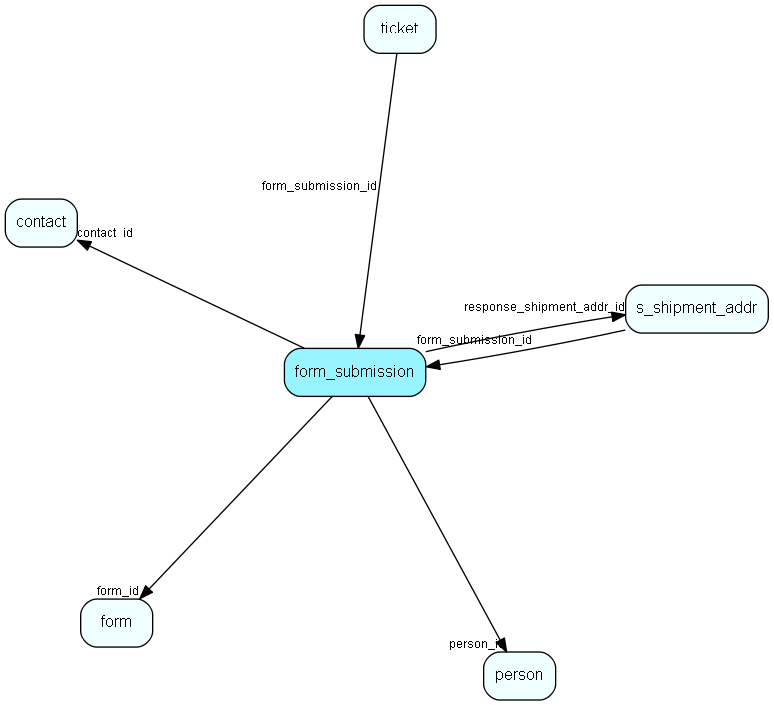

# form\_submission Table (479)

## Fields

| Name | Description | Type | Null |
|------|-------------|------|:----:|
|form\_submission\_id|Primary key|PK| |
|form\_id|The id of the parent form.|FK [form](form.md)| |
|when\_submitted|The time of the submit.|DateTime|&#x25CF;|
|contact\_id|The optional id of the contact of the person who submitted.|FK [contact](contact.md)| |
|person\_id|The optional id of the person who submitted.|FK [person](person.md)| |
|email\_address|The email address of the person who submitted|String(255)|&#x25CF;|
|response\_shipment\_addr\_id|The id of the s_shipment_addr that is the response mail|FK [s_shipment_addr](s-shipment-addr.md)| |
|response|The JSON-formatted response from this form|Clob|&#x25CF;|
|status|What is the status of this submission|Enum [FormSubmissionStatus](enums/formsubmissionstatus.md)| |
|processing\_log|A log of what happened during processing|String(4000)|&#x25CF;|

## Indexes

| Fields | Types | Description |
|--------|-------|-------------|
|form\_submission\_id |PK |Clustered, Unique |
|form\_id |FK |Index |
|contact\_id |FK |Index |
|person\_id |FK |Index |
|response\_shipment\_addr\_id |FK |Index |

## Replication Flags

* None

## Security Flags

* No access control via user's Role.

