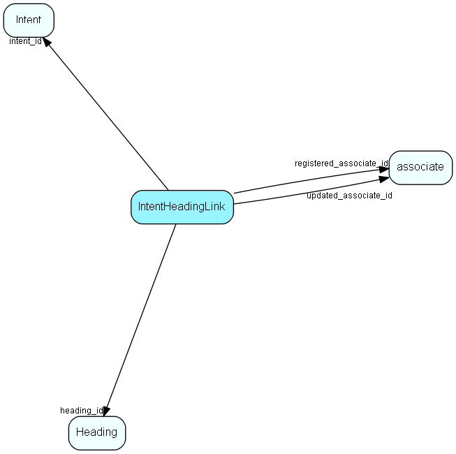

# IntentHeadingLink Table (218)

## Fields

| Name | Description | Type | Null |
|------|-------------|------|:----:|
|intentheadinglink\_id|Primary key|PK| |
|intent\_id|Link to Intent list table|FK [Intent](intent.md)| |
|heading\_id|Link to Heading table|FK [Heading](heading.md)| |
|registered|Registered when|UtcDateTime| |
|registered\_associate\_id|Registered by whom|FK [associate](associate.md)| |
|updated|Last updated when|UtcDateTime| |
|updated\_associate\_id|Last updated by whom|FK [associate](associate.md)| |
|updatedCount|Number of updates made to this record|UShort| |

## Indexes

| Fields | Types | Description |
|--------|-------|-------------|
|intentheadinglink\_id |PK |Clustered, Unique |
|intent\_id |FK |Index |
|heading\_id |FK |Index |

## Replication Flags

* Replicate changes DOWN from central to satellites and travellers.
* Replicate changes UP from satellites and travellers back to central.
* Copy to satellite and travel prototypes.

## Security Flags

* No access control via user's Role.

