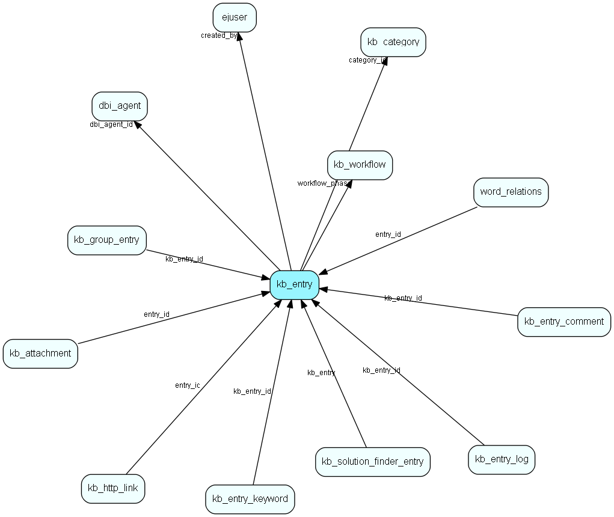

# kb\_entry Table (282)

## Fields

| Name | Description | Type | Null |
|------|-------------|------|:----:|
|id|The primary key (auto-incremented)|PK| |
|category\_id|The id of the category in which this entry is located.|FK [kb-category](kb-category.md)| |
|title|The title of this entry.|String(255)|&#x25CF;|
|question|The question for this entry.|Clob|&#x25CF;|
|answer|The answer for this entry.|Clob|&#x25CF;|
|keywords|The keywords for this entry|String(255)|&#x25CF;|
|access\_level|The access level for this entry (enum).|access-level|&#x25CF;|
|created\_by|The id of the user who owns this entry.|FK [ejuser](ejuser.md)|&#x25CF;|
|sort\_order|A scrictly ascending number indicating the sort-order when listing entries.|Int| |
|last\_changed|When the entry was last changed.|DateTime|&#x25CF;|
|read\_count|The number of times someone has read this entry from the customer frontend.|Int| |
|score|The accumulated score (0..100) for this entry.|Int|&#x25CF;|
|score\_weight|The number of votes behind the accumulated score.|Int|&#x25CF;|
|flags|A bitmap field.|UInt|&#x25CF;|
|status|The status for this entry (enum).|status|&#x25CF;|
|expire\_date|The date until which this entry is valid.|DateTime|&#x25CF;|
|workflow\_phase|The workflow phase this entry is in|FK [kb-workflow](kb-workflow.md)| |
|dbi\_agent\_id|Integration agent (eJournal)|FK [dbi-agent](dbi-agent.md)| |
|dbi\_key|The primary key for the integrated entry in the external datasource.|String(255)| |
|dbi\_last\_syncronized|Last external syncronization.|DateTime| |
|dbi\_last\_modified|When the entry was last modified.|DateTime| |

[!include[details](./includes/kb-entry.md)]

## Indexes

| Fields | Types | Description |
|--------|-------|-------------|
|id |PK |Clustered, Unique |
|category\_id |FK |Index |
|created\_by |FK |Index |
|sort\_order |Int |Index |
|workflow\_phase |FK |Index |
|dbi\_agent\_id |FK |Index |
|dbi\_key |String(255) |Index |
|dbi\_last\_syncronized |DateTime |Index |
|dbi\_last\_modified |DateTime |Index |
|title, question, answer, keywords |String(255), Clob, Clob, String(255) |Full text |

## Replication Flags

* None

## Security Flags

* No access control via user's Role.

