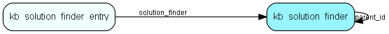

# kb\_solution\_finder Table (294)

## Fields

| Name | Description | Type | Null |
|------|-------------|------|:----:|
|id|The primary key (auto-incremented)|PK| |
|parent\_id|The parent of this solution finder.|FK [kb_solution_finder](kb-solution-finder.md)| |
|name||String(255)|&#x25CF;|
|body|The body for the solution finder. HTML format.|Clob|&#x25CF;|

## Indexes

| Fields | Types | Description |
|--------|-------|-------------|
|id |PK |Clustered, Unique |
|parent\_id |FK |Index |

## Replication Flags

* None

## Security Flags

* No access control via user's Role.

