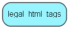

# legal\_html\_tags Table (353)

## Fields

| Name | Description | Type | Null |
|------|-------------|------|:----:|
|id|Primary key|PK| |
|html\_tag|The legal HTML tag |String(255)| |

[!include[details](./includes/legal-html-tags.md)]

## Indexes

| Fields | Types | Description |
|--------|-------|-------------|
|id |PK |Clustered, Unique |

## Replication Flags

* None

## Security Flags

* No access control via user's Role.

