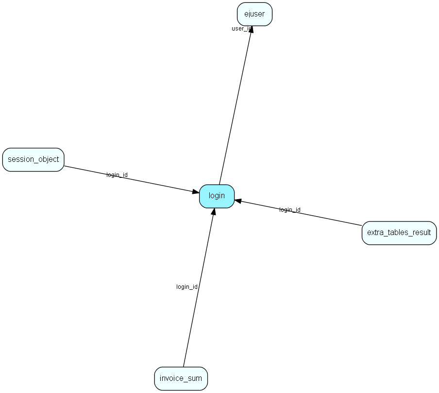

# login Table (297)

## Fields

| Name | Description | Type | Null |
|------|-------------|------|:----:|
|id|The primary key (auto-incremented)|PK| |
|user\_id|The id of the user this entry references.|FK [ejuser](ejuser.md)| |
|session\_key|A random 32 characters value used as authentication key for the session.|String(32)| |
|remote\_addr|The IP address of the client for this session.|String(64)|&#x25CF;|
|remote\_host|The hostname (depending on whether reverse lookup is enabled in httpd) or IP address of the client for this session.|String(64)|&#x25CF;|
|logged\_in|When this session started.|DateTime|&#x25CF;|
|idle|The last time this session was active.|DateTime|&#x25CF;|
|status|The status (enum) for this session.|Int| |
|origin|1=soap call, 2=web pages|Int| |
|error\_message|Stores the last error message recorded on this session|String(255)|&#x25CF;|
|authentication\_type|The authentication type (enum) for this session.|authentication-type|&#x25CF;|
|active\_menu|The currently active (open) left-menu for this session.|Int|&#x25CF;|
|ns\_secret|Netserver login secret.|String(255)|&#x25CF;|
|flags|Bitmask of flags for a service login session|Enum [loginflags](enums/loginflags.md)|&#x25CF;|

[!include[details](./includes/login.md)]

## Indexes

| Fields | Types | Description |
|--------|-------|-------------|
|id |PK |Clustered, Unique |
|user\_id |FK |Index |
|session\_key |String(32) |Index |
|status |Int |Index |
|origin |Int |Index |

## Replication Flags

* None

## Security Flags

* No access control via user's Role.

