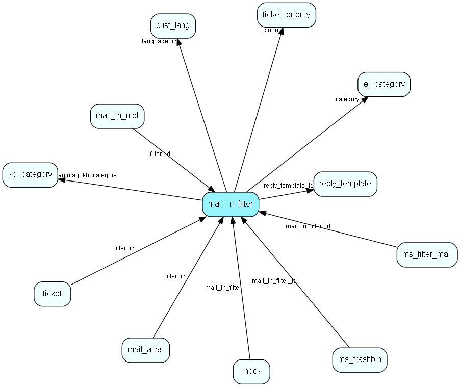

# mail\_in\_filter Table (271)

## Fields

| Name | Description | Type | Null |
|------|-------------|------|:----:|
|id|The primary key (auto-incremented)|PK| |
|server\_type|Enum indicating the protocol to use (POP/IMAP).|Enum [mailboxtype](enums/mailboxtype.md)|&#x25CF;|
|pop\_server|The hostname/IP address of the server.|String(255)|&#x25CF;|
|pop\_user|The username used to login.|String(255)|&#x25CF;|
|pop\_password|The password used to login.|String(255)|&#x25CF;|
|domain|The domain used to login.|String(255)|&#x25CF;|
|address|The address associated with this mailbox (used as FROM: address when sending emails).|String(255)|&#x25CF;|
|category\_id|The id of the category this mailbox assigns tickets to (unless overridden by a sortfilter).|FK [ej-category](ej-category.md)|&#x25CF;|
|priority|The id of the priority tickets are assigned when imported from this mailbox.|FK [ticket-priority](ticket-priority.md)|&#x25CF;|
|reply\_template\_id|ID of the reply template used on this mail box.|FK [reply-template](reply-template.md)| |
|checkwait|How often (in minutes) to check this mailbox.|Int| |
|next\_check|When this mailbox should be checked the next time.|DateTime|&#x25CF;|
|noautoreply|If set, then this mailbox should not send an autoreply.|Bool|&#x25CF;|
|last\_success|Datetime indicating the last time email was sucessfully imported from this mailbox. Used to display warnings when this value is getting too old.|DateTime|&#x25CF;|
|last\_try|Datetime indicating the last time this mailbox tried (but possibly failed) to fetch email.|DateTime|&#x25CF;|
|importmail\_pid|The process id of the importMail instance processing this mailbox|Int|&#x25CF;|
|status|Status indicated whether this mailbox is deleted or not.|status|&#x25CF;|
|last\_error|The last error message recieved from the underlying email system (such as POP3 protocol errors, etc).|Clob|&#x25CF;|
|num\_seq\_failures|The number of sequential failures for this mailbox.|Int|&#x25CF;|
|keep\_headers|A commaseparated list of headers to store for emails imported. E.g. &amp;apos;to,from,recieved-by,subject&amp;apos;. |String(255)|&#x25CF;|
|language\_id|The id of the customer language entry this entry is connected to.|FK [cust-lang](cust-lang.md)|&#x25CF;|
|autofaq|Whether to suggest FAQ entries for this email account or not|Bool|&#x25CF;|
|autofaq\_kb\_category|The root folder for the auto faq search.|FK [kb-category](kb-category.md)|&#x25CF;|
|mailgun\_dsn|If this is set to 1, the route created in Mailgun will be set up to deliver emails of type auto-replies, system messsages etc|Bool|&#x25CF;|

[!include[details](./includes/mail-in-filter.md)]

## Indexes

| Fields | Types | Description |
|--------|-------|-------------|
|id |PK |Clustered, Unique |
|category\_id |FK |Index |
|priority |FK |Index |
|reply\_template\_id |FK |Index |
|language\_id |FK |Index |

## Replication Flags

* None

## Security Flags

* No access control via user's Role.

