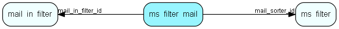

# ms\_filter\_mail Table (311)

## Fields

| Name | Description | Type | Null |
|------|-------------|------|:----:|
|id|The primary key (auto-incremented)|PK| |
|mail\_sorter\_id|The reference to the mail filter entry.|FK [ms_filter](ms-filter.md)| |
|mail\_in\_filter\_id|The reference to the mailbox.|FK [mail_in_filter](mail-in-filter.md)| |

[!include[details](./includes/ms-filter-mail.md)]

## Indexes

| Fields | Types | Description |
|--------|-------|-------------|
|id |PK |Clustered, Unique |
|mail\_sorter\_id |FK |Index |
|mail\_in\_filter\_id |FK |Index |

## Replication Flags

* None

## Security Flags

* No access control via user's Role.

