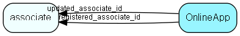

# onlineapp Table (482)

## Fields

| Name | Description | Type | Null |
|------|-------------|------|:----:|
|onlineapp\_id|Primary key|PK| |
|clientId|ID that uniquely identifies the app|String(255)| |
|displayName|Name to be displayed in user interface|String(255)|&#x25CF;|
|partnerName|Name of the partner who owns the app|String(255)|&#x25CF;|
|authorizationRevoked|Has the authorization for this app been revoked|Bool|&#x25CF;|
|lastUsed|Last app use date (not time, to reduce number of writes)|DateTime|&#x25CF;|
|registered|Registered when|UtcDateTime| |
|registered\_associate\_id|Registered by whom|FK [associate](associate.md)| |
|updated|Last updated when|UtcDateTime| |
|updated\_associate\_id|Last updated by whom|FK [associate](associate.md)| |
|updatedCount|Number of updates made to this record|UShort| |

## Indexes

| Fields | Types | Description |
|--------|-------|-------------|
|onlineapp\_id |PK |Clustered, Unique |
|clientId |String(255) |Unique |

## Replication Flags

* None

## Security Flags

* No access control via user's Role.

