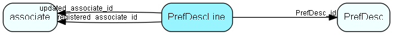

# prefdescline Table (185)

## Fields

| Name | Description | Type | Null |
|------|-------------|------|:----:|
|PrefDescLine\_id|Primary key|PK| |
|PrefDesc\_id|Preference description (parent)|FK [prefdesc](prefdesc.md)| |
|prefValue|Possible value|String(99)| |
|prefShowValue|Descriptive value, multilang-parsed, to put in list|String(254)|&#x25CF;|
|registered|Registered when|UtcDateTime| |
|registered\_associate\_id|Registered by whom|FK [associate](associate.md)| |
|updated|Last updated when|UtcDateTime| |
|updated\_associate\_id|Last updated by whom|FK [associate](associate.md)| |
|updatedCount|Number of updates made to this record|UShort| |
|description|Description of preference value, multi-language parsed|String(2047)|&#x25CF;|
|isBuiltin|1 = This row populated and maintained by SuperOffice|UShort|&#x25CF;|

[!include[details](./includes/PrefDescLine.md)]

## Indexes

| Fields | Types | Description |
|--------|-------|-------------|
|PrefDescLine\_id |PK |Clustered, Unique |
|PrefDesc\_id |FK |Index |
|prefValue |String(99) |Index |

## Replication Flags

* Replicate changes DOWN from central to satellites and travellers.
* Replicate changes UP from satellites and travellers back to central.
* Copy to satellite and travel prototypes.

## Security Flags

* No access control via user's Role.

