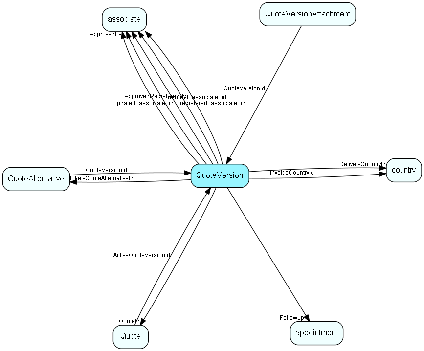

# QuoteVersion Table (39)

## Fields

| Name | Description | Type | Null |
|------|-------------|------|:----:|
|quoteversion\_id|Primary key|PK| |
|ERPQuoteVersionKey|Key in the ERP system that uniquely identifies this Version within the ERP system (if available, the field may be empty).|String(254)|&#x25CF;|
|QuoteId|Foreign key to CRM quote (the conceptual parent). Owning Quote of this Quote Version.|FK [Quote](quote.md)| |
|Description|Description of Version. Potentially longer text description, typically used in a tooltip. Max 2K.|String(2047)|&#x25CF;|
|Number|A quote number that the user (or ERP connector) can fill out.|String(254)|&#x25CF;|
|State|Current state of this quote version.|Enum [QuoteVersionState](enums/quoteversionstate.md)|&#x25CF;|
|ArchivedState|State that this quote version had, right before it was changed to Archived; in this way we can show what happened before the archiving.|Enum [QuoteVersionState](enums/quoteversionstate.md)|&#x25CF;|
|Status|If there was a problem with for instance calculation, this field is set to warning or error.|Enum [QuoteStatus](enums/quotestatus.md)|&#x25CF;|
|Reason|If there was a problem, this field contains a localized explanation of the problem and possible steps to fix it that the user can be shown.|String(2047)|&#x25CF;|
|LikelyQuoteAlternativeId|The alternative that is considered most likely to be accepted. Used to calculate probable income.|FK [QuoteAlternative](quotealternative.md)|&#x25CF;|
|SentDate|The date the version was sent to the customer.|DateTime|&#x25CF;|
|FollowupId|Link to a follow-up activity, created when this quote version was sent to the customer.|FK [appointment](appointment.md)|&#x25CF;|
|ExpirationDate|Last date the quote Version is valid, expiration is at midnight end of this day.|DateTime|&#x25CF;|
|DeliveryCountryId|Country of delivery address, typically copied from the contact record|FK [country](country.md)|&#x25CF;|
|HasOwnDeliveryAddress|The delivery address is not the same as the contact&apos;s Street address|Bool|&#x25CF;|
|InvoiceCountryId|Country of invoice address, typically copied from contact record|FK [country](country.md)|&#x25CF;|
|HasOwnInvoiceAddress|The quote has an address for Invoicing. This will typically be copied from the company&apos;s addresses. |Bool|&#x25CF;|
|ERPPaymentTermsKey|Either a List id to an id from a connector provided list, or, if the connection doesn’t support lists, a text. For instance: ‘Standard 30 days’.|String(254)|&#x25CF;|
|ERPPaymentTypeKey|Either a List id to an id from a connector provided list, or, if the connection doesn’t support lists, a text. For instance: &apos;Invoice&apos;.|String(254)|&#x25CF;|
|ERPDeliveryTermsKey|Either a List id to an id from a connector provided list, or, if the connection doesn’t support lists, a text. For instance: ‘FOB’ (‘Free on board’).|String(254)|&#x25CF;|
|ERPDeliveryTypeKey|Either a List id to an id from a connector provided list, or, if the connection doesn’t support lists, a text. For instance: ‘Air’.|String(254)|&#x25CF;|
|Rank|Rank/Version number, starts at 1|Int|&#x25CF;|
|ApprovedBy|Id of associate who approved (or rejected approval) for this version|FK [associate](associate.md)|&#x25CF;|
|ApprovedText|Text with comments on why approval was granted (or rejected)|String(1023)|&#x25CF;|
|ApprovedRegisteredBy|Id of associate who actually entered the approval; might be different from ApprovedBy (f.x. due to telephone consultation/approval)|FK [associate](associate.md)|&#x25CF;|
|ApprovedRegisteredDate|When was approval granted or rejected|DateTime|&#x25CF;|
|extraField1|Optional information added by Quote Connector; usable in the quote document merge process|String(1023)|&#x25CF;|
|extraField2|Optional information added by Quote Connector; usable in the quote document merge process|String(1023)|&#x25CF;|
|extraField3|Optional information added by Quote Connector; usable in the quote document merge process|String(1023)|&#x25CF;|
|extraField4|Optional information added by Quote Connector; usable in the quote document merge process|String(1023)|&#x25CF;|
|extraField5|Optional information added by Quote Connector; usable in the quote document merge process|String(1023)|&#x25CF;|
|LastRecalculated|When this version was last subjected to a total recalculation. This field must be set by the connector, since the connector may choose to ignore a RecalculateVersion call based on policies and possibly the current value of this field. SuperOffice will set this field to 1.1.1760 whenever any change occurs to the quote, to indicate that a recalculation is needed.|DateTime|&#x25CF;|
|registered|Registered when|UtcDateTime| |
|registered\_associate\_id|Registered by whom|FK [associate](associate.md)| |
|updated|Last updated when|UtcDateTime| |
|updated\_associate\_id|Last updated by whom|FK [associate](associate.md)| |
|updatedCount|Number of updates made to this record|UShort| |

[!include[details](./includes/quoteversion.md)]

## Indexes

| Fields | Types | Description |
|--------|-------|-------------|
|quoteversion\_id |PK |Clustered, Unique |
|ERPQuoteVersionKey |String(254) |Index |
|QuoteId |FK |Index |

## Replication Flags

* Area Management controlled table. Contents replicated to satellites and traveller databases.
* Copy to satellite and travel prototypes.

## Security Flags

* Sentry controls access to items in this table using user's Role and data rights matrix.

