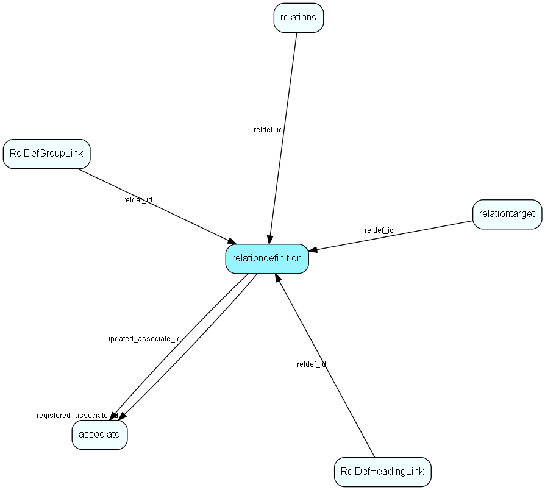

# relationdefinition Table (48)

## Fields

| Name | Description | Type | Null |
|------|-------------|------|:----:|
|reldef\_id|Primary key|PK| |
|name|Active text|String(239)|&#x25CF;|
|rank|Rank order |UShort|&#x25CF;|
|tooltip|Tooltip or other description|String(254)|&#x25CF;|
|deleted|0 -&gt; record is active 1 -&gt; record is &apos;deleted&apos; and should not be shown in lists|UShort|&#x25CF;|
|passive\_text|Text used in passive direction|String(254)|&#x25CF;|
|defcomment|Comment|String(254)|&#x25CF;|
|registered|Registered when|UtcDateTime| |
|registered\_associate\_id|Registered by whom|FK [associate](associate.md)| |
|updated|Last updated when|UtcDateTime| |
|updated\_associate\_id|Last updated by whom|FK [associate](associate.md)| |
|updatedCount|Number of updates made to this record|UShort| |

[!include[details](./includes/relationdefinition.md)]

## Indexes

| Fields | Types | Description |
|--------|-------|-------------|
|reldef\_id |PK |Clustered, Unique |

## Replication Flags

* Replicate changes DOWN from central to satellites and travellers.
* Replicate changes UP from satellites and travellers back to central.
* Copy to satellite and travel prototypes.

## Security Flags

* No access control via user's Role.

