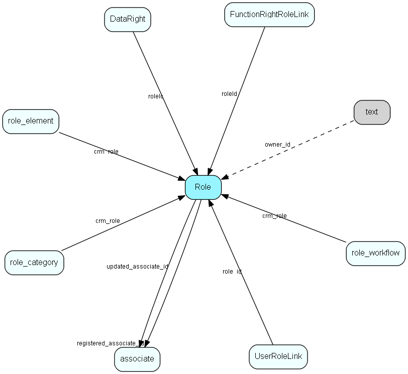

# role Table (191)

## Fields

| Name | Description | Type | Null |
|------|-------------|------|:----:|
|Role\_id|Primary key|PK| |
|name|Visible role name|String(239)|&#x25CF;|
|rank|Sorting rank of this role in lists|UShort| |
|tooltip|Visible tooltip|String(254)|&#x25CF;|
|deleted|1 if role has been deleted (we do not actually delete)|UShort| |
|roleType|0 = employee, 1 = external user, 2 = anonymous|Enum [roletype](enums/roletype.md)| |
|encryptedCheck|Encrypted data, to detect unwanted changes|String(254)| |
|registered|Registered when|UtcDateTime| |
|registered\_associate\_id|Registered by whom|FK [associate](associate.md)| |
|updated|Last updated when|UtcDateTime| |
|updated\_associate\_id|Last updated by whom|FK [associate](associate.md)| |
|updatedCount|Number of updates made to this record|UShort| |
|use\_categories|Override user categories with role categories|Bool|&#x25CF;|

[!include[details](./includes/Role.md)]

## Indexes

| Fields | Types | Description |
|--------|-------|-------------|
|Role\_id |PK |Clustered, Unique |

## Replication Flags

* Replicate changes DOWN from central to satellites and travellers.
* Replicate changes UP from satellites and travellers back to central.
* Copy to satellite and travel prototypes.

## Security Flags

* No access control via user's Role.

