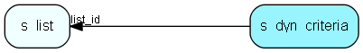

# s\_dyn\_criteria Table (350)

## Fields

| Name | Description | Type | Null |
|------|-------------|------|:----:|
|id|Primary key|PK| |
|list\_id|Connects the criteria to a list.|FK [s-list](s-list.md)| |
|sort\_order|The order to sort the query. Not really relevant|Int| |
|field|Which field to test in this criteria|String(64)| |
|operator|Equals, gt, lt etc.|operator| |
|value|The value|String(64)| |
|log\_op|And/or|log-op|&#x25CF;|

[!include[details](./includes/s-dyn-criteria.md)]

## Indexes

| Fields | Types | Description |
|--------|-------|-------------|
|id |PK |Clustered, Unique |
|list\_id |FK |Index |

## Replication Flags

* None

## Security Flags

* No access control via user's Role.

