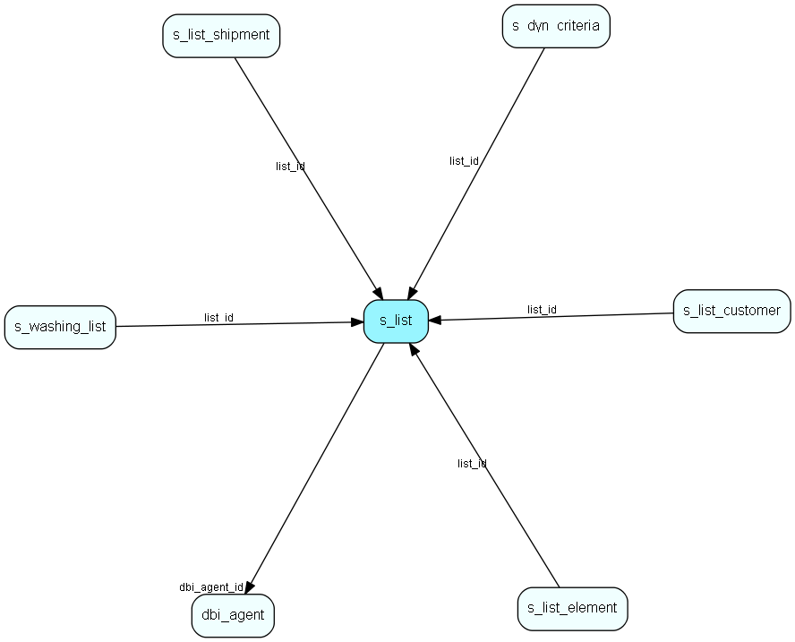

# s\_list Table (344)

## Fields

| Name | Description | Type | Null |
|------|-------------|------|:----:|
|id|Primary key|PK| |
|type|Dynamic/static|type| |
|name|The name of the list|String(255)| |
|washed|Date when this list was last washed(not used until v2)|DateTime|&#x25CF;|
|washing\_percent|How far the washing has gotten (not used until v2)|Short|&#x25CF;|
|flag|Not used|Short|&#x25CF;|
|number\_of\_elements|How many elements this list contains|Int|&#x25CF;|
|folder\_id|The folder which this link belongs to. -1 indicates that the link is on the root|Int| |
|dbi\_agent\_id|Integration agent (eJournal)|FK [dbi_agent](dbi-agent.md)| |
|dbi\_key|The primary key for the integrated entry in the external datasource.|String(255)| |
|dbi\_last\_syncronized|Last external syncronization.|DateTime| |
|dbi\_last\_modified|When the entry was last modified.|DateTime| |

## Indexes

| Fields | Types | Description |
|--------|-------|-------------|
|id |PK |Clustered, Unique |
|dbi\_agent\_id |FK |Index |
|dbi\_key |String(255) |Index |
|dbi\_last\_syncronized |DateTime |Index |
|dbi\_last\_modified |DateTime |Index |

## Replication Flags

* None

## Security Flags

* No access control via user's Role.

