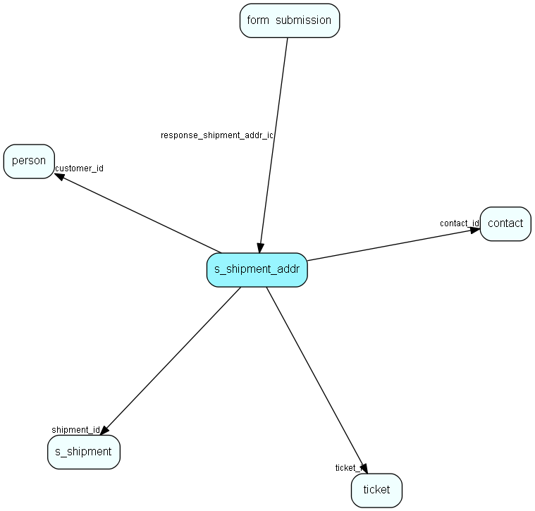

# s\_shipment\_addr Table (347)

## Fields

| Name | Description | Type | Null |
|------|-------------|------|:----:|
|id|Primary key|PK| |
|shipment\_id|Which shipment this address belongs to|FK [s-shipment](s-shipment.md)| |
|address|The email address|String(255)| |
|name|The name of the recipient|String(255)|&#x25CF;|
|timestamp|A stamp set when this address it taken by ejSender to prevent two ejSenders to take one address.|Int|&#x25CF;|
|customer\_id|Id of the customer if this entry is created by a dynamic list|FK [person](person.md)| |
|type|Indicates if this is an email or a sms|Int|&#x25CF;|
|sender\_nr|Used for multiple ejSenders. This field indicate which ejSender process this belongs to|Int|&#x25CF;|
|ticket\_id|Id of the ticket if this entry is created by a ticketSelection list|FK [ticket](ticket.md)| |
|status|Status for sending to this particular recipient|Enum [shipmentaddrstatus](enums/shipmentaddrstatus.md)|&#x25CF;|
|contact\_id|Id of contact bound to shipment address|FK [contact](contact.md)|&#x25CF;|
|sending\_time|Estimated or actual sent time (depends on status)|DateTime|&#x25CF;|
|bounce\_reason|Reason text received from mailing system|String(1023)|&#x25CF;|

[!include[details](./includes/s-shipment-addr.md)]

## Indexes

| Fields | Types | Description |
|--------|-------|-------------|
|id |PK |Clustered, Unique |
|shipment\_id |FK |Index |
|address |String(255) |Index |
|customer\_id |FK |Index |
|ticket\_id |FK |Index |
|contact\_id |FK |Index |

## Replication Flags

* None

## Security Flags

* No access control via user's Role.

