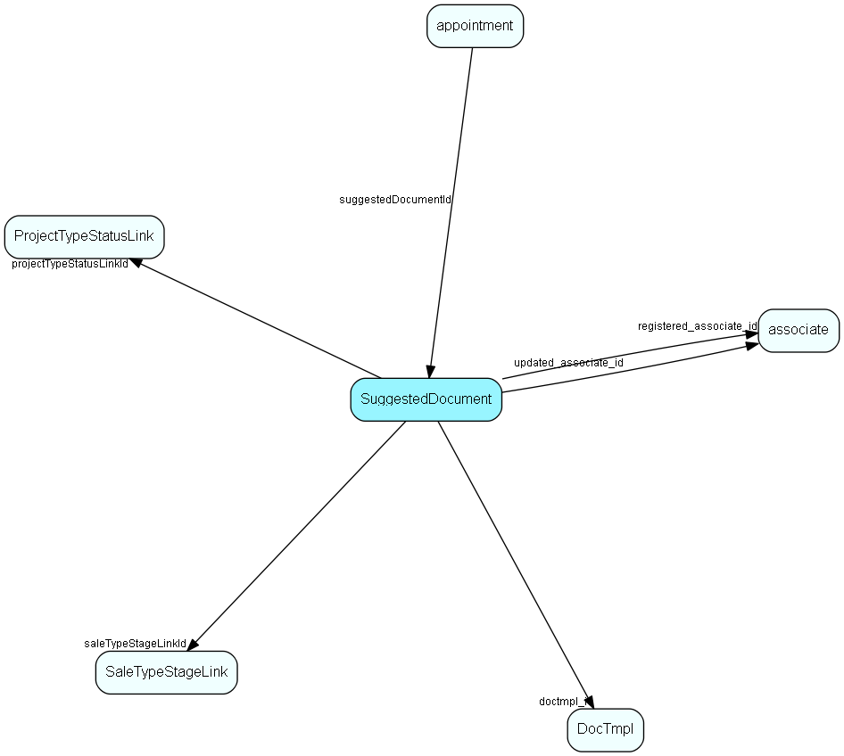

# SuggestedDocument Table (126)

## Fields

| Name | Description | Type | Null |
|------|-------------|------|:----:|
|SuggestedDocument\_id|Primary key|PK| |
|name|Item name, visible in Guide|String(239)| |
|rank|Rank, controls rank of non-instantiated items in Guide|UShort|&#x25CF;|
|tooltip|Tooltip / description|String(254)|&#x25CF;|
|deleted|0 -&gt; record is active 1 -&gt; record is &apos;deleted&apos; and should not be shown in lists|UShort|&#x25CF;|
|saleTypeStageLinkId|Link to saleTypeStageLink, the anchor for sale guide items. Either this OR projectAnchorId should be set, not both at the same time.|FK [SaleTypeStageLink](saletypestagelink.md)|&#x25CF;|
|projectTypeStatusLinkId|Link to projectTypeStatusLink, the anchor for project guide items. Either this OR saleAnchorId should be set, not both at the same time.|FK [ProjectTypeStatusLink](projecttypestatuslink.md)|&#x25CF;|
|doctmpl\_id|Type of the suggested document|FK [DocTmpl](doctmpl.md)|&#x25CF;|
|header|Suggested &apos;header&apos;|String(219)|&#x25CF;|
|our\_ref|Suggested &apos;our reference&apos;|String(99)|&#x25CF;|
|registered|Registered when|UtcDateTime| |
|registered\_associate\_id|Registered by whom|FK [associate](associate.md)| |
|updated|Last updated when|UtcDateTime| |
|updated\_associate\_id|Last updated by whom|FK [associate](associate.md)| |
|updatedCount|Number of updates made to this record|UShort| |

## Indexes

| Fields | Types | Description |
|--------|-------|-------------|
|SuggestedDocument\_id |PK |Clustered, Unique |
|name |String(239) |Index |
|saleTypeStageLinkId |FK |Index |
|projectTypeStatusLinkId |FK |Index |

## Replication Flags

* Replicate changes DOWN from central to satellites and travellers.
* Replicate changes UP from satellites and travellers back to central.
* Copy to satellite and travel prototypes.

## Security Flags

* No access control via user's Role.

