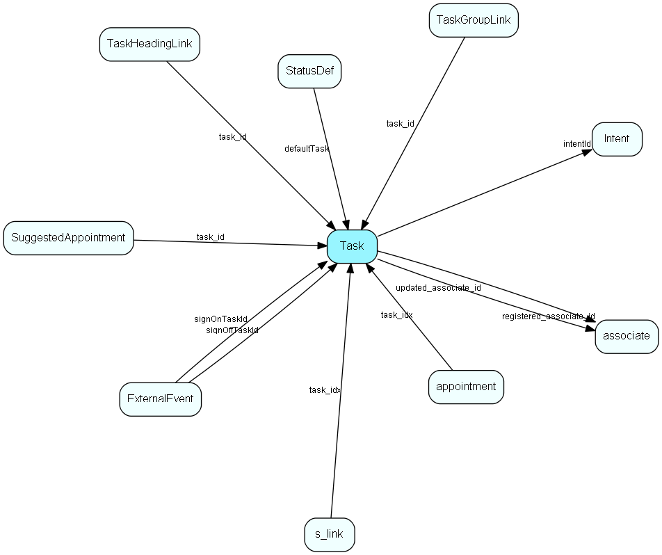

# Task Table (67)

Task MDO list item table.
Task list table, activity types, like Phone, Meeting

## Fields

| Name | Description | Type | Null |
|------|-------------|------|:----:|
|Task\_id|Primary key|PK| |
|name|The list item|String(239)| |
|rank|Rank order|UShort|&#x25CF;|
|tooltip|Tooltip or other description|String(254)|&#x25CF;|
|deleted|0 -&gt; record is active 1 -&gt; record is &apos;deleted&apos; and should not be shown in lists|UShort|&#x25CF;|
|record\_type|1 = app, 2 = doc, 3 = email, 4 = fax, 5 = phone, 6 = todo - see EAppntRecordTypes|Enum [TaskType](enums/tasktype.md)| |
|direction|1 = incoming, 2 = outgoing, see EAppntDirection|Enum [TaskDirection](enums/taskdirection.md)|&#x25CF;|
|color\_index|JAP|UShort|&#x25CF;|
|registered|Registered when|UtcDateTime| |
|registered\_associate\_id|Registered by whom|FK [associate](associate.md)| |
|updated|Last updated when|UtcDateTime| |
|updated\_associate\_id|Last updated by whom|FK [associate](associate.md)| |
|updatedCount|Number of updates made to this record|UShort| |
|defaultAlldayEvent|Default value for alldayEvent flag|Enum [AllDayEvent](enums/alldayevent.md)|&#x25CF;|
|defaultFreeBusy|Default value for Free/Busy indicator|Enum [FreeBusy](enums/freebusy.md)|&#x25CF;|
|defaultPublishType|Should this field be published by default?|Enum [PublishType](enums/publishtype.md)|&#x25CF;|
|intentId|Link to the intention of this kind of task (used by SAINT)|FK [Intent](intent.md)|&#x25CF;|
|default\_videomeeting\_status|Default video-meeting status for meetings created in SuperOffice CRM.|Enum [VideoMeetingStatus](enums/videomeetingstatus.md)| |

## Indexes

| Fields | Types | Description |
|--------|-------|-------------|
|Task\_id |PK |Clustered, Unique |
|name |String(239) |Unique |

## Replication Flags

* Replicate changes DOWN from central to satellites and travellers.
* Replicate changes UP from satellites and travellers back to central.
* Copy to satellite and travel prototypes.

## Security Flags

* No access control via user's Role.

