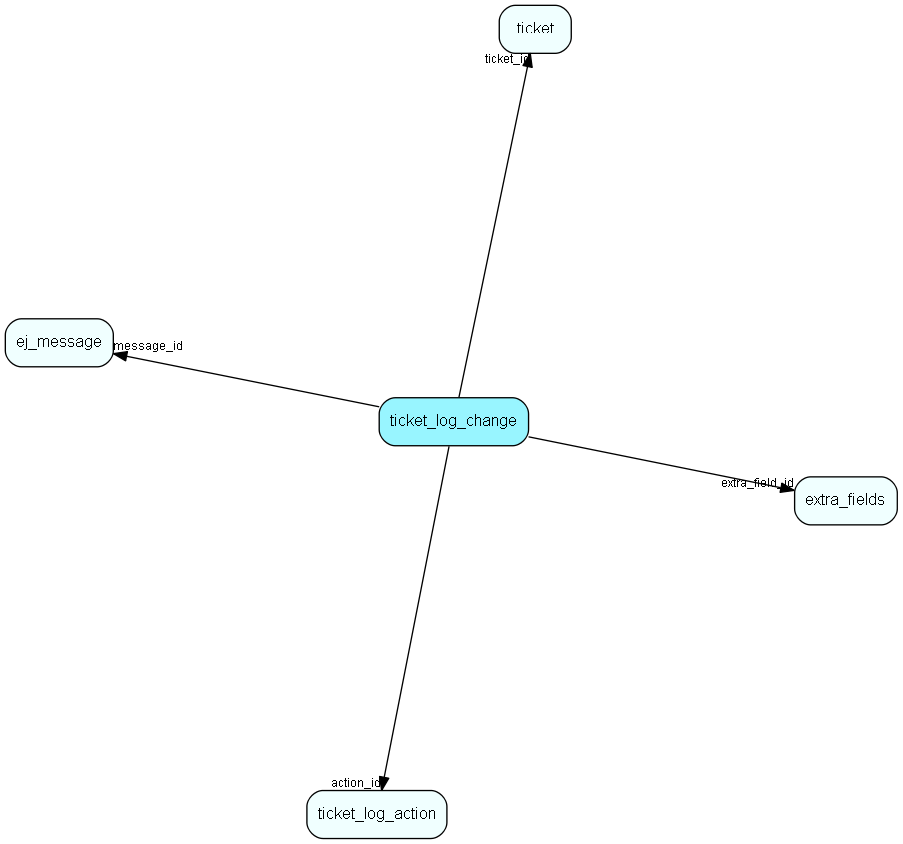

# ticket\_log\_change Table (268)

## Fields

| Name | Description | Type | Null |
|------|-------------|------|:----:|
|id|The primary key (auto-incremented)|PK| |
|ticket\_id|The id of the ticket this entry is connected to.|FK [ticket](ticket.md)| |
|message\_id|If this entry is connected to a message, then this is a message change log entry.|FK [ej-message](ej-message.md)| |
|action\_id|The id of ticket_log_action this entry is connected to.|FK [ticket-log-action](ticket-log-action.md)| |
|extra\_field\_id|The id of the extra_field this entry is connected to.|FK [extra-fields](extra-fields.md)| |
|log\_change|An enum indicating what kind of log-entry this is.|Int|&#x25CF;|
|to\_value|A the &amp;apos;to&amp;apos; value|String(255)| |
|from\_value|A the &amp;apos;from&amp;apos; value|String(255)| |

[!include[details](./includes/ticket-log-change.md)]

## Indexes

| Fields | Types | Description |
|--------|-------|-------------|
|id |PK |Clustered, Unique |
|ticket\_id |FK |Index |
|message\_id |FK |Index |
|action\_id |FK |Index |
|extra\_field\_id |FK |Index |

## Replication Flags

* None

## Security Flags

* No access control via user's Role.

