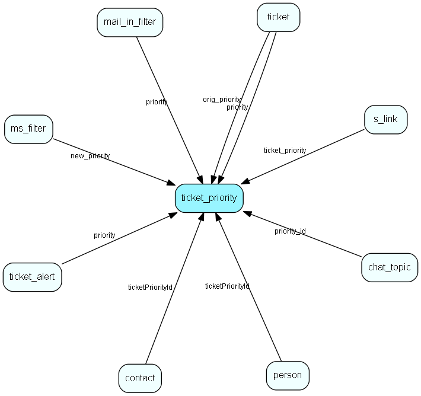

# ticket\_priority Table (275)

## Fields

| Name | Description | Type | Null |
|------|-------------|------|:----:|
|id|The primary key (auto-incremented)|PK| |
|name|The name of the priority.|String(64)|&#x25CF;|
|status|The status (normal/deleted) of the priority.|Enum [ticketprioritystatus](enums/ticketprioritystatus.md)|&#x25CF;|
|flags|A bitmask of flags.|Enum [ticketpriorityflags](enums/ticketpriorityflags.md)|&#x25CF;|
|mon\_start|When the timeframe starts on monday.|DateTime|&#x25CF;|
|mon\_stop|When the timeframe ends on monday.|DateTime|&#x25CF;|
|tue\_start||DateTime|&#x25CF;|
|tue\_stop||DateTime|&#x25CF;|
|wed\_start||DateTime|&#x25CF;|
|wed\_stop||DateTime|&#x25CF;|
|thu\_start||DateTime|&#x25CF;|
|thu\_stop||DateTime|&#x25CF;|
|fri\_start||DateTime|&#x25CF;|
|fri\_stop||DateTime|&#x25CF;|
|sat\_start||DateTime|&#x25CF;|
|sat\_stop||DateTime|&#x25CF;|
|sun\_start||DateTime|&#x25CF;|
|sun\_stop||DateTime|&#x25CF;|
|non\_dates|A comma separated list of dates (dd/mm) which should be excluded from the timeframe.|String(255)|&#x25CF;|
|deadline|Deadline to add if escalated (minutes)|Int|&#x25CF;|
|sort\_order|Indicates the sort order for this priority. 1 is first, 100 is last|Int|&#x25CF;|
|ticket\_read|This field indicates what to do with the escalation chain when the request is read|Enum [ticketpriorityescalateevent](enums/ticketpriorityescalateevent.md)|&#x25CF;|
|changed\_owner|This field indicates what to do with the escalation chain when the request changes owner (manually)|Enum [ticketpriorityescalateevent](enums/ticketpriorityescalateevent.md)|&#x25CF;|
|ticket\_newinfo|This field indicates what to do with the escalation chain when the request gets new info|Enum [ticketpriorityescalateevent](enums/ticketpriorityescalateevent.md)|&#x25CF;|
|ticket\_closed|This field indicates what to do with the escalation chain when the request is closed|Enum [ticketpriorityescalateevent](enums/ticketpriorityescalateevent.md)|&#x25CF;|
|ticket\_changed\_priority|This field indicates what to do with the escalation chain when the request is changed into this priority|Enum [ticketpriorityescalateevent](enums/ticketpriorityescalateevent.md)|&#x25CF;|
|ticket\_new|This field indicates what to do with the escalation chain when a new request is registered|Enum [ticketpriorityescalateevent](enums/ticketpriorityescalateevent.md)| |

[!include[details](./includes/ticket-priority.md)]

## Indexes

| Fields | Types | Description |
|--------|-------|-------------|
|id |PK |Clustered, Unique |

## Replication Flags

* None

## Security Flags

* No access control via user's Role.

