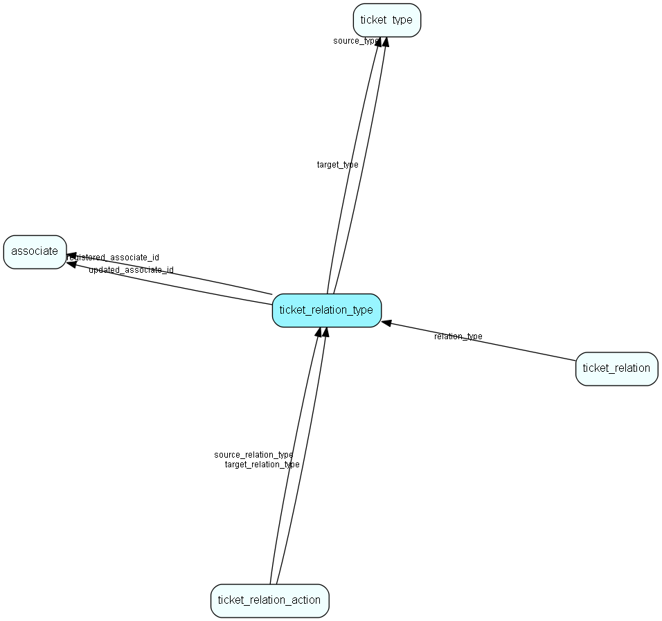

# ticket\_relation\_type Table (452)

## Fields

| Name | Description | Type | Null |
|------|-------------|------|:----:|
|id|Primary key|PK| |
|name|Multi-language name, shown in the administrative GUI|String(2047)|&#x25CF;|
|source\_type|Type of ticket that can be used as source for this type of relation|FK [ticket_type](ticket-type.md)|&#x25CF;|
|target\_type|Type of ticket that can be used as target for this type of relation|FK [ticket_type](ticket-type.md)|&#x25CF;|
|source\_label|Multi-language name of relation when viewed from source (&apos;caused by&apos;)|String(2047)|&#x25CF;|
|target\_label|Multi-language name of relation when viewed from target (&apos;causes&apos;)|String(2047)|&#x25CF;|
|rank|Display sort sequence for default sort order|UShort|&#x25CF;|
|registered|Registered when|UtcDateTime|&#x25CF;|
|registered\_associate\_id|Registered by whom|FK [associate](associate.md)|&#x25CF;|
|updated|Last updated when|UtcDateTime|&#x25CF;|
|updated\_associate\_id|Last updated by whom|FK [associate](associate.md)|&#x25CF;|
|updatedCount|Number of updates made to this record|UShort|&#x25CF;|

[!include[details](./includes/ticket-relation-type.md)]

## Indexes

| Fields | Types | Description |
|--------|-------|-------------|
|id |PK |Clustered, Unique |

## Replication Flags

* None

## Security Flags

* No access control via user's Role.

