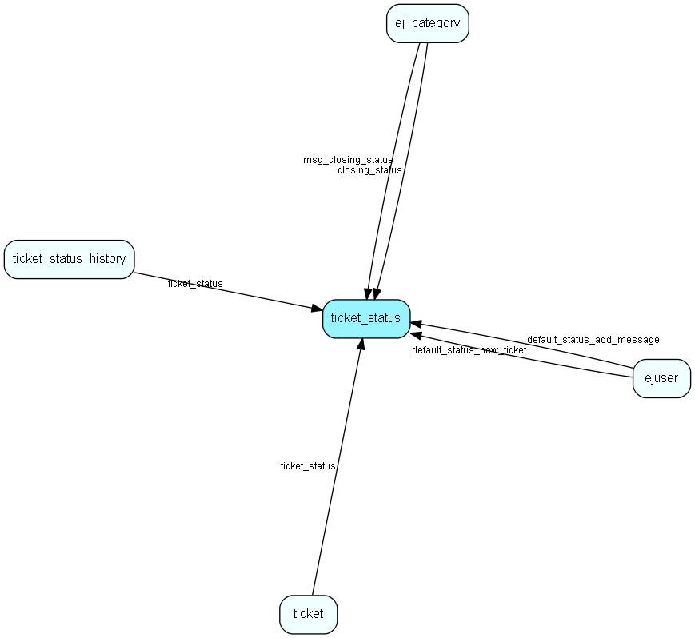

# ticket\_status Table (263)

## Fields

| Name | Description | Type | Null |
|------|-------------|------|:----:|
|id|The primary key (auto-incremented)|PK| |
|status|The &amp;apos;classic&amp;apos; ticket status. I.e. active/closed/postponed/deleted|Enum [ticketbasestatus](enums/ticketbasestatus.md)| |
|ts\_rank|Sort order|Int| |
|name|Name of user defined ticket status|String(255)| |
|time\_counter|Which field in ticket we count time spent on (queue, internal, external) |Enum [ticketstatustimecounter](enums/ticketstatustimecounter.md)|&#x25CF;|
|deleted|Whether the status is deleted (unavailable) or not|Bool|&#x25CF;|
|no\_email\_reopen|Whether inbound emails can reopen requests with this status or not|Bool|&#x25CF;|

[!include[details](./includes/ticket-status.md)]

## Indexes

| Fields | Types | Description |
|--------|-------|-------------|
|id |PK |Clustered, Unique |
|status |Enum |Index |

## Replication Flags

* None

## Security Flags

* No access control via user's Role.

