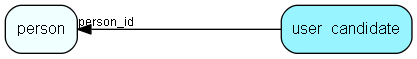

# user\_candidate Table (389)

## Fields

| Name | Description | Type | Null |
|------|-------------|------|:----:|
|id|Primary key|PK| |
|person\_id||FK [person](person.md)| |
|secret\_key||String(255)|&#x25CF;|
|secret\_value||String(255)|&#x25CF;|

[!include[details](./includes/user-candidate.md)]

## Indexes

| Fields | Types | Description |
|--------|-------|-------------|
|id |PK |Clustered, Unique |
|person\_id |FK |Index |
|secret\_key |String(255) |Index |

## Replication Flags

* None

## Security Flags

* No access control via user's Role.

