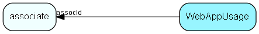

# webappusage Table (249)

## Fields

| Name | Description | Type | Null |
|------|-------------|------|:----:|
|WebAppUsage\_id|Primary key|PK| |
|version|Version number of usage stats|UInt| |
|assocId|ID of associate|FK [associate](associate.md)| |
|timestamp|Time stamp of operation|DateTime| |
|viewState|Current view state, excluding data|String(254)| |
|aggregateBin|Bin no. If this is aggregated data|UInt|&#x25CF;|
|aggregateCount|Bin count, if this is aggregated data|UInt|&#x25CF;|

[!include[details](./includes/WebAppUsage.md)]

## Indexes

| Fields | Types | Description |
|--------|-------|-------------|
|WebAppUsage\_id |PK |Clustered, Unique |
|viewState, timestamp, assocId |String(254), DateTime, FK |Index |

## Replication Flags

* None

## Security Flags

* No access control via user's Role.

