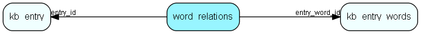

# word\_relations Table (355)

## Fields

| Name | Description | Type | Null |
|------|-------------|------|:----:|
|id|Primary key|PK| |
|entry\_word\_id|A reference to the id of the word|FK [kb-entry-words](kb-entry-words.md)| |
|entry\_id|A reference to the id of the entry|FK [kb-entry](kb-entry.md)| |
|used|Indicates how many times this word is used in the FAQ entry|Int| |
|origin|Indicates if it is an entry word (0) or a category word (1).|Short| |

[!include[details](./includes/word-relations.md)]

## Indexes

| Fields | Types | Description |
|--------|-------|-------------|
|id |PK |Clustered, Unique |
|entry\_word\_id |FK |Index |
|entry\_id |FK |Index |

## Replication Flags

* None

## Security Flags

* No access control via user's Role.

