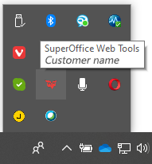

<!-- markdownlint-disable-file MD041 -->
SharePoint: Erstellen Sie ein neues Dokument. Wenn es in Microsoft Office Online geöffnet wird, verwenden Sie SharePoint.

SuperOffice WebTools: Öffnen Sie den Infobereich in der unteren rechten Ecke Ihres Desktops und suchen Sie das SuperOffice-Symbol.

