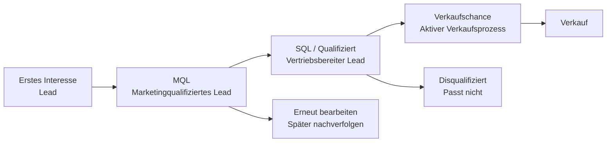

# Lead-Management

Lead-Management hilft Ihnen zu verstehen, wo sich potenzielle Kunden in ihrem Kaufprozess befinden, und bietet Marketing und Vertrieb eine gemeinsame, strukturierte Methode, um Interesse, Bereitschaft und Fortschritt zu verfolgen.

Durch einheitliche Nutzung von Kategorien und Lead-Status können Sie sehen, welche Leads sofortige Aufmerksamkeit benötigen, welche gepflegt werden sollten und welche bereit sind, in den Verkaufsprozess überzugehen.

Leadinformationen werden direkt auf Firmen- und Person-Ansicht, in der Bereichsregisterkarte Personen, in Selektionen und in Dashboards angezeigt, damit Sie den nächsten Schritt leicht priorisieren können.

## Lead-Lebenszyklus

Ein Lead durchläuft normalerweise mehrere Stufen, bevor er zu einer Verkaufschance wird. SuperOffice verwendet eine Kombination aus **Firma-Kategorie** und **Lead-Status der Person**, um jede Phase abzubilden. Diese Werte helfen Ihnen zu verstehen, ob ein Lead neu ist, kontaktiert wird, bereit für die Nachverfolgung durch den Vertrieb ist oder nicht passt.

## Lead-Status

Der **Lead-Status** zeigt den Fortschritt eines Leads von der ersten Kontaktaufnahme bis zur Qualifizierung. Er hilft Vertrieb und Marketing, Aktivitäten zu priorisieren und sorgt für ein einheitliches Verständnis der Position des Leads im Verkaufstrichter.

Lead-Status ist nur verfügbar, wenn das Firma einer Kategorie in der Gruppe **Potentieller Kunde** zugeordnet ist und **Lead-Status aktivieren** ausgewählt wurde.

Wenn diese Einstellung aktiv ist, erscheint das Feld direkt unter **Kategorie** in der Person-Ansicht. Jede Person kann einen anderen Status haben, selbst wenn sie im selben Firma arbeitet.

Neue Personen erhalten automatisch den Status *Offen*. Wenn die Firma später in eine Kategorie verschoben wird, die keinen Lead-Status verwendet, wird das Feld ausgeblendet – der Wert bleibt jedoch für Suchen und Dashboards gespeichert.

> [!TIP]
> Wenn der **Lead-Status** fehlt, gehört die Firma nicht zur Gruppe *Potentieller Kunde*.

### Vordefinierte Status

Die folgenden Status sind standardmäßig in SuperOffice verfügbar und stellen wichtige Schritte dar, wie ein Lead durch den Qualifizierungsprozess fortschreiten kann. [Lead-Status können angepasst werden][2] von Administratoren.

| Status | Beschreibung |
|---|---|
| Offen | Es wurde noch kein Kontaktversuch vorgenommen. |
| Kontaktaufnahme | Der Vertrieb versucht aktiv, den Lead zu erreichen. |
| Disqualifiziert | Der Lead erfüllt die Kriterien nicht. |
| Erneut bearbeiten | Der Lead ist jetzt nicht bereit, könnte aber später relevant sein. |
| Qualifiziert | Der Lead erfüllt alle Anforderungen für den Verkaufsprozess. |

## Kategorien für potenzielle Kunden

Das Feld **Kategorie** in einer Firma definiert die Art der Beziehung, die Sie mit diesem Firma haben, wie z. B. *Kunde*, *Partner* oder *Lead*. Nur Kategorien, die zur Gruppe **Potentieller Kunde** gehören, zeigen das Feld **Lead-Status** an.

Die Gruppierung von Kategorien nach Typ stellt sicher, dass Leads konsistent behandelt werden:

* **Suchen und Dashboards** können problemlos alle potenziellen Kunden auf einmal filtern.
* **Automatisierungen** können Kategorien sicher aktualisieren, ohne versehentlich Kunden zu Leads herabzustufen.
* **Sichtbarkeit:** Das Feld **Lead-Status** erscheint automatisch nur dort, wo es relevant ist.

### Vordefinierte Kategorien

Die folgenden Kategorien stellen wichtige Schritte dar, wie ein Lead durch den Verkaufstrichter fortschreiten kann. Sie stehen standardmäßig in **neuen** SuperOffice-Datenbanken ab Version 11.6 zur Verfügung. Kategorien können von Administratoren hinzugefügt und geändert werden.

| Kategorie | Beschreibung |
|---|---|
| Lead | Ein Firma oder eine Person mit anfänglichem Interesse. |
| Marketingqualifizierter Lead (MQL) | Entspricht dem Zielprofil oder hat weiteres Interesse gezeigt. |
| Opportunity | Eine potenzielle Kunde in einem aktiven Verkaufsprozess. |
| Verlorene Opportunity | Eine potenzielle Kunde mit einem oder mehreren verlorenen Verkäufen. |

## Wo Leadinformationen erscheinen

Leadinformationen werden an mehreren Stellen in SuperOffice CRM angezeigt, sodass Sie den Fortschritt eines Leads leicht erkennen und bei Bedarf handeln können.

* **Person-Ansicht:** Das Feld **Lead-Status** erscheint direkt unter **Kategorie**, wenn das Firma eine Kategorie für potenzielle Kunden mit aktiviertem Lead-Status verwendet.

    ![Kategorie und Lead-Status in der Personenansicht. -screenshot][img2]

* **Firma-Ansicht:** Die **Kategorie** des Firmas bestimmt, ob Personen in diesem Firma den Lead-Status anzeigen können.

* **Bereichsregisterkarte Personen:** Sie können die Spalten **Lead-Status**, **Kategorie** und **Kategoriengruppe** hinzufügen, um Personen nach ihrem Lead-Stadium zu sortieren, zu filtern oder zu gruppieren.

    ![Lead-Status in der Firma-Ansicht mit Personen-Registerkarte. -screenshot][img1]

* **Suchkriterien:** Lead-bezogene Felder wie **Kategorie**, **Kategoriengruppe** und **Lead-Status** können verwendet werden, um dynamische Selektionen für Marketing oder Lead-Nurturing zu erstellen.

* **Board-Ansicht:** Visualisieren Sie Leads nach Status in einem spaltenbasierten Layout.

* **Dashboards:** Dashboard-Kacheln können Zählungen oder Listen von Leads in bestimmten Status oder Kategorien anzeigen, sodass Sie neue, aktive oder disqualifizierte Leads überwachen können.

## Verwandte Inhalte

* [Mit Leads in SuperOffice arbeiten][4]
* [Conversion-Tracking][5]
* [Lead-Management einrichten][3] - in Einstellungen und Verwaltung
* [Firma-Kategorien konfigurieren][1]
* [Lead-Status verwalten][2]

<!-- Referenced links -->
[1]: ../admin/add-company-category.md
[2]: ../admin/add-lead-status.md
[3]: ../admin/index.md
[4]: work-with-leads.md
[5]: ../../marketing/utm/learn/index.md

<!-- Referenced images -->
[img1]: ../../../media/loc/en/lead/company-lead-with-contacts-section-tab.png
[img2]: ../../../media/loc/en/lead/contact-card-open-lead.png
