# Conversion-Tracking

Marketingfachleute haben oft Schwierigkeiten zu verstehen, welche Kampagnen, Kanäle oder Plattformen die wertvollsten Leads generieren. Ohne dieses Wissen ist es schwierig, Ausgaben zu optimieren oder den Return on Investment (ROI) nachzuweisen.

Das Conversion-Tracking in SuperOffice hilft Ihnen, Marketingaktivitäten mit tatsächlichen Ergebnissen zu verknüpfen. Es verwendet **UTM-Parameter**, um zu identifizieren, woher jedes Lead stammt und wie Besucher mit Ihrer Website interagieren, bevor sie zu Personen oder Verkaufschancen werden.

Durch das Nachverfolgen der Quelle jedes Leads können Sie:

* Genau sehen, woher jedes Lead stammt (z. B. LinkedIn-Anzeige, Newsletter oder Google-Suche)
* Ermitteln, welche Kanäle und Kampagnen die meisten Leads und Abschlüsse generieren
* Kampagnenleistungen vergleichen und Ihr Marketingbudget auf das konzentrieren, was funktioniert

Um im Detail zu verstehen, wie das UTM-Tracking funktioniert, siehe [UTM-Parameter erklärt][1].

## In SuperOffice CRM erfasste Datenpunkte

SuperOffice erfasst mehrere wichtige Datenpunkte, um Ihnen zu helfen, zu verstehen, wie Leads erstellt und konvertiert werden.

| Datenpunkt | Beschreibung | Speicherungsebene |
|---|---|---|
| **Erster Kontakt (First touch)** | Die erste Quelle, das Medium und die Kampagne, die die Person zur Interaktion mit dem Unternehmen gebracht haben. | Person |
| **Lead-Erstellung** | Die Quelle, das Medium und die Kampagne, die zur eigentlichen Lead-Erstellung im CRM geführt haben. | Person |
| **Conversion** | Die letzte Quelle, das Medium und die Kampagne, die eine bestehende Person zur Einsendung eines neuen Formulars veranlasst haben. | Formularübermittlung |
| **Unternehmensquelle** | Wenn eine neue Person hinzugefügt und gleichzeitig eine Firmenkarte erstellt wird, wird die Quelle auf der Firmenkarte gespeichert. | Firma |

> [!NOTE]
> Erster Kontakt, Lead-Erstellung und Unternehmensquelle werden nur für neue Personen und Firmen erfasst, die noch nicht im CRM vorhanden sind.

## Wie die Lead-Quelle erfasst wird

Ein Besucher klickt auf eine **LinkedIn-Anzeige** und landet auf Ihrer Website. Beim Eintreffen werden *Daten zum ersten Kontakt* – einschließlich Quelle, Medium und Kampagne – im Browser gespeichert. Der Besucher verlässt die Website, ohne etwas zu tun.

Später klickt dieselbe Person auf eine **Facebook-Anzeige** und kehrt zur Website zurück. Dieses Mal füllt sie ein Formular aus und **sendet es ab**. Beim Absenden des Formulars erfasst SuperOffice die Quelldaten aus der URL.

Wenn die Einsendung einen neuen Kontakt oder ein neues Lead in SuperOffice CRM erstellt, werden sowohl **Erster Kontakt** als auch **Lead-Erstellung** auf der Personenkarte gespeichert.

```mermaid
flowchart TD
    subgraph Journey["Besucherreise"]
        A["<br/>&#8203;Klickt auf LinkedIn-Anzeige<br/> "] --> B["<br/>&#8203;Besucht Website<br/> "]
        B --> C["<br/>&#8203;Verlässt Website<br/> "]
        C --> D["<br/>&#8203;Erste Kontaktdaten im Browser gespeichert<br/> "]
        D --> E["<br/>&#8203;Klickt auf Facebook-Anzeige<br/> "]
        E --> F["<br/>&#8203;Besucht Website erneut<br/> "]
        F --> G["<br/>&#8203;Sendet Formular ab<br/> "]
    end

    subgraph CRM["CRM-Verarbeitung"]
        G --> H["<br/>&#8203;Quelle erfasst<br/> "]
        H --> I["<br/>&#8203;Sowohl Erster Kontakt als auch Lead-Erstellung in SuperOffice gespeichert<br/> "]
    end

    style Journey fill:#f5faff,stroke:#c0d9f1,stroke-width:1px
    style CRM fill:#f2fff8,stroke:#a8e0c0,stroke-width:1px
```


<!--Alt-Text: Flussdiagramm zeigt, wie Erster Kontakt und Lead-Erstellung nach einer Formularübermittlung in SuperOffice CRM gespeichert werden.-->

## Erfasste UTM-Daten in SuperOffice CRM anzeigen

Wenn SuperOffice UTM-Parameter aus einer Formularübermittlung erfasst, sind die Details zu **Erster Kontakt** und **Lead-Erstellung** in der **Datenschutz**-Registerkarte der Person unter dem Zweck *E-Marketing* sichtbar.
Sie können diese schreibgeschützten Werte anzeigen, indem Sie auf *Mehr anzeigen* klicken.

![Der E-Marketing-Bereich in der Datenschutz-Registerkarte zeigt Erster Kontakt und Lead-Erstellung UTM-Felder -screenshot][img1]

Sie können UTM-Daten auch in der [Bereichsregisterkarte **Personen**][7] auf einer Firmenkarte anzeigen.

Klicken Sie auf <i class="ph ph-gear" aria-label="Gear icon"></i>, um anzupassen, welche Spalten angezeigt werden.

![Bereichsregisterkarte Personen zeigt Lead-Spalten mit UTM-Daten -screenshot][img3]

## UTM-Daten als Suchkriterien verwenden

Sie können UTM-Datenfelder verwenden, um Personen und Firmen in SuperOffice CRM zu finden oder zu segmentieren.

Im **Suchen**-Bildschirm fügen Sie Kriterien unter **Firma** > **Lead** oder **Person** > **Lead** hinzu, zum Beispiel:

* Erste Kontaktquelle
* Erste Kontaktkampagne
* Lead-Erstellungsquelle
* Lead-Erstellungsmedium
* Lead-Erstellungskampagne

![Der Suchen-Bildschirm zeigt UTM-Felder, die als Kriterien verfügbar sind -screenshot][img2]

Sie können Ihre Suchergebnisse als **Selektion** speichern, die später für gezielte Marketingaktivitäten oder Berichte verwendet werden kann.

Wenn Sie eine dynamische Selektion von Firmen oder Personen haben, können Sie diese auch in der [Board-Ansicht][6] öffnen, um den Lead-Fortschritt zu visualisieren.

## Praxisbeispiele

### Anwendungsfall 1: Ermitteln, welcher Kanal die meisten Anmeldungen bringt

Sie führen ein **Webinar** durch und bewerben es über einen **LinkedIn-Post**, eine **Google-Anzeige** und einen **Newsletter**.

Nach dem Event möchten Sie wissen:

* Welcher Kanal brachte die meisten Anmeldungen?
* Welche Leads wurden später zu Verkaufschancen?

**Berichte in SuperOffice zeigen:**

* 50 % der Anmeldungen kamen über LinkedIn.
* Leads aus dem Newsletter haben eine 30 % höhere Conversion-Rate.

Diese Erkenntnisse helfen Ihnen, Budget und Botschaft für zukünftige Kampagnen zu optimieren.

### Anwendungsfall 2: Leistung von Partneraktivitäten vergleichen

Sie führen drei Marketingaktivitäten mit verschiedenen Partnern durch:

* Einen Partner-Newsletter
* Ein Co-Brand-Webinar
* Einen Empfehlungslink auf der Partner-Website

Sie möchten wissen, welche Aktivität die meisten neuen Leads und Abschlüsse generiert.

| Quelle | Medium | Leads | Abschlüsse |
|---|---|---|---|
| Partner A | E-Mail | 30 | 2 |
| Partner B | Webinar | 50 | 10 |
| Partner C | Empfehlung | 10 | 1 |

Das Conversion-Tracking in SuperOffice hilft Ihnen, Partnerleistungen zu vergleichen und sich auf messbare Ergebnisse zu konzentrieren.

## Beispiel-Tracking-Link

Sie können UTM-Parameter an jede Kampagnen-URL anhängen, um Traffic-Quellen zu identifizieren.

```text
https://yourcompany.com/signup?utm_source=linkedin&utm_medium=social&utm_campaign=webinar_sept
```

Verwenden Sie den UTM-Builder für SuperOffice-Formulare, um Kampagnenlinks mit konsistenten Benennungen zu erstellen.

## Verwandte Inhalte

* [UTM-Parameter erklärt][1]
* [UTM-Tracking für Formularübermittlungen aktivieren][3] in Einstellungen und Verwaltung
* [UTM-Builder für SuperOffice-Formulare][2]
* [Lead-Dashboards und Berichte][5]

[1]: parameters.md
[2]: ../../forms/learn/publish.md
[3]: ../admin/set-up.md
[5]: ../../../dashboard/learn/show-marketing.md
[6]: ../../../search-options/selection/learn/board-view.md
[7]: ../../../learn/section-tabs/contacts-tab.md

<!-- Referenced images -->
[img1]: ../../../../media/loc/en/marketing/contact-privacy-utm-data.png
[img2]: ../../../../media/loc/en/search-options/lead-utm-criteria.png
[img3]: ../../../../media/loc/en/marketing/lead-in-contact-section-tab.png
