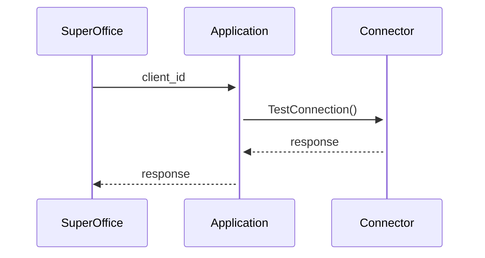

# ERP Quote Connector Interface

The SuperOffice Quote Management system is based on an architecture that allows connection to several ERP systems. This is facilitated through a set of **Quote Connectors**. A quote connector provides specific data and business logic for the ERP system in question. It communicates with SuperOffice through a set of APIs. SuperOffice relies on partners to develop all connectors.

> [!NOTE]
> SuperOffice will certify all available connectors, but will not distribute them or offer them as part of our standard price list.

![interfaces][img1]

![quote database][img2]

[!include[License requirement](../../../../../common/includes/req-sales-prem.md)]

## Architecture

### Onsite

The *\<SpesificERP>QuoteConnector.DLL* is loaded into the SuperOffice client when the SuperOffice client starts. The information needed to connect to the ERP system is set up and stored in the SuperOffice database first.

![01][img3]

(BaaN ERP system)

### Online

There is no way to inject a custom .dll into the Online environment, so the architecture is a little different compared to Onsite.
For example, when setting up a new connection SuperOffice will call [TestConnection()][4] to verify that the connection can be created. For Online the sequence would look like this:

In short this means it is not possible to go directly towards a service from SuperOffice. Instead the client_id/application_id is defined in SuperOffice Admin, which then uses this application to communicate with the service.
To set up a new QuoteConnector the following steps needs to be completed:

1. [Create a quote connector][0]
2. [Register an ERP and quote sync app][1]
3. [Configure the application with service endpoints][2]
4. [Create a new Quote Connector in SuperOffice Admin][3]

> [!NOTE]
> Where and how the connector is hosted is up to the developer, and SuperOffice does not provide a platform for this.

The implementation of the quote connector is identical for both onsite and online, and it can be expected to stay unchanged in the future. This means an existing onsite connector implementation is useable for online, and the sample-code for [JsonQuoteConnector][5] can be used as-is in both scenarios.

## Files

* **SoDatabase.dll** – Contains the business logic and the implementation of the core functionality. It changes with every major and minor release of SuperOffice.

* **SuperOffice.Plugins.Dll** – Contains the interface definitions and data carriers used by the interface. It changes rarely, and then only additions. The goal is that ERP plugins only need to reference the *plugins.dll* so that they are compatible across minor and major releases of SuperOffice.

* **Erp.QuoteConnector.Baan.dll** – Contains the implementation of the `IQuoteConnector` interface defined in *SuperOffice.Plugins.dll*. This DLL should be compatible across minor releases of SuperOffice as long as it does not reference the *SoDatabase.dll* directly.

## The SuperOffice Quote Management API

The API will be implemented as an interface named `IQuoteConnector`, of which an ERPConnector can implement one or more functions. By overloading either `BaseQuoteConnector` or `QuoteConnectorExtender` you get to only overload the parts you want to change.

Functions that we expect to vary between ERP systems we will make available for queries via capability checks. For example, not all connectors will support the creation of orders, so SuperOffice will first check that the capability is available by calling `CanProvideCapability("iorderconsumer_place_order")`.

## Some facts

* A SuperOffice installation can have, 0, 1, or many ERP connectors at the same time. Many large companies have more than one ERP system. (Typically divided over country borders.)

* The connector should be completely without a user interface. It might be run at a server far, far away, far away from the user, by both Windows and Web clients.

* A connector must be installed and configured by the administrator.

* The system will allow the administrator to set up which salesmen shall have access to which ERP clients. If a salesman has access to more than one system, he will be asked which one he wants to use when he creates a quote.

* Since not all connectors will be able to support all functionality, and we don’t want to accept the least common denominator, the connector should be query-able; SuperOffice shall be able to query the connector about its capabilities.

* SuperOffice shall report to the connectors the language the user is running in, and will strongly request that the responses are translated as far as possible (especially the user error responses).

## Company Policy Preferences

SuperOffice Quote system can be configured to enable the various features available:

* Alternatives – available or not.
* Versioning – used or not.
* Discounts on total order amount – or only online items.

## Other company policy rules

See QuoteConnectorExtender chapter for a simple way of adding a specific rule for an installation without having to recompile the whole ERP connector.

## Parts

The system is implemented as one interface, but has some parts:

* **Quote Connector Setup:** Configure the connection to the ERP system. Provides meta-data about connection properties.

* **Basic Connector:** Handles the connection to the ERP system and the work of keeping the ERP system informed about the Quote.

* **Product Provider:** Search products and price lists.

* **Price Provider:** Calculates the discount on a single quoteline and a complete quote.

* **Order Consumer:** Accepts a quote and creates an order in the ERP system.

* **Address Provider** Some ERP systems will be able to supply the default addresses for a quote/order.

* **Product Search Provider:** A set of functions to be able to do more complex searches.

## Config values

Configuration fields can be declared to be one of a number of different types, using the `FieldMetadataInfo`. However, they are always transmitted as strings; and to do the conversion between strongly typed value and string we use the SuperOffice.Globalization.CultureDataFormatter class. Use the ParseXXX methods from the same class to get back to the correct type (int, datetime, etc).

<!-- Reference links -->
[0]: ./online-quote-connectors/index.md
[1]: ../../../developer-portal/create-app/sync-app.md
[2]: ../../../developer-portal/create-app/config/update-endpoints.md
[3]: ../../../erp/admin/add-connection.md
[4]: ../../../api/plugins/quote-connectors/set-up.md#pluginresponseinfo-testconnection--dictionarystring-string-connectiondata-connectiondata-
[5]: https://github.com/SuperOffice/SuperOffice.DevNet.Online/tree/master/Source/SuperOffice.DevNet.Online.IntegrationServer/JsonQuoteConnector

<!-- Referenced images -->
[img1]: media/interfaces.png
[img2]: media/quotedatabase.png
[img3]: media/image001.png
