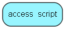

# access\_script Table (406)

Scripts to implement row-based access rules (sentry light)

## Fields

| Name | Description | Type | Null |
|------|-------------|------|:----:|
|id|The primary key (auto-incremented)|PK| |
|access\_table\_name|The name of the table that the access_script is connected to|String(255)| |
|body|The ejscript that limits the access to the according table|Clob|&#x25CF;|

[!include[details](./includes/access-script.md)]

## Indexes

| Fields | Types | Description |
|--------|-------|-------------|
|id |PK |Clustered, Unique |

## Replication Flags

* None

## Security Flags

* No access control via user's Role.

