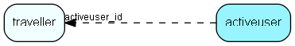

# activeuser Table (28)

Currently logged-on users. This table contains encrypted license information.  Changing it may disable login for all users and require intervention by SuperOffice support. Recommended use; for determining who is logged on, at what location, etc.

## Fields

| Name | Description | Type | Null |
|------|-------------|------|:----:|
|activeuser\_id|Note: This ID is not assigned from sequence, but instead corresponds to the Associate primary key|PK| |
|lastlogin|Date of last login|DateTime|&#x25CF;|
|netAddress|DNS and numeric IP address|String(127)|&#x25CF;|
|clientType|1=CRM , 2=Admin, 3=SOQL, …|UShort|&#x25CF;|
|computerName|Computer name|String(127)|&#x25CF;|
|domainName|Domain name|String(127)|&#x25CF;|
|osUserName|OS user name currently logged on|String(127)|&#x25CF;|

[!include[details](./includes/activeuser.md)]

## Indexes

| Fields | Types | Description |
|--------|-------|-------------|
|activeuser\_id |PK |Clustered, Unique |

## Relationships

| Table|  Description |
|------|-------------|
|[traveller](traveller.md)  |Associates traveling out from this database |

## Replication Flags

* None

## Security Flags

* No access control via user's Role.

