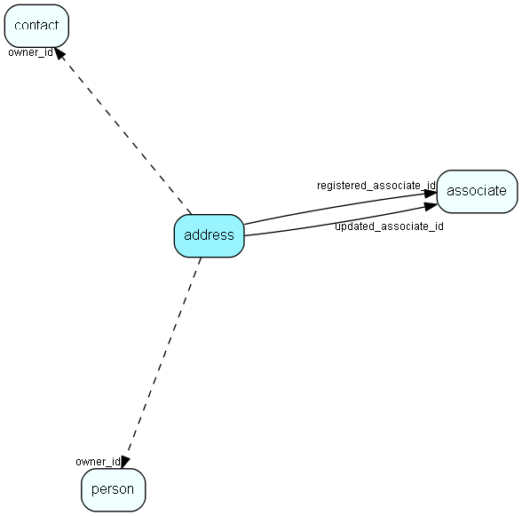

# address Table (7)

Contact and Person addresses

## Fields

| Name | Description | Type | Null |
|------|-------------|------|:----:|
|address\_id|Primary key|PK| |
|owner\_id|Record id of owner: Contact or Person|Id| |
|atype\_idx|Bit mask, combines address type (EAddressType) and owner type (EOwnerType)|Enum [AddressType](enums/addresstype.md)| |
|zipcode|Zip code, alphanumeric|String(11)| |
|city|City corresponding to zip code|String(79)|&#x25CF;|
|state|State|String(5)|&#x25CF;|
|county|County (not country)|String(29)|&#x25CF;|
|address1|Address line 1|String(79)|&#x25CF;|
|address2|Address line 2|String(79)|&#x25CF;|
|address3|Address line 3|String(79)|&#x25CF;|
|registered|Registered when|UtcDateTime| |
|registered\_associate\_id|Registered by whom|FK [associate](associate.md)| |
|updated|Last updated when|UtcDateTime| |
|updated\_associate\_id|Last updated by whom|FK [associate](associate.md)| |
|updatedCount|Number of updates made to this record|UShort| |
|validFrom|Valid from date for this record|DateTime|&#x25CF;|
|validTo|Valid to date for this record|DateTime|&#x25CF;|
|wgs84latitude|Latitude (that&apos;s north/south), decimal degrees, relative to WGS 84 ellipsoid. SuperOffice ASA is at 59.91892. This value needs no further grid reference or other qualifying information.|Double|&#x25CF;|
|wgs84longitude|Longitude (that&apos;s East/west), decimal degrees, relative to WGS 84 ellipsoid. SuperOffice ASA is at 10.73159. This value needs no further grid reference or other qualifying information.|Double|&#x25CF;|

[!include[details](./includes/address.md)]

## Indexes

| Fields | Types | Description |
|--------|-------|-------------|
|address\_id |PK |Clustered, Unique |
|zipcode |String(11) |Index |
|state |String(5) |Index |
|owner\_id, atype\_idx |Id, Enum |Unique |

## Relationships

| Table|  Description |
|------|-------------|
|[associate](associate.md)  |Employees, resources and other users - except for External persons |
|[contact](contact.md)  |Companies and Organizations.   This table features a special record containing information about the contact that owns the database.   |
|[person](person.md)  |Persons in a company or an organizations. All associates have a corresponding person record |

## Replication Flags

* Area Management controlled table. Contents replicated to satellites and traveller databases.
* Replicate changes UP from satellites and travellers back to central.
* Copy to satellite and travel prototypes.

## Security Flags

* Sentry controls access to items in this table using user's Role and data rights matrix on the table's parent.

