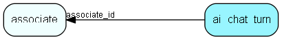

# ai\_chat\_turn Table (462)

Contains AI Chatbot history - contains whole chat, not just what is sent to the chatbot. History is ready ordered by timestamp

## Fields

| Name | Description | Type | Null |
|------|-------------|------|:----:|
|ai\_chat\_turn\_id|Primary key|PK| |
|associate\_id|User id that is chatting with the bot|FK [associate](associate.md)| |
|chat\_id|The name of this chat topic - usually soproto + id (contact-123, sale-43, diary) but could also be an arbitrary name|String(40)| |
|timestamp|When the chat happened (UTC)|UtcDateTime| |
|user\_prompt|What the user typed|Clob|&#x25CF;|
|user\_displaytext|Display this text instead of the prompt (if set) - could be set by action|Clob|&#x25CF;|
|bot\_response|AI Bot response to user_prompt - usually text|Clob|&#x25CF;|
|bot\_actions|Suggested actions (string dictionary) in JSON. NULL if not set|Clob|&#x25CF;|
|attachments|JSON Array of bot - NULL if not set|Clob|&#x25CF;|

[!include[details](./includes/ai-chat-turn.md)]

## Indexes

| Fields | Types | Description |
|--------|-------|-------------|
|ai\_chat\_turn\_id |PK |Clustered, Unique |
|associate\_id |FK |Index |
|timestamp |UtcDateTime |Index |
|associate\_id, chat\_id, timestamp |FK, String(40), UtcDateTime |Index |

## Relationships

| Table|  Description |
|------|-------------|
|[associate](associate.md)  |Employees, resources and other users - except for External persons |

## Replication Flags

* None

## Security Flags

* No access control via user's Role.

