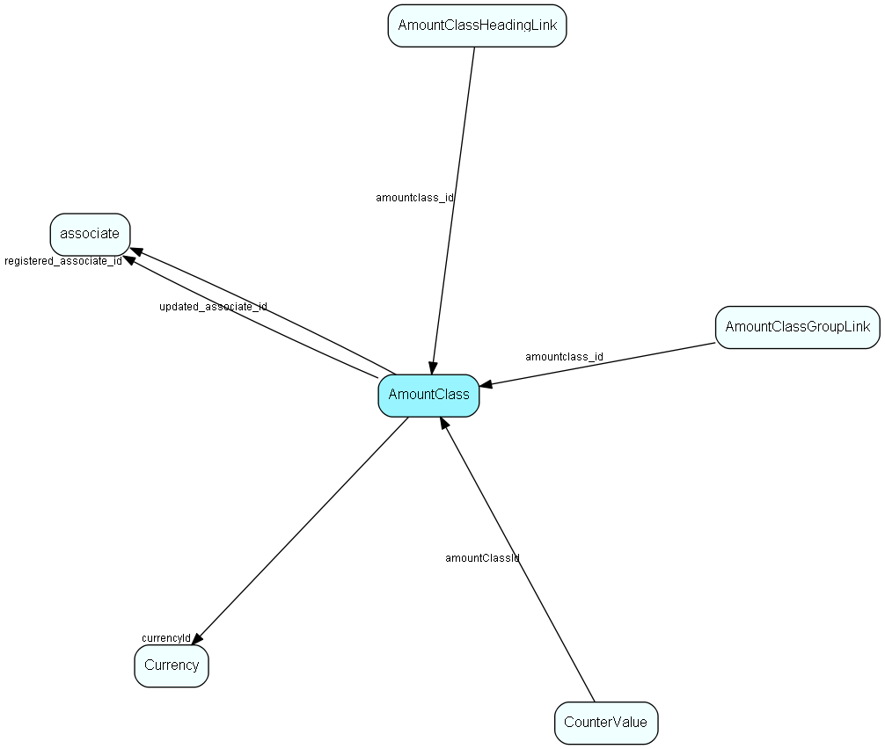

# AmountClass Table (225)

AmountClass MDO list item table.
Amount Class list for SuperOffice Sales Intelligence (Saint) - used to group sales by amounts, into bins (low --&gt; high) called amount classes. More information regarding SuperOffice Sales Intelligence on http;//techdoc.superoffice.com 

## Fields

| Name | Description | Type | Null |
|------|-------------|------|:----:|
|AmountClass\_Id|Primary key|PK| |
|name|The list item|String(239)| |
|rank|Rank order|UShort|&#x25CF;|
|tooltip|Tooltip or other description|String(254)|&#x25CF;|
|deleted|0 -&gt; record is active 1 -&gt; record is &apos;deleted&apos; and should not be shown in lists|UShort|&#x25CF;|
|amountFrom|Lower limit of this amount class|Double|&#x25CF;|
|amountTo|Upper limit of this amount class|Double|&#x25CF;|
|currencyId|Currency the limits in this amount class refer to. Mixing currencies between classes can give rise to overlapping intervals and thus unpredictable classifications.|FK [Currency](currency.md)|&#x25CF;|
|registered|Registered when|UtcDateTime| |
|registered\_associate\_id|Registered by whom|FK [associate](associate.md)| |
|updated|Last updated when|UtcDateTime| |
|updated\_associate\_id|Last updated by whom|FK [associate](associate.md)| |
|updatedCount|Number of updates made to this record|UShort| |

[!include[details](./includes/amountclass.md)]

## Indexes

| Fields | Types | Description |
|--------|-------|-------------|
|AmountClass\_Id |PK |Clustered, Unique |
|name |String(239) |Unique |
|amountFrom |Double |Index |
|amountTo |Double |Index |

## Relationships

| Table|  Description |
|------|-------------|
|[AmountClassGroupLink](amountclassgrouplink.md)  |User group link table for AmountClass, for MDO item hiding |
|[AmountClassHeadingLink](amountclassheadinglink.md)  |Heading link table for AmountClass, for MDO headers |
|[associate](associate.md)  |Employees, resources and other users - except for External persons |
|[CounterValue](countervalue.md)  |Visible for rights |
|[Currency](currency.md)  |Currency list table |

## Replication Flags

* Replicate changes DOWN from central to satellites and travellers.
* Replicate changes UP from satellites and travellers back to central.
* Copy to satellite and travel prototypes.

## Security Flags

* No access control via user's Role.

