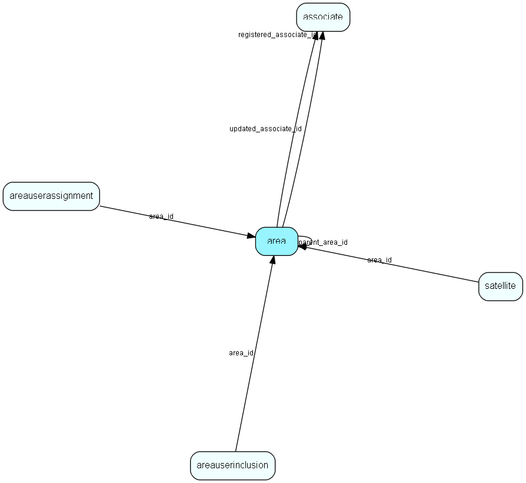

# area Table (38)

Definition of an Area (database subset for satellite and travel)

## Fields

| Name | Description | Type | Null |
|------|-------------|------|:----:|
|area\_id|Primary key|PK| |
|name|Area name|String(49)|&#x25CF;|
|parent\_area\_id|Reserved/not implemented: for subareas, travel from satellite, maybe future multi-level satellites|FK [area](area.md)|&#x25CF;|
|allData|if set to 1, means &apos;no filtering&apos;|UShort|&#x25CF;|
|dbType|0 = as in preferences, 1 = Sybase Anywhere, 2 = Ctree; used when generating prototypes|UShort|&#x25CF;|
|filterType|Area filtering algorithm - reserved for future use|UShort|&#x25CF;|
|encryptedComm|Use encryption for this Area?|UShort|&#x25CF;|
|maxDataAge|Max age of data when generating db&apos;s based on this area|UShort|&#x25CF;|
|registered|Registered when|UtcDateTime| |
|registered\_associate\_id|Registered by whom|FK [associate](associate.md)| |
|updated|Last updated when|UtcDateTime| |
|updated\_associate\_id|Last updated by whom|FK [associate](associate.md)| |
|updatedCount|Number of updates made to this record|UShort| |

[!include[details](./includes/area.md)]

## Indexes

| Fields | Types | Description |
|--------|-------|-------------|
|area\_id |PK |Clustered, Unique |
|parent\_area\_id |FK |Index |

## Relationships

| Table|  Description |
|------|-------------|
|[area](area.md)  |Definition of an Area (database subset for satellite and travel) |
|[areauserassignment](areauserassignment.md)  |Link table indicating which users actually reside in this area. |
|[areauserinclusion](areauserinclusion.md)  |Link table incidated whose data should be included in this area. If Include all data in Area (no filtering) is ticket then there will be no rows for this area in this table. |
|[associate](associate.md)  |Employees, resources and other users - except for External persons |
|[satellite](satellite.md)  |Definition of Satellites |

## Replication Flags

* Replicate changes DOWN from central to satellites and travellers.
* Copy to satellite and travel prototypes.
* Cache table during filtering.

## Security Flags

* No access control via user's Role.

